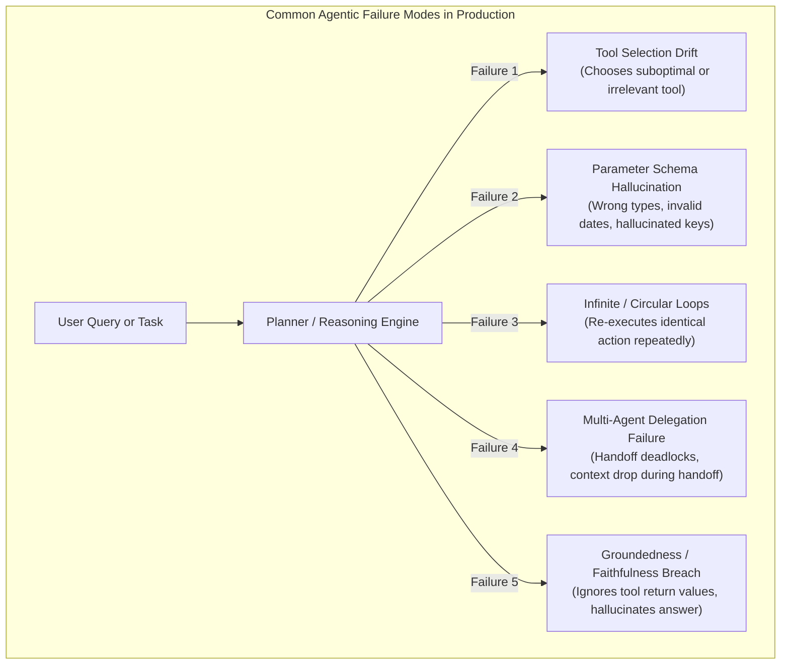
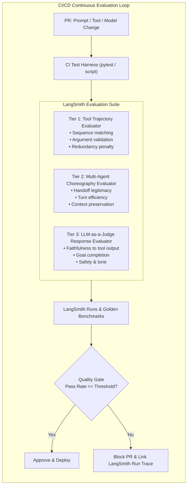

# Case Study 01: Agentic Evaluation & CI/CD Integration Pattern

> **Core Focus**: Designing a repeatable architecture for automated evaluation of tool trajectories, multi-agent coordination, and LLM-as-a-judge verification integrated into CI/CD pipelines.

---

## 1. Executive Summary & Context

Autonomous Agents and Multi-Agent Systems (MAS) represent a shift from static input-output LLM applications (like standard Q&A RAG) to non-deterministic, multi-step problem solvers. 

In agentic architectures, **the journey (trajectory) is just as critical as the destination (final response)**:
- An agent might arrive at an apparently plausible final answer by pure coincidence, despite hallucinating tool inputs, falling into retry loops, or invoking wrong APIs.
- Conversely, an agent might choose the optimal sequence of tools but experience a synthesis formatting error at the very last step.

### The Problem
Currently, the Agentic AI ecosystem lacks **standardized tooling and automated CI/CD integration for evaluation**. Most teams rely on:
1. Manual spot-checking in playground UIs.
2. Naive string-matching or simple cosine similarity on the final response.
3. Post-production log inspection after bad decisions have already impacted users.

This case study brainstorms a **repeatable evaluation pattern** powered by LangSmith and automated CI/CD gates.

---

## 2. Problem Breakdown & Failure Taxonomy

### Key Gaps Identified:
1. **Lack of Trajectory Observability in Pre-deployment**: Developers modify system prompts, add new tools, or switch foundational models without measuring impact across multi-step execution graphs.
2. **Missing CI/CD Enforcement**: No automated pull-request gate blocks merges when tool call efficiency drops, token costs spike unexpectedly, or trajectory steps deviate from golden standards.
3. **Multi-Agent Complexity**: When multiple specialized agents (e.g., Planner $\rightarrow$ Researcher $\rightarrow$ Critic) interact, there is no standardized metric to assess agent-to-agent protocol correctness.

---

## 3. The Repeatable Solution Pattern

The proposed solution pattern structures agentic evaluation into a **3-Tier Trajectory & Response Evaluation Pipeline**, executed automatically in CI/CD.

---

## 4. Architectural Deep Dive: The 3 Evaluation Tiers

### Tier 1: Tool Trajectory & Parameter Evaluator
Evaluates the step-by-step action space taken by an agent:
- **Tool Order & Selection**: Compares the sequence of tools called against golden benchmark trajectories (supporting exact match, subset match, or graph-DAG compliance).
- **Trajectory Efficiency Metric**:

$$
\text{Efficiency Score} = \max\left(0, 1.0 - \alpha \cdot N_{\text{redundant}} - \beta \cdot N_{\text{superfluous}}\right)
$$

  Penalizes unnecessary tool roundtrips, circular attempts, and wasteful token consumption.

### Tier 2: Multi-Agent Protocol & Choreography Evaluator
In multi-agent setups (e.g., LangGraph state graphs, supervisor-worker topologies):
- **Handoff Correctness**: Verifies whether the supervisor delegated the task to the appropriate specialized agent.
- **Context Preservation**: Asserts that essential parameters and constraints survived across agent handoffs without loss of context.
- **Convergence & Step Budget**: Ensures the multi-agent debate/collaboration reaches consensus within a bounded number of turns.

### Tier 3: LLM-as-a-Judge for Response Verification & Grounding
Grading the final output using a high-capability evaluator model with structured rubrics:
- **Tool Evidence Grounding**: Did the agent's synthesis stay strictly faithful to the factual outputs returned by intermediate tools, or did it fabricate details?
- **Goal Completion**: Did the output answer every component of the user's initial prompt?
- **Deterministic Rubrics**: Structured outputs scoring from 0.0 to 1.0 accompanied by explicit reasoning explanations to assist human debugging.

---

## 5. CI/CD Integration Blueprint

### Automated Gating Flow
1. **Trigger**: Developer creates a Pull Request modifying an agent's prompt, tool signatures, orchestration graph, or base model checkpoint.
2. **Deterministic Sandboxed Execution**: CI runs the agent across a versioned "Golden Evaluation Dataset" in LangSmith using deterministic tool mocks to avoid live API side-effects.
3. **Assertion Gates**:
   - `tool_trajectory_score >= 0.90` (Zero tolerance for parameter hallucinations or unauthorized tools).
   - `multi_agent_handoff_score >= 0.85` (Correct delegation path).
   - `llm_judge_faithfulness >= 0.90` (High factual grounding).
4. **Actionable PR Feedback**: If any evaluation run drops below the threshold, CI fails and automatically posts the exact LangSmith trace URL in the GitHub PR comment, allowing engineers to visualize the broken step instantly.

---

## 6. Trade-offs, Edge Cases & Brainstorm Takeaways

| Opportunity / Dimension | Considerations & Best Practices |
|---|---|
| **Deterministic vs Flexible Trajectories** | Rigid order matching can penalize valid alternate reasoning paths. *Solution*: Use DAG (Directed Acyclic Graph) trajectory matching rather than strict array indexing. |
| **Judge Flakiness & Non-determinism** | LLM judges can be subjective. *Solution*: Set temperature to 0, use structured schema outputs, and employ few-shot calibration examples in judge prompts. |
| **CI Cost & Latency** | Running multi-turn trajectories on every commit can be slow and costly. *Solution*: Tier CI runs into a lightweight fast set (smoke test on PRs) and a comprehensive benchmark suite (nightly / pre-release). |
| **Mocking External APIs** | Real tool execution in CI can be slow, stateful, or destructive. *Solution*: Record-and-replay cassettes or deterministic synthetic mock responses for tools during CI evaluation. |

---

## 7. Repeatable Pattern Checklist for Future Agentic Systems

When implementing agentic evaluation in production, verify:
- [ ] Golden dataset versioned in LangSmith alongside code.
- [ ] Trajectory evaluator checking tool call sequences and arguments.
- [ ] Multi-agent state graph transitions validated against expected choreography.
- [ ] LLM judge evaluating response faithfulness against tool execution outputs.
- [ ] Automated CI/CD pipeline gating PRs with clear trace links on failure.
