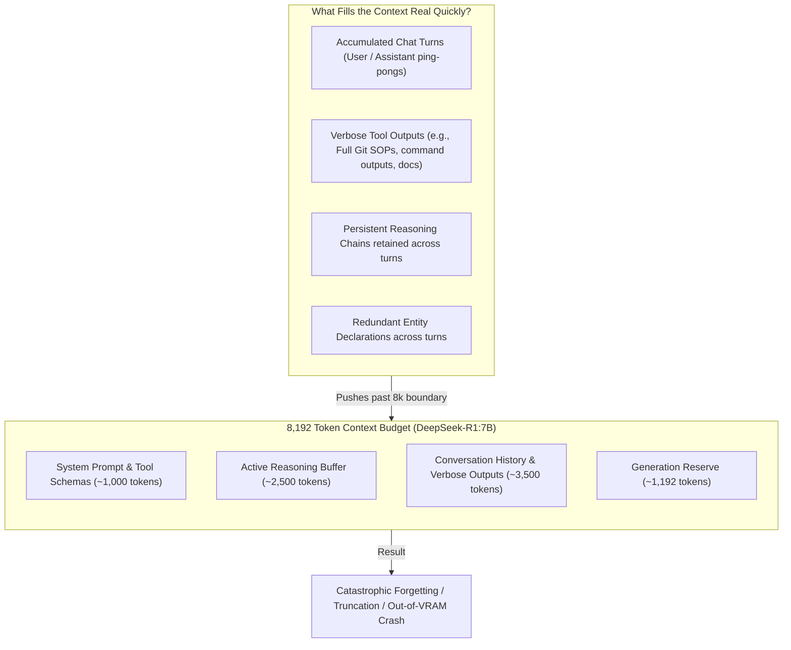
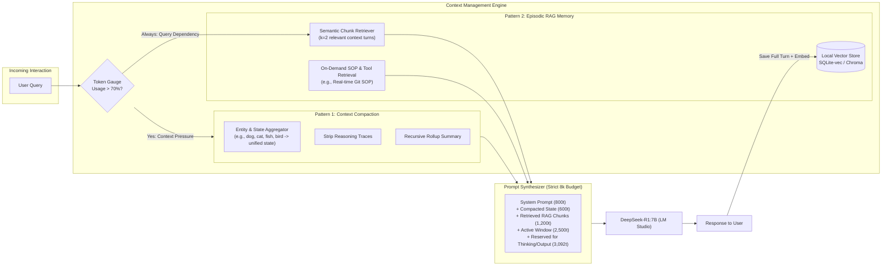
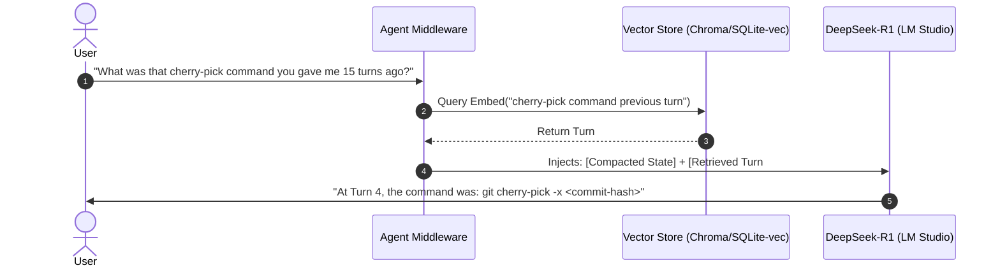
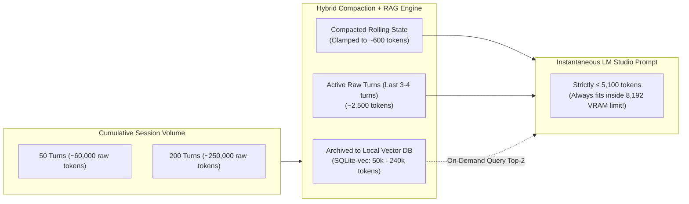

# Case Study 02: Context Compaction & RAG Memory Pattern for Constrained Local LLMs

> **Core Focus**: Designing repeatable architectural patterns to prevent rapid context saturation in local, resource-constrained LLM environments (e.g., DeepSeek-R1:7B running under an 8k context window in LM Studio) through sliding-window compaction, episodic conversation RAG, and tiered memory hierarchies.

---

## 1. Executive Summary & Context

Local LLM deployments—powered by engines such as **LM Studio**, **Ollama**, or **vLLM**—frequently operate under strict hardware-enforced context boundaries. While frontier cloud models offer 128k to 2M token windows, local setups hosting models like `deepseek-r1:7b` are often limited to **8k (8,192 tokens)** due to GPU VRAM limits (e.g., 6GB–12GB VRAM cards) and KV-cache memory constraints.

### The Amplification Problem: Reasoning Models & Local Limits
When running reasoning-centric models such as **DeepSeek-R1:7B**, the context saturation problem escalates exponentially:
- **Reasoning Overhead**: Before emitting a single response token, the model generates internal chain-of-thought tokens enclosed within `<think>...</think>`. A single complex question can consume 1,500–3,500 tokens solely on internal deliberation.
- **Rapid Context Exhaustion**: In an 8k context window, a multi-turn conversation can reach 100% capacity within 2 to 4 turns.
- **Catastrophic Failure Modes**:
  - *Hard Truncation*: LM Studio drops the earliest messages, shedding initial system instructions, user preferences, and foundational state.
  - *KV-Cache Degradation & OOM*: Crashing inference or generating repetitive loops once the context boundary is breached.
  - *Instruction Drift*: The model forgets user rules established at turn 1.

This case study establishes a **repeatable, production-ready memory architecture** combining **Context Compaction** and **Retrieval-Augmented Generation (RAG)** to sustain indefinite multi-turn sessions within constrained token budgets.

---

## 2. Problem Breakdown & Context Anatomy



### Anatomy of Context Bloat
1. **Low Information-Density Ping-Pongs**:
   A multi-turn interaction often contains conversational boilerplate:
   ```text
   User: "I have a dog"     --> Assistant: "OK"
   User: "I have a cat"     --> Assistant: "OK"
   User: "I have a fish"    --> Assistant: "OK"
   User: "I have a bird"    --> Assistant: "OK"
   ```
   Each turn carries chat template overhead (`<|im_start|>user\n...<|im_end|>\n<|im_start|>assistant\n...`), burning hundreds of tokens for minimal net information.

2. **Monolithic Static Documentation & Verbose SOPs**:
   Injecting comprehensive Standard Operating Procedures (e.g., an exhaustive 1,500-token guide on *Git cherry-picking conflict resolution*) burns 20% of the entire window upfront, even if the user only needed a single CLI command.

3. **Leaked Chain-of-Thought Traces**:
   If past `<think>` blocks are fed back into the conversation history of subsequent turns, reasoning tokens compound quadratically with every turn.

---

## 3. The Repeatable Solution Architecture

To achieve high performance within an 8k window, we organize context management into a **Tiered Memory Hierarchy**:



---

## 4. Pattern 1: Context Compaction (Lossless & Lossy State Reduction)

Context compaction periodically compresses dialogue history into a dense state representation before tokens overflow.

### 1. Entity & State Delta Aggregation
Instead of retaining $N$ conversational turns for incremental state updates, the compaction engine collapses sequential assertions into a consolidated state object:

```text
[Raw Dialogue Turns]
Turn 1: User: "I have a dog"     | Assistant: "OK"
Turn 2: User: "I have a cat"     | Assistant: "OK"
Turn 3: User: "I have a fish"    | Assistant: "OK"
Turn 4: User: "I have a bird"    | Assistant: "OK"

                             ▼ COMPACTION ▼

[Compacted Entity State]
"User's pets: [dog, cat, fish, bird]. State updated at Turn 4."
```
- **Token Reduction**: Drops from ~180 tokens (with chat formatting) to ~16 tokens (**>90% compression ratio**).
- **Context Retention**: Retains 100% of the semantic payload.

### 2. Stripping Reasoning Traces from History
For models like DeepSeek-R1, the `<think>` block is crucial *during generation* but becomes deadweight *after generation*:
- **Rule**: When storing assistant turns into working history, **strip the `<think>...</think>` enclosure**.
- Retain only the distilled conclusion or action step. If the reasoning process itself must be preserved for auditability, route it to the episodic RAG store rather than active prompt context.

### 3. Dynamic Knowledge Pointers (Replacing Verbose SOPs)
Instead of embedding a verbose 2,000-token manual (such as a full Git SOP for cherry-picking):
- **Compress to a Pointer**: Include an ultra-concise intent signature:
  ```text
  "Task SOP available: git_cherry_pick. Invoke tool or retrieval when conflicts occur."
  ```
- **Dynamic Fetch**: Use real-time web search or a local doc lookup tool *only* when the agent encounters an ambiguous merge conflict.

---

## 5. Pattern 2: Episodic Conversation RAG

While compaction preserves high-level state, specific details (exact code snippets, past error logs, verbatim user quotes) would be lost if compacted away. **Episodic RAG** preserves the long tail of memory.



### Episodic Chunking Strategy
1. **Turn-Pair Chunking**: Group `(User Message + Compacted Assistant Response)` as an atomic chunk. Do not split user intent from assistant resolution.
2. **Metadata Tagging**:
   - `turn_id`: Monotonically increasing turn counter.
   - `timestamp`: Execution time.
   - `topics`: Extracted entities/tags (e.g., `git`, `cherry-pick`, `pets`).
   - `has_code`: Boolean flag prioritizing code block retrieval.
3. **Local Vector Engine**: Run lightweight local embedding models (e.g., `all-MiniLM-L6-v2` or `bge-small-en-v1.5` via ONNX/llama.cpp) consuming <150MB of RAM, avoiding any GPU VRAM competition with DeepSeek-R1.

---

## 6. Comparative Decision Matrix: Compaction vs. RAG vs. Hybrid

| Dimension | Compaction Only | RAG Memory Only | Hybrid (Compaction + RAG) |
|---|---|---|---|
| **Primary Strength** | Preserves continuous narrative & ongoing goals | Endless session retention; exact verbatim recall | Best of both: continuous coherent flow + deep historical recall |
| **Token Efficiency** | High (constant state size: ~400–800 tokens) | Variable (retrieval adds 500–1,500 tokens per query) | Optimal (compact state always present, RAG on demand) |
| **Risk of Information Loss** | Medium (lossy summaries drop subtle nuances) | High if retriever fails (semantic mismatch) | Low (critical state is summarized; details retrievable) |
| **Implementation Complexity** | Low (periodic prompt-based summary) | Moderate (vector DB, chunking, embeddings) | Moderate-High (controller coordinates both) |
| **Latency Impact** | Low (only runs summarization every $K$ turns) | Low-to-Moderate (embedding + similarity lookup) | Moderate during compaction step, low during steady state |
| **Suitability for 8k Limits** | ⭐⭐⭐⭐ (Solid for 10–25 turn tasks) | ⭐⭐⭐ (Vulnerable to context fragmentation) | ⭐⭐⭐⭐⭐ **(Recommended for production agents)** |

---

## 7. The 8k Budget Allocation Blueprint

In an 8,192 token window running DeepSeek-R1:7B, allocate context dynamically using the **Threshold Budget Model**:

| Context Zone | Token Allocation | Strategy / Policy |
|---|---|---|
| **System Instruction & Tools** | 800 tokens | Static, cached prefix; concise tool signatures |
| **Compacted Entity/State Summary** | 600 tokens | Continuously rolled over; updated when history triggers compaction |
| **Dynamic Episodic RAG Chunks** | 1,200 tokens | Top-2 semantic chunks injected only when query references past turns |
| **Sliding Active Dialogue Buffer** | 2,500 tokens | Last 3–4 raw turns (without past `<think>` tokens) for immediate context |
| **Reserved for Generation & `<think>`** | 3,092 tokens | Guaranteed headroom for DeepSeek-R1's internal reasoning and output |
| **Total** | **8,192 tokens** | **100% capacity enforced without truncation risk** |

---

## 8. Effective Context Utilization & Session Sizing Estimation

A common misconception is that an 8k context window limits a session to 8,192 total tokens of conversation. With the **Hybrid Compaction + Episodic RAG** architecture, the 8,192 token limit is merely the **instantaneous working memory (VRAM ceiling)** per turn, while the **cumulative session context capacity** expands by orders of magnitude.

### 1. Mathematical Estimation Model

Let:
- $T_{\text{max}} = 8,192$ (Hardware context limit)
- $B_{\text{prompt}} \approx 5,100$ tokens (Maximum prompt budget: system + compacted state + active buffer + RAG chunks)
- $B_{\text{gen}} \approx 3,092$ tokens (Reserved for `<think>` reasoning traces and final response)
- $N$ = Number of turns in the session
- $C_{\text{turn}}$ = Average raw tokens generated per turn (User prompt + Tool output + `<think>` + Response) $\approx 1,200 \text{ tokens}$
- $R_{\text{compact}}$ = Compaction compression ratio $\approx 10:1$ (90% reduction)

$$\text{Effective Session Tokens Processed} = N \times C_{\text{turn}}$$

While raw cumulative tokens grow linearly ($N \times 1,200$), the instantaneous prompt presented to LM Studio remains clamped below $B_{\text{prompt}}$ at all times.

---

### 2. Worked Estimation Example: 50-Turn vs. 200-Turn Sessions



#### Scenario A: Moderate Session (50 Turns — e.g., Debugging a Complex Feature)
- **Raw Tokens Generated**: $50 \text{ turns} \times 1,200 \text{ tokens/turn} \approx \mathbf{60,000\text{ tokens}}$
- **Vanilla 8k Window**: Would have crashed/truncated around **Turn 5 or 6** (failing at ~8k tokens).
- **Hybrid Memory Allocation at Turn 50**:
  - System Prompt & Tools: `800 tokens`
  - Compacted State (Turns 1–46 rolled up): `600 tokens`
  - Episodic RAG Retrieval (Top-2 relevant historical chunks): `1,200 tokens`
  - Active Sliding Buffer (Turns 47–50): `2,500 tokens`
  - Generation & `<think>` Headroom: `3,092 tokens`
  - **Instantaneous Active Tokens**: `5,100 tokens` ($\le 8,192$ limit)
- **Session Multiplier**: **$\sim 7.5\times$ context expansion** over raw hardware limit.

#### Scenario B: Extended Enterprise Session (200 Turns — e.g., Full Day Pairing / Refactoring)
- **Raw Tokens Generated**: $200 \text{ turns} \times 1,200 \text{ tokens/turn} \approx \mathbf{240,000\text{ to } 300,000\text{ tokens}}$
- **Vanilla 8k Window**: Impassable without clearing session 30+ times.
- **Hybrid Memory Allocation at Turn 200**:
  - Compacted State (Hierarchical rollup of 196 turns): `750 tokens`
  - Episodic Vector DB Storage: `~220,000 tokens` stored locally on disk (~60 MB in SQLite-vec)
  - Active Sliding Buffer (Turns 197–200): `2,500 tokens`
  - Dynamic RAG Injection: `1,200 tokens`
  - **Instantaneous Active Tokens**: `5,250 tokens` ($\le 8,192$ limit)
- **Session Multiplier**: **$\sim 30\times\text{ to }37.5\times$ context expansion**.

---

### 3. Session Context Utilization Comparison

| Metric | Vanilla LM Studio (No Memory Layer) | Compaction Only | RAG Only | Hybrid (Compaction + RAG) |
|---|---|---|---|---|
| **Max Physical Context** | 8,192 tokens | 8,192 tokens | 8,192 tokens | 8,192 tokens |
| **Max Safe Turns Before Degradation** | 4 – 6 turns | 25 – 40 turns | 20 – 30 turns | **Indefinite (200+ turns)** |
| **Max Effective Session Tokens** | $\sim 8,000$ tokens | $\sim 35,000$ tokens | $\sim 50,000$ tokens | **$250,000\text{ to }1,000,000+$ tokens** |
| **Long-Term Fact Retention** | 0% (evicted) | 60% (lossy summaries) | 75% (retrieval-dependent) | **95%+ (state pinned + verbatim search)** |
| **Local Disk Storage Overhead** | 0 MB | < 1 MB (JSON state) | ~20–100 MB (embeddings) | **~25–100 MB (lightweight local DB)** |

> [!TIP]
> **Key Takeaway**: Under the hybrid architecture, the 8k context window of `deepseek-r1:7b` is transformed from a hard session limit into an **infinite streaming pipeline**. You can comfortably process **250k to 1M+ cumulative tokens per session** because cold history lives in lightweight local vector storage while warm state is compressed into a fixed-size summary token envelope.

---

## 9. Repeatable Implementation Checklist

When deploying agents on local models with strict context limits:

- [ ] **Strip Thinking Chains**: Ensure historical assistant messages have `<think>...</think>` blocks excised before re-injection into chat history.
- [ ] **Watermark Compaction Trigger**: Configure automatic compaction when context consumption crosses **70% (e.g., 5,700 / 8,192 tokens)**.
- [ ] **Entity Delta Extraction**: Consolidate repetitive user facts into a structured state object (e.g., JSON or bulleted facts).
- [ ] **Offload Static SOPs to On-Demand RAG**: Never hardcode lengthy documentation into system prompts; provide lightweight tool triggers or RAG lookups.
- [ ] **Lightweight Local Vector Store**: Run an embedded local vector database (e.g., SQLite-vec, Chroma) with a tiny CPU-friendly embedding model.
- [ ] **Deterministic Turn-Pair Chunking**: Index dialogue as coherent `(user, assistant)` pairs with metadata flags (`has_code`, `turn_id`).
- [ ] **Context Eviction Safeguards**: Ensure system prompt and active state summary are pinned and never evicted during rolling-window truncations.
