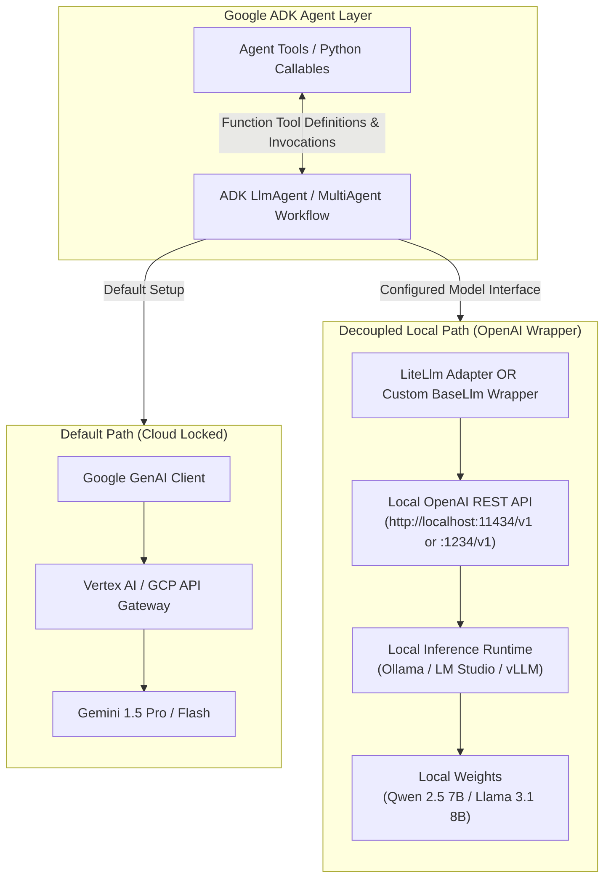
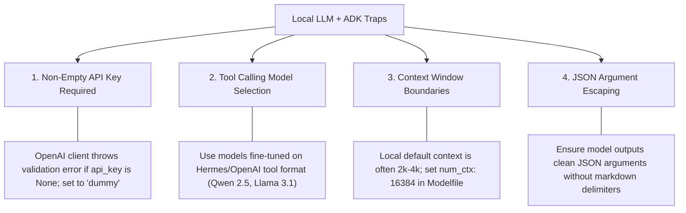

# Case Study 03: Connecting Google ADK Agents to Local LLMs via OpenAI-Compatible Wrappers

> **Core Focus**: Decoupling Google Agent Development Kit (ADK) from Google Cloud Vertex AI / Google AI Studio by routing agent reasoning and tool-calling execution to local LLM engines (Ollama, LM Studio, vLLM) via OpenAI-compatible API wrappers and ADK's `BaseLlm` abstraction.

---

## 1. Executive Summary & Context

The **Google Agent Development Kit (ADK)** (`google-adk`) is a code-first, open-source framework designed by Google for building, testing, and orchestrating multi-agent systems and autonomous tool-using agents. 

### The Default Behavior & The Friction
By default, Google ADK agents are configured out-of-the-box to route prompts, reasoning chains, and function calls through Google's Gemini ecosystem:
1. **Google Cloud Vertex AI** (requiring GCP credentials, `GOOGLE_CLOUD_PROJECT`, and billing accounts).
2. **Google AI Studio API** (requiring `GEMINI_API_KEY`).

While ideal for enterprise cloud deployments, developers building private, air-gapped, zero-cost, or offline agentic architectures face a key challenge: **How do you keep Google ADK's powerful multi-agent primitives, workflow state machines, and evaluation harnesses while running 100% privately against locally hosted open-weight models (e.g., Llama 3.1, Qwen 2.5, DeepSeek-R1)?**

### The Architectural Opportunity
Most modern local inference engines—such as **Ollama**, **LM Studio**, and **vLLM**—expose an **OpenAI-compatible REST API** (e.g., `http://localhost:11434/v1` or `http://localhost:1234/v1`). 

Because Google ADK was architected with a decoupled runtime interface (`BaseLlm`), developers can bridge Google ADK agents to local LLMs via:
1. **Built-in `LiteLlm` Adapter** (`google.adk.models.lite_llm.LiteLlm`): Native translation layer supported directly in ADK.
2. **Custom OpenAI `BaseLlm` Provider**: A lightweight wrapper subclassing ADK's `BaseLlm` that speaks directly to local OpenAI endpoints using the official `openai` SDK.

---

## 2. Architecture: Cloud vs. Local Inference Flow



---

## 3. Fact-Checking & Premise Validation

| Premise / Question | Status | Details & Nuance |
|---|---|---|
| **"By default Google ADK connects with Vertex or GCP"** | **Accurate (with nuance)** | By default, ADK targets Gemini models. If no custom model provider is supplied, it attempts to authenticate via Vertex AI (using GCP environment variables) or Gemini API Studio (`GEMINI_API_KEY`). However, ADK's core engine was intentionally decoupled from Gemini to remain model-agnostic. |
| **"Using OpenAI wrappers to connect Google ADK agents to local LLM"** | **Valid & Achievable** | Local runners (Ollama, LM Studio, vLLM) implement the `/v1/chat/completions` specification. ADK provides the `LiteLlm` bridge, and also allows custom implementations of `BaseLlm` using the `openai` client. |
| **Tool / Function Calling Caveat** | **Critical Gotcha** | Google ADK agents rely on structured tool definitions. The chosen local model must natively support OpenAI-compatible tool/function calling (e.g., `qwen2.5:7b-instruct`, `llama3.1:8b-instruct`), otherwise the agent will hallucinate tool outputs as plain text. |

---

## 4. Step-by-Step Implementation Guide

### Step 1: Prepare the Local LLM Server

Ensure your local model server is running and exposes an OpenAI-compatible endpoint with function-calling support.

#### Option A: Using Ollama
```bash
# Pull a model with robust function calling capabilities
ollama run qwen2.5:7b-instruct
# Or
ollama run llama3.1:8b-instruct
```
*Endpoint*: `http://localhost:11434/v1`

#### Option B: Using LM Studio
1. Load a tool-compatible model (e.g., `Qwen2.5-7B-Instruct-GGUF` or `Meta-Llama-3.1-8B-Instruct-GGUF`).
2. Start the Local Inference Server on port `1234`.
*Endpoint*: `http://localhost:1234/v1`

---

### Step 2: Method 1 — Native `LiteLlm` Adapter (Recommended)

Google ADK provides first-class support for `LiteLlm`, which handles mapping messages, schemas, and tool calling directly.

#### 1. Install Dependencies
```bash
pip install google-adk litellm
```

#### 2. Agent Implementation
```python
import os
from google.adk.agents import LlmAgent
from google.adk.models.lite_llm import LiteLlm
from google.adk.tools import FunctionTool

# 1. Define a tool for the agent
def get_system_metrics(resource: str) -> str:
    """Returns local system metrics for CPU, RAM, or Disk."""
    metrics = {
        "cpu": "12% utilization across 16 cores",
        "ram": "14.2 GB used of 32 GB",
        "disk": "420 GB free of 1 TB NVMe SSD"
    }
    return metrics.get(resource.lower(), f"Unknown resource '{resource}'.")

# Wrap as ADK FunctionTool
metrics_tool = FunctionTool(get_system_metrics)

# 2. Configure Local Model via LiteLlm wrapper
# Note: For Ollama, the model name format is "ollama_chat/<model_name>" or "openai/<model_name>"
local_model = LiteLlm(
    model="openai/qwen2.5:7b-instruct",
    api_base="http://localhost:11434/v1",
    api_key="dummy-key-for-local"  # Required by OpenAI client validation
)

# 3. Instantiate Google ADK Agent
agent = LlmAgent(
    name="LocalDiagnosticsAgent",
    instruction="You are a system diagnostics agent. Use the get_system_metrics tool to answer queries.",
    model=local_model,
    tools=[metrics_tool]
)

# 4. Run the Agent
if __name__ == "__main__":
    prompt = "Check how much free disk space and RAM we currently have."
    print(f"User: {prompt}\n")
    
    response = agent.run(prompt)
    print(f"Agent Response:\n{response.text}")
```

---

### Step 3: Method 2 — Custom OpenAI `BaseLlm` Wrapper (Full Control)

If you want zero intermediate translation layers and complete control over the OpenAI payload, subclass `BaseLlm` directly.

#### 1. Implementation of Custom Wrapper
```python
import json
from typing import Any, Dict, List, Optional
from openai import OpenAI
from google.adk.models import BaseLlm
from google.adk.types import ModelResponse, FunctionCall

class LocalOpenAILlm(BaseLlm):
    """Custom Google ADK BaseLlm implementation connecting directly to a local OpenAI endpoint."""

    def __init__(
        self,
        model_name: str,
        base_url: str = "http://localhost:11434/v1",
        api_key: str = "local-not-needed",
        temperature: float = 0.2
    ):
        super().__init__()
        self.model_name = model_name
        self.temperature = temperature
        self.client = OpenAI(base_url=base_url, api_key=api_key)

    def generate_content(
        self,
        messages: List[Dict[str, Any]],
        tools: Optional[List[Any]] = None,
        **kwargs
    ) -> ModelResponse:
        """Translates ADK message & tool schemas to OpenAI format and executes request."""
        
        # 1. Format tools for OpenAI function calling
        openai_tools = None
        if tools:
            openai_tools = []
            for t in tools:
                openai_tools.append({
                    "type": "function",
                    "function": {
                        "name": t.name,
                        "description": t.description or "",
                        "parameters": t.parameters_schema
                    }
                })

        # 2. Invoke local LLM
        response = self.client.chat.completions.create(
            model=self.model_name,
            messages=messages,
            tools=openai_tools,
            temperature=self.temperature,
            **kwargs
        )

        choice = response.choices[0].message
        
        # 3. Parse tool calls if generated by the model
        function_calls = []
        if choice.tool_calls:
            for tc in choice.tool_calls:
                function_calls.append(
                    FunctionCall(
                        name=tc.function.name,
                        args=json.loads(tc.function.arguments)
                    )
                )

        # 4. Return standard ADK ModelResponse
        return ModelResponse(
            text=choice.content or "",
            function_calls=function_calls,
            raw_response=response
        )
```

#### 2. Using the Custom Wrapper in an Agent
```python
from google.adk.agents import LlmAgent

# Initialize custom provider pointing to LM Studio or Ollama
custom_local_llm = LocalOpenAILlm(
    model_name="qwen2.5:7b-instruct",
    base_url="http://localhost:11434/v1"
)

agent = LlmAgent(
    name="PrivateLocalAgent",
    instruction="You are a secure, privacy-first enterprise assistant running on local hardware.",
    model=custom_local_llm
)
```

---

## 5. Critical Traps & Best Practices



1. **Dummy API Key**: Even though local endpoints do not authenticate requests, the `openai` Python client requires a non-empty string. Always pass `api_key="local"` or `api_key="dummy"`.
2. **Model Selection for Agent Trajectories**: Not all open weights handle tool-calling arguments reliably. Models with verified function calling accuracy:
   - `qwen2.5:7b-instruct` / `qwen2.5:14b-instruct` (exceptional tool adherence)
   - `llama3.1:8b-instruct` / `llama3.1:70b-instruct`
   - `mistral-nemo:12b`
3. **Context Window Expansion**: By default, Ollama initializes models with a 2,048 token window unless specified. When running multi-step agent trajectories with system prompts and tool schemas, set `num_ctx` to at least 16,384 in your Modelfile or LiteLLM extra parameters.

---

## 6. Summary & Takeaways

- **Is the user correct?** Yes. By default, Google ADK binds to Gemini via Vertex AI / Google AI Studio.
- **Can it run locally?** Yes. Google ADK is decoupled by design.
- **The cleanest path**: Using `LiteLlm` (`from google.adk.models.lite_llm import LiteLlm`) gives zero-boilerplate access to Ollama, LM Studio, or vLLM while preserving all ADK multi-agent orchestration, state management, and evaluation tooling.
