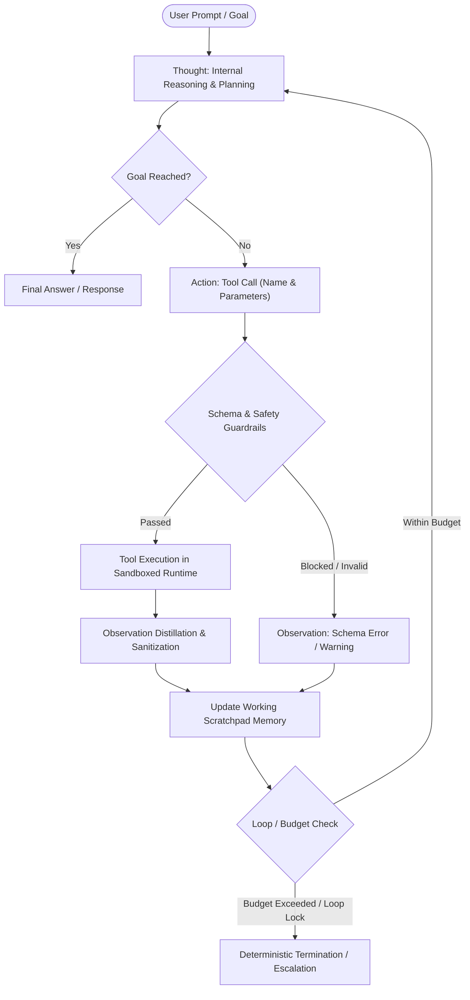
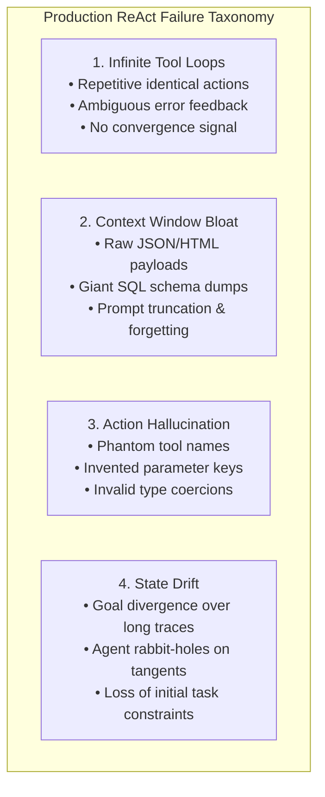
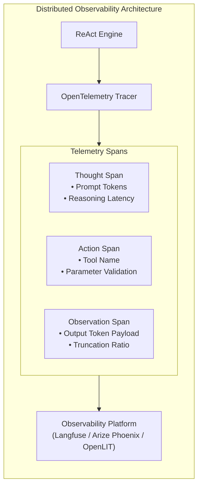

# Case Study 04: Resilient ReAct Production Architecture & Engineering Blueprint

> **Core Focus**: Designing an enterprise-grade ReAct (Reasoning + Acting) autonomous system—mitigating infinite tool loops, context window bloat, action hallucinations, and state drift via trajectory fingerprinting, dual-tier memory, and deterministic guardrails.

---

## 1. Executive Summary & Context

The **`prethiv/Agentic-AI-Case-studies`** repository focuses on applied Agentic AI patterns—transitioning from single-prompt LLMs to autonomous systems that perform multi-step reasoning, environment interaction, and workflow automation (such as unstructured document intelligence, data transformation pipelines, and task-specific tooling).

In modern agentic architectures, the foundational engine driving autonomous capabilities is the **ReAct (Reasoning + Acting)** paradigm. While laboratory prototypes can function with naive while-loops and raw LLM text generation, production systems face stringent reliability, latency, cost, and safety requirements. 

This case study provides an in-depth architectural breakdown and end-to-end production solutioning blueprint for building reliable, resilient, and enterprise-grade ReAct systems.

---

## 2. Architectural Foundations: The ReAct Paradigm

Introduced by Yao et al. (2022), **ReAct** interleaves reasoning traces (`Thought`) with task-specific external tool executions (`Action`) and sensory feedback (`Observation`).

```
           +---------------------------------------------------+
           |                     User Prompt                   |
           +---------------------------------------------------+
                                     |
                                     v
                       +---------------------------+
         +------------>| Thought (Internal State)  |<------------+
         |             +---------------------------+             |
         |                           |                           |
         |                           v                           |
         |             +---------------------------+             |
         |             | Action (Tool Invocation)  |             |
         |             +---------------------------+             |
         |                           |                           |
         |                           v                           |
         |             +---------------------------+             |
         +-------------| Observation (Tool Output) |             |
   (Next Step Loop)    +---------------------------+             |
                                     |                           |
                                     v                           |
                            Goal Reached? --- No ----------------+
                                     |
                                    Yes
                                     |
                                     v
                        +-------------------------+
                        |      Final Response     |
                        +-------------------------+
```



### Why ReAct Outperforms Isolated Alternatives

```mermaid
quadrantChart
    title Reasoning Depth vs. Environmental Grounding
    x-axis Low Environmental Grounding --> High Environmental Grounding
    y-axis Low Deliberation / Reasoning --> High Deliberation / Reasoning
    quadrant-1 ReAct (Balanced & Adaptive)
    quadrant-2 Pure Chain-of-Thought (CoT)
    quadrant-3 Zero-Shot Single Prompt
    quadrant-4 Direct Tool-Use / Action-Only
    "Zero-Shot Direct Prompt": [0.15, 0.20]
    "Pure Chain-of-Thought (CoT)": [0.25, 0.85]
    "Direct Tool Calling (Action-Only)": [0.85, 0.25]
    "ReAct (Reasoning + Acting)": [0.85, 0.88]
```

* **Vs. Pure Chain-of-Thought (CoT):** CoT lacks grounded truth; it hallucinates facts and cannot retrieve updated context or manipulate external state.
* **Vs. Direct Tool-Use / Function Calling (Action-Only):** Direct execution lacks explicit deliberation. When an API call returns an unexpected error, Action-only models struggle to backtrack or adapt their strategy dynamically.

---

## 3. Core Failure Modes in Production ReAct Systems

When deploying ReAct agents beyond prototypes, systems encounter distinct operational bottlenecks:



| Bottleneck | Root Cause | Impact | Mitigation Pattern |
| :--- | :--- | :--- | :--- |
| **Infinite Tool Loops** | Agent repeats identical action/arguments after ambiguous observations. | High token cost, latency spikes, request timeouts. | **Trajectory Fingerprinting** (MD5 action hashing) & deterministic repetition guards. |
| **Context Window Bloat** | Tool outputs (e.g., raw HTML, entire SQL schemas) overwhelm the prompt. | Truncation of initial reasoning, degraded coherence. | **Observation Distillation** (sub-token parsers, schema filters, 1500-char truncation). |
| **Action Hallucination** | Model invents tools or parameter keys not present in the tool catalog. | Runtime schema validation failures, aborted tasks. | Strict **Pydantic / JSON Schema** validation & schema injection in system prompt. |
| **State Drift** | Lengthy trajectories dilute the primary goal; agent wanders into tangential tasks. | Reduced Task Completion Rate (TCR), goal abandonment. | **Dual-Tier Memory** (anchored task objective + pruned working scratchpad). |

---

## 4. Production Architecture Blueprint

To mitigate these risks, production solutioning requires a modular, layered architecture around the core ReAct loop:

```
+-----------------------------------------------------------------------------------+
|                                Client Application                                 |
+-----------------------------------------------------------------------------------+
                                         │
                                         ▼
+───────────────────────────────────────────────────────────────────────────────────+
|                                API Gateway & Auth                                 |
+───────────────────────────────────────────────────────────────────────────────────+
                                         │
                                         ▼
+───────────────────────────────────────────────────────────────────────────────────+
|                         AGENT RUNTIME & ORCHESTRATION                             |
|                                                                                   |
|  ┌─────────────────────┐    ┌──────────────────────┐    ┌──────────────────────┐  |
|  | Context Controller  |    |  Planning / Router   |    | ReAct Loop Engine    |  |
|  | (Pruner / Summarizer|───>|  (Hierarchical /     |───>| (Thought-Action-Obs  |  |
|  |  Scratchpad Memory) |    |   Sub-goal Splitter) |    |  State Machine)      |  |
|  └─────────────────────┘    └──────────────────────┘    └──────────────────────┘  |
+───────────────────────────────────────────────────────────────────────────────────+
                                         │
                   ┌─────────────────────┴─────────────────────┐
                   ▼                                           ▼
+───────────────────────────────────────+   +───────────────────────────────────────+
|            TOOL EXECUTION             |   |        PERSISTENCE & OBSERVABILITY    |
|                                       |   |                                       |
|  • Sandboxed Python / Bash Execution  |   |  • Graph State Checkpointer           |
|  • Enterprise DB / Vector Store RAG   |   |  • Trajectory Logs (OpenTelemetry)    |
|  • External APIs / Web Scrapers       |   |  • Human-in-the-Loop (HITL) Queue     |
|  • Guardrail Interceptor (Validation) |   |  • Token & Latency Budget Guards      |
+───────────────────────────────────────+   +───────────────────────────────────────+
```

### Key Subsystems

#### 1. Dual-Tier Memory & Scratchpad Management
* **Working Memory:** Contains the anchored task objective, current plan step, and active scratchpad (`Thought -> Action -> Observation`).
* **Episodic Memory:** Checkpointed state snapshots (e.g., using Redis, SQLite, or PostgreSQL) to allow rollbacks, historical retrospectives, and human-in-the-loop pauses.
* **Observation Distillation:** Every raw tool output passes through a parser or mini-summarizer before re-entering the prompt (e.g., extracting 3 relevant fields from a 20KB JSON payload, sanitizing ANSI escapes, and truncating strings beyond safe bounds).

#### 2. Tool Execution Isolation & Guardrails
* Tools are registered with strict **Pydantic / JSON Schema** specifications.
* **Read-only vs. State-Mutating actions:** Non-reversible mutations (e.g., `DELETE`, `TRANSFER_FUNDS`, `COMMIT_CODE`, `DROP_TABLE`) require a suspension checkpoint and approval via a **Human-in-the-Loop (HITL)** queue.
* **Execution Sandboxing:** Unsafe scripts (Python, Bash) are executed in ephemeral containers (Docker/gVisor/Wasm) with restricted network and filesystem access.

#### 3. Deterministic Termination & Guardrail Interceptors
* **Maximum Iteration Threshold:** Hard stop (e.g., $N=8$ or $N=10$) preventing run-away token spend.
* **Trajectory Fingerprinting:** Hash `(Action, Action_Input)`. If an exact match occurs twice consecutively, inject an explicit error directive:
  > *"System Warning: Detected repetitive tool loop with identical parameters. Re-evaluate your assumptions or formulate a different approach."*

---

## 5. Implementation Pattern: Resilient ReAct Engine

Below is an enterprise-grade async implementation demonstrating strict state control, tool validation, cycle detection, and observation sanitization:

```python
import json
import hashlib
import asyncio
from typing import Callable, Dict, Any, List, Optional
from pydantic import BaseModel, Field

class AgentState(BaseModel):
    """Encapsulates the state and trajectory of an autonomous ReAct execution."""
    task: str
    scratchpad: List[Dict[str, Any]] = Field(default_factory=list)
    action_hashes: List[str] = Field(default_factory=list)
    iterations: int = 0
    max_iterations: int = 8
    is_complete: bool = False
    final_output: str = ""

class ToolRegistry:
    """Manages tool registration, JSON schema definitions, and safe execution."""
    def __init__(self):
        self._tools: Dict[str, Callable] = {}
        self._schemas: Dict[str, dict] = {}

    def register(self, name: str, schema: dict, func: Callable):
        self._tools[name] = func
        self._schemas[name] = schema

    def get_catalog(self) -> Dict[str, dict]:
        return self._schemas

    async def execute(self, name: str, params: dict) -> str:
        if name not in self._tools:
            return f"Error: Tool '{name}' does not exist. Available tools: {list(self._tools.keys())}"
        try:
            func = self._tools[name]
            if asyncio.iscoroutinefunction(func):
                result = await func(**params)
            else:
                result = func(**params)
            
            # Truncate and sanitize output to protect the context window
            return str(result)[:1500]
        except Exception as e:
            return f"Execution Error in '{name}': {type(e).__name__} - {str(e)}"

class ReActOrchestrator:
    """Production-grade ReAct Orchestration engine with loop detection and guardrails."""
    def __init__(self, llm_client, tools: ToolRegistry):
        self.llm = llm_client
        self.tools = tools

    async def run(self, task: str) -> str:
        state = AgentState(task=task)

        while not state.is_complete and state.iterations < state.max_iterations:
            state.iterations += 1
            
            # 1. Generate Thought & Action
            prompt = self._construct_prompt(state)
            step_output = await self.llm.generate(prompt)
            parsed_step = self._parse_llm_response(step_output)

            # 2. Check for task completion
            if parsed_step.get("final_answer"):
                state.final_output = parsed_step["final_answer"]
                state.is_complete = True
                break

            action_name = parsed_step.get("action")
            action_input = parsed_step.get("action_input", {})
            thought = parsed_step.get("thought", "")

            # 3. Cycle Detection via Trajectory Fingerprinting
            action_signature = f"{action_name}:{json.dumps(action_input, sort_keys=True)}"
            action_hash = hashlib.md5(action_signature.encode()).hexdigest()

            if state.action_hashes.count(action_hash) >= 2:
                observation = (
                    "System Warning: Detected repetitive tool loop with identical arguments. "
                    "Re-evaluate assumptions, modify parameters, or formulate a new strategy."
                )
            else:
                state.action_hashes.append(action_hash)
                # 4. Tool Action Execution with Sandboxing
                observation = await self.tools.execute(action_name, action_input)

            # 5. Append trajectory to working scratchpad
            state.scratchpad.append({
                "thought": thought,
                "action": action_name,
                "input": action_input,
                "observation": observation
            })

        if not state.is_complete:
            state.final_output = (
                f"Task terminated: Exceeded iteration budget ({state.max_iterations} steps) "
                "before reaching definitive resolution."
            )
            
        return state.final_output

    def _construct_prompt(self, state: AgentState) -> str:
        # Formats task objective, tool schema catalog, and structured history
        return (
            f"Objective: {state.task}\n\n"
            f"Available Tools:\n{json.dumps(self.tools.get_catalog(), indent=2)}\n\n"
            f"Scratchpad History:\n{json.dumps(state.scratchpad, indent=2)}\n\n"
            "Format your response as valid JSON with keys:\n"
            "Either: {'thought': '...', 'action': '...', 'action_input': {...}}\n"
            "Or:     {'thought': '...', 'final_answer': '...'}"
        )

    def _parse_llm_response(self, response: str) -> dict:
        try:
            # Clean possible markdown wrapping
            cleaned = response.strip()
            if cleaned.startswith("```json"):
                cleaned = cleaned[7:]
            if cleaned.startswith("```"):
                cleaned = cleaned[3:]
            if cleaned.endswith("```"):
                cleaned = cleaned[:-3]
            return json.loads(cleaned.strip())
        except Exception as e:
            return {
                "thought": "Failed to parse structured JSON response from model.",
                "action": "unknown",
                "action_input": {},
                "error": f"JSONDecodeError: {str(e)}"
            }
```

---

## 6. Production Observability & Evaluation

Continuous maintenance and regression testing of production ReAct systems requires tracking three key metric categories:

```
┌────────────────────────────────────────────────────────┐
│               AGENT EVALUATION METRICS                 │
├────────────────────────┬───────────────────────────────┤
│ Trajectory Efficiency  │ Steps to resolution vs.       │
│                        │ theoretical minimum           │
├────────────────────────┼───────────────────────────────┤
│ Tool Call Accuracy     │ Valid argument rate (avoiding │
│                        │ schema validation errors)     │
├────────────────────────┼───────────────────────────────┤
│ Recovery Rate          │ % of successful recoveries    │
│                        │ after an error observation    │
├────────────────────────┼───────────────────────────────┤
│ Task Completion Rate   │ % of tasks correctly resolved │
│ (TCR)                  │ within iteration & cost caps  │
└────────────────────────┴───────────────────────────────┘
```



### Key Practices

1. **Distributed Tracing (OpenTelemetry)**:
   - Wrap every `Thought`, `Action`, and `Observation` step into an OpenTelemetry span.
   - Tag attributes: `tool.name`, `tool.input_hash`, `agent.iteration`, `agent.token_usage`, `agent.scratchpad_size`.
   - Monitor real-time trajectory watermarks to catch anomalous infinite loops or sudden latency anomalies before they impact end-user SLAs.

2. **Golden Trajectory Benchmarking**:
   - Maintain a curated suite of end-to-end benchmark tasks.
   - Validate agent candidate versions against deterministic assertions (e.g., verifying final database state or exact API parameter matching) rather than non-deterministic semantic similarity.
   - Establish automated pull request gates as formulated in [Case Study 01: Agentic Evaluation Pattern](file:///c:/Users/preth/Documents/Agentic-AI-Case-studies/case-studies/01-agentic-evaluation-pattern/README.md).

---

## 7. Comparative Blueprint: Enterprise vs. Naive ReAct

| Architectural Dimension | Naive Prototype ReAct | Enterprise Production ReAct |
| :--- | :--- | :--- |
| **Execution Loop** | Unbounded `while True` loop | Bounded iteration budget ($N \le 8$) with early cycle break |
| **Repetition Handling** | None; easily locks in circular retries | **Trajectory Fingerprinting** (MD5 signature hashing) |
| **Tool Execution** | In-process synchronous calls | Sandboxed asynchronous runtime with isolation |
| **Observation Context** | Raw strings appended directly | Observation distillation, token pruning & sanitization |
| **High-Risk Operations** | Unchecked write/delete executions | **Human-in-the-Loop (HITL)** approval gating |
| **Observability** | `print()` statements to standard console | OpenTelemetry distributed tracing & trajectory metrics |
| **Model Portability** | Hardcoded vendor SDK calls | Abstracted model provider / OpenAI-compatible wrapper |

---

## 8. Related Case Studies & Architectural Synergy

- [Case Study 01: Agentic Evaluation & CI/CD Integration Pattern](file:///c:/Users/preth/Documents/Agentic-AI-Case-studies/case-studies/01-agentic-evaluation-pattern/README.md) - Testing trajectory efficiency, tool call accuracy, and LLM-as-a-judge gates.
- [Case Study 02: Context Compaction & RAG Memory Pattern](file:///c:/Users/preth/Documents/Agentic-AI-Case-studies/case-studies/02-context-compaction-rag-memory/README.md) - Pruning scratchpads and entity compaction for memory-constrained models.
- [Case Study 03: Google ADK to Local LLMs via OpenAI Wrappers](file:///c:/Users/preth/Documents/Agentic-AI-Case-studies/case-studies/03-google-adk-local-llm-wrapper/README.md) - Decoupling orchestration frameworks from cloud-locked model backends.
