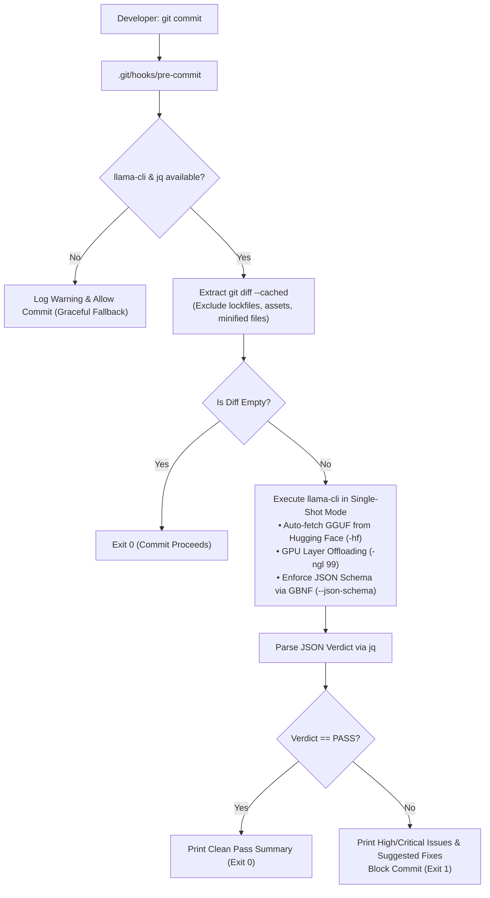
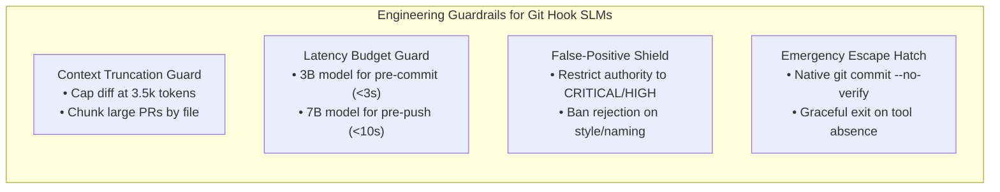

# Case Study 06: SLM-as-a-Judge via Git Pre-Hooks & Zero-Daemon `llama-cli`

> **Core Focus**: Implementing local, intelligent code review and semantic sanity checks on edge developer workstations via Git pre-commit and pre-push hooks using Small Language Models (e.g., Qwen 2.5-Coder 3B/7B, Phi-3.5-mini) with zero-daemon `llama-cli` auto-bootstrapping and native JSON Schema-to-GBNF grammar enforcement.

---

## 1. Executive Summary & Context

Modern software engineering relies heavily on two extremes of code validation:
1. **Deterministic Static AST Linters** (ESLint, Ruff, Flake8, Prettier): Fast (<100ms) and rigid, but fundamentally blind to semantics, business logic violations, security anti-patterns, or contextual flaws.
2. **Cloud-Hosted Frontier AI Code Reviewers** (GitHub Copilot PR Reviewer, Sonnet 3.5, GPT-4o): Semantically powerful, but expensive, high-latency (10–45s per PR), requiring third-party WAN network hops, and incapable of preventing bad code from being committed locally in the first place.

Deploying **Small Language Models (SLMs)** locally on edge developer machines (Apple Silicon M-series, Linux/WSL workstations, or CI gateway nodes) as an automated **"SLM-as-a-Judge"** via Git hooks bridges this divide.

```
                  ┌────────────────────────────────────────────────────────┐
                  │              THE CODE REVIEW SPECTRUM                  │
                  ├──────────────────────┬─────────────────────────────────┤
                  │ Deterministic Linters│ Rigid, AST-based, fast (<100ms),│
                  │ (ESLint, Ruff)       │ blind to intent or logic.       │
                  ├──────────────────────┼─────────────────────────────────┤
                  │ Local SLM Judge      │ Semantic, intent-aware, offline,│
                  │ (Qwen 2.5-Coder 3B)  │ zero-cost, sub-3s via llama-cli.│
                  ├──────────────────────┼─────────────────────────────────┤
                  │ Cloud Frontier LLMs  │ Broad reasoning, but high cost, │
                  │ (GPT-4o, Sonnet 3.5) │ WAN latency, data privacy leaks.│
                  └──────────────────────┴─────────────────────────────────┘
```

By leveraging standalone **`llama-cli`** rather than background server daemons (like Ollama), developers avoid daemon memory leaks, inter-process HTTP overhead, and manual model distribution.

---

## 2. Architecture: Local Pre-Commit & Pre-Push Interceptor

The Git hook intercepts commits locally, extracts staged diffs, filters out generated artifacts, executes a single-shot inference pass via `llama-cli` constrained by a JSON schema, and either passes or aborts the commit with actionable line-by-line feedback:

```
+-------------------------------------------------------------------------+
| Local Workstation / Developer Environment                               |
|                                                                         |
|  [git commit]                                                           |
|        │                                                                |
|        ▼                                                                |
|  [pre-commit hook] ───► git diff --cached                               |
|        │                                                                |
|        ▼                                                                |
|  [Diff Filter] ───────► Discard lockfiles, assets, minified bundles     |
|        │                                                                |
|        ▼                                                                |
|  [Context Packer] ────► Diff + AST skeleton / repo rules / rubric       |
|        │                                                                |
|        ▼                                                                |
|  [Local SLM Engine] ──► llama-cli (Standalone Binary)                   |
|                         (Qwen 2.5-Coder 3B / Phi-3.5 3.8B Q4_K_M)       |
|        │                                                                |
|        ▼                                                                |
|  [JSON Output Parser] ─► Validates structured verdict                   |
|        │                                                                |
|        ├── Pass  ────────► Commit proceeds cleanly                      |
|        └── Reject ───────► Non-zero exit + inline diff suggestions      |
+-------------------------------------------------------------------------+
```



---

## 3. High-Impact SLM Judge Use Cases

Unlike deterministic linters checking syntax tokens, an on-device SLM evaluator targets semantic and contextual intent:

| Focus Area | Failure Mode Caught by SLM Judge | Why AST Linters Miss It |
| :--- | :--- | :--- |
| **Semantic Logic & Edge Cases** | Off-by-one bounds, missing `await` inside loop contexts, unhandled null return values. | Syntactically valid Python/TypeScript code that compiles cleanly but crashes at runtime. |
| **Contextual Secret Leaks** | Obfuscated API tokens, high-entropy variable assignments, private internal endpoints. | Regex scanners rely on rigid token prefixes (`ghp_`, `AKIA`) and miss custom credentials. |
| **API Migration Enforcement** | Developer re-introduces deprecated internal helper functions rather than new standard utilities. | Deprecated methods still exist in the repository; only semantic intent identifies misuse. |
| **Unit Test Sanity** | Assertion-free "happy path" tests written purely to inflate line coverage metrics. | Coverage tools verify lines executed, not whether outputs are meaningfully asserted. |
| **Commit Message Fidelity** | Commit message claims *"fix: database connection leak"* while diff modifies frontend CSS. | Git ignores commit message semantics relative to staged changes. |

---

## 4. Recommended Models & Quantization for Developer Machines

A pre-commit hook must complete within **under 3 to 4 seconds**. If latency exceeds 5 seconds, developer ergonomics degrade, leading to routine `--no-verify` hook bypasses:

| Model Architecture | Quantization | RAM Footprint | Inference Speed (Apple M-series / RTX 4070) | Recommended Hook Placement |
| :--- | :--- | :--- | :--- | :--- |
| **Qwen 2.5-Coder 3B** | **Q4_K_M** | **~2.2 GB** | **65–95 tok/s** | **Pre-Commit (Sub-2.5s review)** |
| **Qwen 2.5-Coder 7B** | Q4_K_M / Q8 | ~4.8 GB | 32–52 tok/s | Pre-Push / Branch Release Gate |
| **Phi-3.5-mini (3.8B)** | Q4_K_M | ~2.6 GB | 55–75 tok/s | Pre-Commit (Strict rule adherence) |
| **DeepSeek-Coder 6.7B** | Q4_K_M | ~4.5 GB | 30–45 tok/s | Pre-Push (Deep cross-file refactoring) |

---

## 5. Architectural Deep Dive: Why `llama-cli` Over Local Daemons (Ollama)

While background daemons (like Ollama or LocalAI) are convenient for conversational applications, Git hooks require **ephemeral, isolated, and zero-maintenance execution**:

```
+───────────────────────────────────────────────────────────────────────────────────+
|                           DAEMON VS. STANDALONE CLI COMPARISON                    |
+───────────────────────────────────────────────────────────────────────────────────+
| Metric / Feature           | Local Daemon (Ollama)       | Standalone (llama-cli)  |
+────────────────────────────┼─────────────────────────────┼─────────────────────────┤
| Process Lifetime           | Resident in background RAM  | Ephemeral (Runs & exits)|
| Memory Footprint at Rest   | 3GB-6GB idle VRAM/RAM       | 0 MB (Zero idle memory) |
| Cold Execution Overhead    | Inter-process HTTP socket   | Direct memory-mapped I/O|
| Dependency Management      | Requires system service     | Portable single binary  |
| Model Distribution         | `ollama pull` imperative    | Declarative `-hf` cache |
| Schema Enforcement         | JSON mode (best-effort)     | Native GBNF grammar mask|
+───────────────────────────────────────────────────────────────────────────────────+
```

### Key Advantages of `llama-cli`
1. **Zero Background RAM Waste**: Developers don't sacrifice 4GB of VRAM to an idle daemon while compiling or debugging.
2. **Declarative Hugging Face Streaming (`-hf`)**: Models are automatically fetched and cached in `~/.cache/llama.cpp` on the first hook trigger without manual pull steps.
3. **Hardware Grammar Masking (`--json-schema`)**: `llama-cli` converts JSON Schema draft-07 directly into a GGML Backus-Naur Form (GBNF) grammar at runtime, ensuring strict schema adherence.

---

## 6. End-to-End Implementation Blueprint

### Step 1: Strict JSON Evaluation Schema (`.git-hooks/schema.json`)

Define the deterministic evaluation rubric in the repository root at `.git-hooks/schema.json`:

```json
{
  "$schema": "http://json-schema.org/draft-07/schema#",
  "type": "object",
  "properties": {
    "verdict": {
      "type": "string",
      "enum": ["PASS", "REJECT"]
    },
    "summary": {
      "type": "string"
    },
    "issues": {
      "type": "array",
      "items": {
        "type": "object",
        "properties": {
          "file": { "type": "string" },
          "severity": { "type": "string", "enum": ["CRITICAL", "HIGH", "MEDIUM"] },
          "message": { "type": "string" },
          "suggested_fix": { "type": "string" }
        },
        "required": ["file", "severity", "message"],
        "additionalProperties": false
      }
    }
  },
  "required": ["verdict", "summary", "issues"],
  "additionalProperties": false
}
```

### Step 2: Self-Bootstrapping Pre-Commit Hook (`.git/hooks/pre-commit`)

Save the following executable shell script to `.git/hooks/pre-commit` (or version-control as `scripts/pre-commit` and symlink via `git config core.hooksPath`):

```bash
#!/usr/bin/env bash
set -eo pipefail

# ==============================================================================
# Edge SLM Pre-Commit Judge Hook
# Validates staged code diffs using Qwen 2.5-Coder 3B via standalone llama-cli
# ==============================================================================

# 1. Prerequisite Checks
if ! command -v llama-cli &>/dev/null; then
  echo -e "\033[0;33m[SLM-Judge] 'llama-cli' not found in PATH. Skipping intelligent check.\033[0m"
  exit 0
fi

if ! command -v jq &>/dev/null; then
  echo -e "\033[0;33m[SLM-Judge] 'jq' not found. Skipping intelligent check.\033[0m"
  exit 0
fi

# 2. Extract staged diff, discarding non-source files and build lockfiles
DIFF=$(git diff --cached --unified=3 \
  ':(exclude)*.lock' \
  ':(exclude)*.min.*' \
  ':(exclude)*.sum' \
  ':(exclude)*.svg' \
  ':(exclude)*.png' \
  ':(exclude)*.jpg' \
  ':(exclude)package-lock.json' \
  ':(exclude)yarn.lock')

# Bypass if only non-code files or assets were staged
if [ -z "$DIFF" ]; then
  exit 0
fi

# 3. Model Configuration (Auto-downloaded and cached by llama-cli)
MODEL_REPO="Qwen/Qwen2.5-Coder-3B-Instruct-GGUF"
MODEL_FILE="qwen2.5-coder-3b-instruct-q4_k_m.gguf"

# 4. JSON Schema Grammar Compilation
REPO_ROOT="$(git rev-parse --show-toplevel)"
SCHEMA_FILE="$REPO_ROOT/.git-hooks/schema.json"
SCHEMA_ARG=""
if [ -f "$SCHEMA_FILE" ]; then
  SCHEMA_ARG="--json-schema $(tr -d '\n ' < "$SCHEMA_FILE")"
fi

SYSTEM_PROMPT="You are an automated Git pre-commit code review judge.
Analyze the staged git diff. Check ONLY for:
1. Critical logic flaws, race conditions, concurrency bugs, or unhandled null/exception paths.
2. Leaked hardcoded secrets, private tokens, or environment keys.
3. Obvious breaking regressions or broken error handling.
Do NOT reject for stylistic formatting or variable naming.
Reject if any CRITICAL or HIGH severity security/logic issues exist; otherwise, PASS."

USER_PROMPT="Evaluate this staged git diff:

\`\`\`diff
$DIFF
\`\`\`"

echo -e "\033[0;34m[SLM-Judge] Running local diff evaluation via Qwen 2.5-Coder (llama-cli)...\033[0m"

# 5. Execute llama-cli
# -ngl 99: Offloads all layers to Metal / CUDA / Vulkan
# -c 4096: Limits context window to 4k tokens to protect memory
# --temp 0.0: Enforces deterministic greedy sampling
# --log-disable & --simple-io: Mutes banners and outputs clean JSON payload
RAW_OUTPUT=$(llama-cli \
  -hf "$MODEL_REPO:$MODEL_FILE" \
  -ngl 99 \
  -c 4096 \
  --temp 0.0 \
  -sys "$SYSTEM_PROMPT" \
  -p "$USER_PROMPT" \
  $SCHEMA_ARG \
  --log-disable \
  --simple-io \
  -n 512 2>/dev/null)

# 6. Parse structured verdict
VERDICT=$(echo "$RAW_OUTPUT" | jq -r '.verdict // empty' 2>/dev/null)

if [ "$VERDICT" = "REJECT" ]; then
  echo -e "\033[0;31m\n❌ [SLM-Judge] Commit rejected due to high-severity issues:\033[0m"
  echo -e "\033[1mSummary:\033[0m $(echo "$RAW_OUTPUT" | jq -r '.summary')"
  echo ""
  echo -e "\033[0;31mDetected Issues:\033[0m"
  echo "$RAW_OUTPUT" | jq -r '.issues[] | "  • [" + .severity + "] " + .file + ": " + .message'
  echo ""
  echo -e "\033[0;33mTo fix: Address the issues above, or bypass with: git commit --no-verify\033[0m\n"
  exit 1
fi

if [ "$VERDICT" = "PASS" ]; then
  echo -e "\033[0;32m✅ [SLM-Judge] Check passed: $(echo "$RAW_OUTPUT" | jq -r '.summary')\033[0m"
  exit 0
fi

# Fallback in case of parsing anomaly
echo -e "\033[0;33m[SLM-Judge] Non-standard model output detected. Allowing commit.\033[0m"
exit 0
```

### Step 3: Activation & Testing

```bash
# Ensure hook is executable
chmod +x .git/hooks/pre-commit

# Test hook against staged changes
git add src/auth.ts
git commit -m "feat: Add authentication refresh token handler"
```

---

## 7. Engineering Guardrails & Failure Mitigations



### 1. Context Window Overflows on Massive Diffs
- **Problem**: Staging 50 files or huge bundle outputs easily exceeds the 4k context window of small models.
- **Solution**: Always filter lockfiles (`package-lock.json`, `pnpm-lock.yaml`, `Cargo.lock`) and binary assets. For diffs exceeding 3,500 tokens, chunk evaluation file-by-file or escalate large diffs to pre-push.

### 2. Developer Friction & Latency Fatigue
- **Problem**: If hooks take $\gt 5$ seconds, developers habitually add `alias gc="git commit --no-verify"`, defeating the governance gate.
- **Solution**: Enforce strict hardware offloading (`-ngl 99`) and keep pre-commit models $\le 3\text{B}$ parameters. Reserve 7B/8B models for pre-push hooks where developers expect a brief network-like pause.

### 3. False-Positive Fatigue
- **Problem**: If the SLM blocks commits because it dislikes variable names or imports ordering, developer trust drops to zero.
- **Solution**: Specifically prompt the system instructions: *"Do NOT reject for stylistic preferences, code formatting, or naming conventions. Rejection authority is restricted strictly to breaking runtime flaws and leaked credentials."*

---

## 8. Comparative Matrix: Code Review Gates

| Dimension | Standard Linter (Ruff/ESLint) | Local SLM Hook (Qwen 2.5-Coder 3B) | Cloud AI Reviewer (Sonnet 3.5 / GPT-4o) |
| :--- | :--- | :--- | :--- |
| **Execution Trigger** | `pre-commit` (Instant) | `pre-commit` / `pre-push` (~2s) | PR Creation / CI Run (30s–2m) |
| **Context Awareness** | ❌ AST Token matching only | ✅ Semantic intent & diff understanding | ✅ Full repository comprehension |
| **Cost per Review** | 🟢 Zero | 🟢 Zero (Runs on developer silicon) | 🔴 $0.05–$0.30 per PR run |
| **Data Privacy** | 🟢 100% On-Device | 🟢 100% On-Device | 🔴 Code dispatched to cloud APIs |
| **Noise & Formatting** | 🟢 100% Deterministic | 🟢 Constrained by GBNF JSON Schema | 🟡 Highly verbose explanations |

---

## 9. Related Case Studies & Architectural Synergy

- [Case Study 01: Agentic Evaluation & CI/CD Integration Pattern](case-studies/01-agentic-evaluation-pattern/README.md) - Trajectory and LLM-as-a-judge gates integrated into continuous integration workflows.
- [Case Study 02: Context Compaction & RAG Memory Pattern](case-studies/02-context-compaction-rag-memory/README.md) - Pruning context windows and managing token saturation on local LLMs.
- [Case Study 05: Harnessing Small Language Models on Edge Devices](case-studies/05-slm-edge-device-harnessing/README.md) - Edge SLM runtime architectures, memory bandwidth constraints, and GBNF grammar enforcement.
