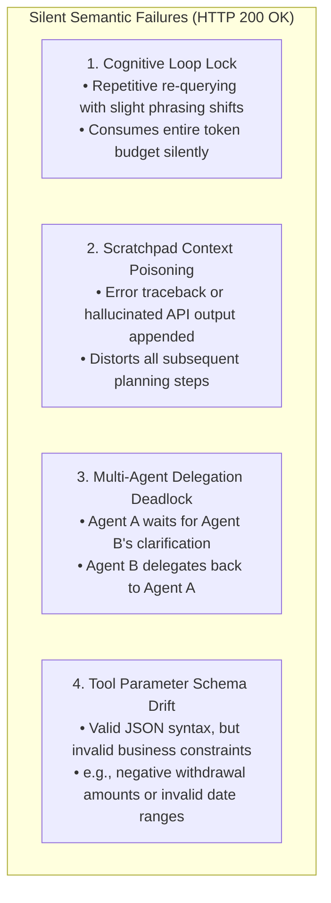
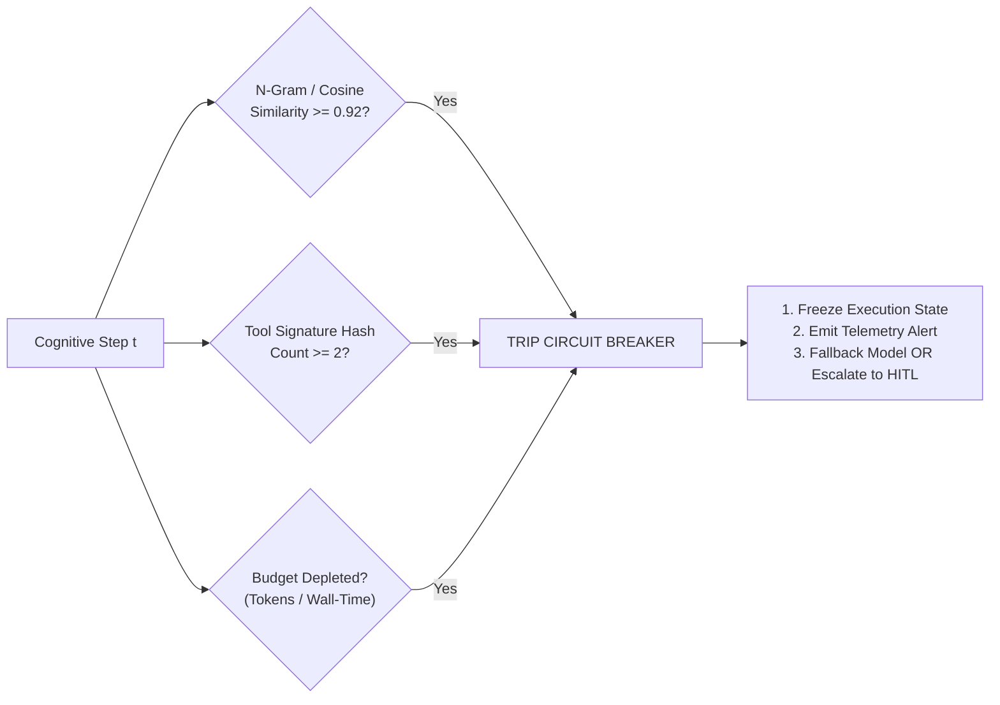
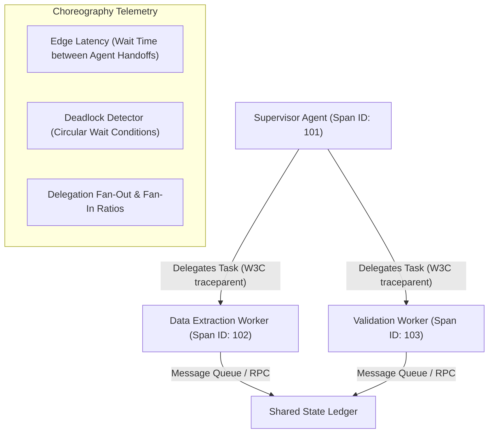
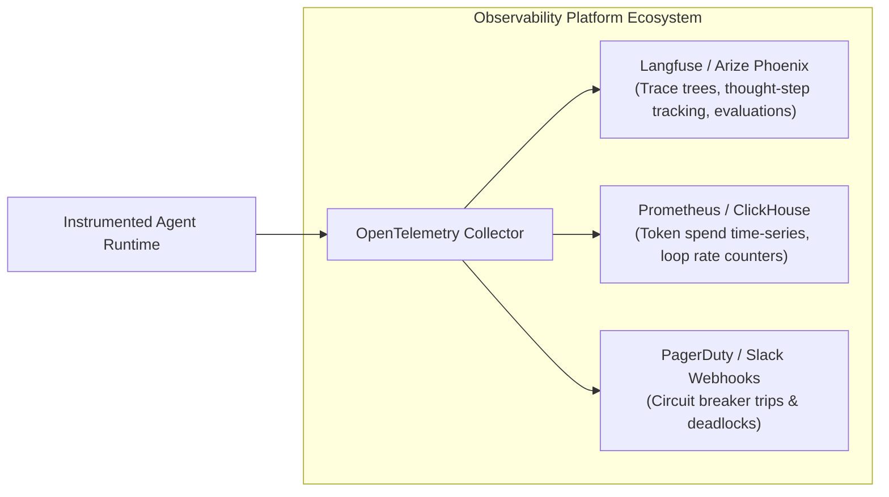

# Case Study 07: Semantic Observability & Telemetry Patterns for Autonomous AI Agents

> **Core Focus**: Transitioning from traditional APM infrastructure to semantic, cognitive-loop observability—implementing hierarchical span-trees (OpenTelemetry GenAI), event-sourced state-delta ledgers, budget-enforced circuit breakers, and asynchronous LLM-as-a-judge pipelines.

---

## 1. Executive Summary & Context

Traditional Application Performance Monitoring (APM) and network telemetry (HTTP 200/500 status codes, P99 latency, CPU utilization, and memory usage) fundamentally fail when monitoring Autonomous Agentic AI systems:

> **The Core Disconnect**: In an agentic system, **failures are semantic, not syntactic**. An agent runtime can return `200 OK` at the HTTP gateway while internally executing an infinite circular tool loop, hallucinating database parameter types, corrupting its working scratchpad memory, or leaking sensitive customer PII across agent handoffs.

```
┌───────────────────────────────────────────────────────────────────────────┐
│                     THE AGENTIC OBSERVABILITY GAP                         │
├──────────────────────────┬────────────────────────────────────────────────┤
│ Traditional Telemetry    │ Measures process health & network hops.        │
│ (Prometheus, Datadog)    │ Blind to reasoning, drift, and tool fidelity.  │
├──────────────────────────┼────────────────────────────────────────────────┤
│ Agentic Semantic Telemetry│ Measures cognitive intent, trajectory optimality,│
│ (OTel GenAI, Langfuse)   │ state drift, tool ground truth, and recursion. │
└──────────────────────────┴────────────────────────────────────────────────┘
```

This case study provides an architectural blueprint and reference implementation for production agentic observability—capturing the agent's internal cognitive loop without adding blocking in-band inference latency.

---

## 2. Core Failure Taxonomy: What Traditional APM Misses



---

## 3. Five Architectural Pillars of Agentic Telemetry

```
+───────────────────────────────────────────────────────────────────────────────────+
|                           THE 5 AGENTIC TELEMETRY PILLARS                         |
+───────────────────────────────────────────────────────────────────────────────────+
|  1. Hierarchical Semantic Spans    |  Tracks internal cognitive tree (Thought-Act) |
|  2. State-Delta Ledger             |  Event-sourced snapshots for replay & audit   |
|  3. Circuit Breaker & Loop Guards  |  Token budgets, iteration caps & loop halts   |
|  4. Async LLM-as-a-Judge Pipeline  |  Out-of-band faithfulness & grounding scoring |
|  5. Choreography Graph Tracing     |  W3C traceparent propagation across agents   |
+───────────────────────────────────────────────────────────────────────────────────+
```

### Pillar 1: Hierarchical Semantic Distributed Tracing (Span-Tree Pattern)
Traditional tracing tracks physical network hops between microservices. Agentic tracing must track the agent's **internal cognitive loop** across discrete reasoning and execution phases:

```
[Root Trace: Task Goal - "Reconcile Q3 Invoice Anomaly"]
  ├── [Span: Context Retrieval / Vector Search] (latency: 42ms, docs_returned: 4)
  ├── [Span: LLM Plan / Reason Step] (tokens: 380, model: "gemini-1.5-pro")
  ├── [Span: Tool Invocation: execute_sql]
  │     └── [Metadata: raw_args: {"query": "..."}, exit_code: 0, rows: 14]
  ├── [Span: LLM Reflection / Verification Step] (confidence: 0.94)
  └── [Span: Inter-Agent Delegation: Handoff to AuditorAgent]
        └── [Metadata: W3C traceparent: "00-4bf92f3577b34da6a3ce929d0e0e4736-..."]
```

#### OpenTelemetry GenAI Semantic Conventions
Telemetry must adhere to standardized OpenTelemetry attributes to ensure vendor neutrality:
* `gen_ai.system`: Identifier (e.g., `"openai"`, `"gemini"`, `"anthropic"`, `"llama_cpp"`).
* `gen_ai.request.model`: Underlying model ID (e.g., `"qwen2.5-coder-7b"`).
* `gen_ai.usage.prompt_tokens` & `gen_ai.usage.completion_tokens`: Granular token spend.
* `gen_ai.tool.name` & `gen_ai.tool.parameters`: Serialized execution payload.
* `gen_ai.agent.step_index`: Current ordinal position in the execution loop.

---

### Pillar 2: State-Delta Ledger & Memory Checkpointing

When an agent pollutes its own working scratchpad with malformed outputs, downstream reasoning degrades rapidly. 

* **Event-Sourced Delta Tracking**: Rather than saving only final state, log an immutable snapshot before and after each cognitive turn:

$$
\Delta \text{State} = \text{State}_{t+1} - \text{State}_t
$$

* **Tracked Metrics**:
  - Context Window Occupancy Ratio: $\frac{\text{Current Tokens}}{\text{Max Model Context Limit}}$
  - Scratchpad Churn: Number of tokens appended vs. pruned per iteration.
  - State Checkpoint Hash: Cryptographic hash of memory state to identify identical historical states.
* **Deterministic Time-Travel Replay**: By retaining serialized state snapshots at turn $t$, engineers can replay divergent executions with altered prompts, temperature adjustments, or mocked tool responses to diagnose hallucinations in staging.

---

### Pillar 3: Agentic Circuit Breakers & Loop Detection

Autonomous loops must have deterministic failsafes against infinite recursion and token runaway:



1. **Semantic Thought Convergence Sensor**: Computes cosine similarity between consecutive reasoning steps. If $\text{CosineSim}(\text{Thought}_t, \text{Thought}_{t-1}) \ge 0.92$, the agent is rationalizing in a circular loop.
2. **Tool Invocation Churn Sensor**: Hashes `(tool_name, tool_input)`. If an exact signature match repeats twice consecutively without environmental state changes, trigger an automated warning or hard halt.
3. **Hard Budget Enforcers**: Enforces strict telemetry limits on **Max Iterations** ($N \le 8$), **Total Token Expenditure**, and **Wall-Clock Duration** (e.g., $\lt 60\text{s}$).

---

### Pillar 4: Shadow Evaluation & Online LLM-as-a-Judge Pipeline

Because agentic outputs are non-deterministic, synthetic pre-deployment tests must be supplemented with continuous online shadow evaluation:

| Telemetry Target | Evaluation Metric | Implementation Mechanism |
| :--- | :--- | :--- |
| **Tool Calling Accuracy** | Valid Schema Rate ($\%$) | Pydantic validation interceptors emitting error count metrics. |
| **Reasoning Groundedness** | Faithfulness Score ($0.0–1.0$) | Asynchronous judge model comparing final claim against retrieved tool context. |
| **Trajectory Efficiency** | Step Optimality Ratio | $\frac{\text{Optimal Benchmark Steps}}{\text{Observed Steps}}$ based on reference golden paths. |
| **Safety & Policy Guardrails** | Violation Flag (Binary) | Asynchronous policy filter (e.g., Llama Guard 3, NeMo Guardrails). |

---

### Pillar 5: Multi-Agent Choreography Graph Observability

In multi-agent systems (hierarchical supervisor-worker or peer swarms), interface failures cause silent deadlocks:



- **W3C `traceparent` Propagation**: Every inter-agent message payload passing through message queues (Kafka, Redis, RabbitMQ, gRPC) must serialize and propagate standard distributed tracing headers.
- **Deadlock & Starvation Metrics**: Measure time-to-first-acknowledgment between specialized agents and alert if mutual waiting locks an interaction graph.

---

## 4. Production Architecture: In-Band vs. Out-of-Band Telemetry

To avoid degrading real-time agent execution latency, heavy semantic analysis must be separated from in-band execution:

```
[Agent Execution Runtime] ──(Non-Blocking OTel Queue)──► [Streaming AI Gateway]
                                                                  │
                             ┌────────────────────────────────────┴────────────────────────────────────┐
                             ▼                                                                         ▼
                   [In-Band Telemetry Store]                                                 [Async Semantic Worker]
                 (ClickHouse / Langfuse / OTel)                                            (LLM-as-a-Judge, PII Scrubber,
                             │                                                              Trajectory Efficiency)
                             │                                                                         │
                             └────────────────────────────► [Alerting Engine] ◄────────────────────────┘
                                                    (Budget Trips, Deadlocks, Loops)
```

1. **In-Band Path (Low-Latency, $\lt 2\text{ms}$)**: Emits lightweight OpenTelemetry spans, token usage counters, and latency measurements via asynchronous background threads.
2. **Out-of-Band Path (Deep Semantic Analysis, Asynchronous)**: Workers pull trace payloads from a queue (e.g., Redis Streams / Kafka) to run LLM-as-a-Judge grounding checks, verify PII compliance, and compute trajectory efficiency scores without blocking user-facing responses.

---

## 5. Implementation Pattern: Production Agentic Telemetry Harness

Below is a complete, runnable Python implementation featuring an OpenTelemetry semantic span hierarchy, state-delta ledger, and an integrated circuit breaker:

```python
import time
import json
import hashlib
from typing import Dict, Any, List, Optional
from pydantic import BaseModel, Field

# OpenTelemetry Tracing Primitives
from opentelemetry import trace
from opentelemetry.trace import Status, StatusCode

tracer = trace.get_tracer("agentic.telemetry.engine", "1.0.0")

class TelemetryBudget(BaseModel):
    """Enforces strict resource limits on agent execution."""
    max_iterations: int = 8
    max_total_tokens: int = 16384
    timeout_seconds: float = 60.0
    current_tokens: int = 0
    current_iterations: int = 0
    start_time: float = Field(default_factory=time.time)

class StateDeltaLedger:
    """Captures an event-sourced audit ledger of all scratchpad and memory mutations."""
    def __init__(self):
        self.history: List[Dict[str, Any]] = []

    def record_turn(self, turn_index: int, thought: str, action: str, observation: str) -> Dict[str, Any]:
        delta_entry = {
            "turn": turn_index,
            "timestamp": time.time(),
            "thought": thought,
            "action": action,
            "observation_preview": observation[:200],
            "scratchpad_hash": hashlib.sha256(f"{thought}:{action}:{observation}".encode()).hexdigest()[:12]
        }
        self.history.append(delta_entry)
        return delta_entry

class AgenticCircuitBreaker:
    """Monitors telemetry for circular loops and resource budget depletion."""
    def __init__(self, budget: TelemetryBudget):
        self.budget = budget
        self.action_history: List[str] = []

    def inspect_step(self, action_name: str, action_params: dict, token_usage: int) -> Optional[str]:
        # 1. Update Resource Counters
        self.budget.current_iterations += 1
        self.budget.current_tokens += token_usage
        elapsed = time.time() - self.budget.start_time

        # 2. Check Hard Budget Limits
        if self.budget.current_iterations > self.budget.max_iterations:
            return f"Circuit Breaker Tripped: Exceeded iteration limit ({self.budget.max_iterations})."
        if self.budget.current_tokens > self.budget.max_total_tokens:
            return f"Circuit Breaker Tripped: Exceeded token budget ({self.budget.max_total_tokens})."
        if elapsed > self.budget.timeout_seconds:
            return f"Circuit Breaker Tripped: Wall-clock timeout exceeded ({self.budget.timeout_seconds}s)."

        # 3. Detect Identical Tool Invocation Churn
        signature = f"{action_name}:{json.dumps(action_params, sort_keys=True)}"
        sig_hash = hashlib.md5(signature.encode()).hexdigest()
        if self.action_history.count(sig_hash) >= 2:
            return f"Circuit Breaker Tripped: Infinite tool loop detected on action '{action_name}'."
        self.action_history.append(sig_hash)

        return None

class InstrumentedAgent:
    """Autonomous agent wrapped with semantic OTel spans and state checkpointing."""
    def __init__(self, name: str, budget: TelemetryBudget):
        self.name = name
        self.ledger = StateDeltaLedger()
        self.circuit_breaker = AgenticCircuitBreaker(budget)

    async def execute_task(self, task_objective: str) -> Dict[str, Any]:
        # Root Span representing the entire autonomous cognitive lifecycle
        with tracer.start_as_current_span("agent.task_lifecycle") as root_span:
            root_span.set_attribute("gen_ai.system", "agentic_framework")
            root_span.set_attribute("gen_ai.agent.name", self.name)
            root_span.set_attribute("gen_ai.task.objective", task_objective)

            step = 0
            while True:
                step += 1
                
                # Child Span: Planning / Reasoning Step
                with tracer.start_as_current_span(f"agent.step.{step}.reasoning") as reason_span:
                    reason_span.set_attribute("gen_ai.step_index", step)
                    
                    # Simulated LLM deliberation
                    thought = f"Analyze customer records to resolve anomaly for step {step}"
                    action_name = "query_database" if step < 3 else "final_resolution"
                    action_params = {"customer_id": 4021}
                    token_cost = 450
                    
                    reason_span.set_attribute("gen_ai.usage.total_tokens", token_cost)
                    reason_span.set_attribute("gen_ai.thought_summary", thought)

                # Circuit Breaker Telemetry Check
                trip_reason = self.circuit_breaker.inspect_step(action_name, action_params, token_cost)
                if trip_reason:
                    root_span.set_status(Status(StatusCode.ERROR, trip_reason))
                    root_span.set_attribute("agent.circuit_breaker.tripped", True)
                    return {"status": "FAILED", "reason": trip_reason}

                if action_name == "final_resolution":
                    root_span.set_status(Status(StatusCode.OK))
                    root_span.set_attribute("agent.success", True)
                    return {"status": "SUCCESS", "turns": step, "ledger": self.ledger.history}

                # Child Span: Tool Invocation
                with tracer.start_as_current_span(f"agent.tool.{action_name}") as tool_span:
                    tool_span.set_attribute("gen_ai.tool.name", action_name)
                    tool_span.set_attribute("gen_ai.tool.parameters", json.dumps(action_params))
                    
                    # Simulated tool execution
                    observation = "Customer record found: balance=140.00, status=ACTIVE"
                    tool_span.set_attribute("gen_ai.tool.output_preview", observation[:100])

                # Record immutable State-Delta
                self.ledger.record_turn(step, thought, action_name, observation)
```

---

## 6. Observability Platform Integrations



### Supported Standards & Tooling
1. **Langfuse & Arize Phoenix**: Native span trees modeling nested agent loops, prompt playground inspection, and integrated LLM-as-a-judge scorers.
2. **OpenTelemetry Collector**: Decoupled ingestion gateway forwarding spans to ClickHouse, Jaeger, or vendor APMs without modifying application logic.
3. **Grafana Agentic Dashboard**: Visualizing context window occupancy ratios, step optimality histograms, and circuit breaker trip counters across production fleets.

---

## 7. Comparative Blueprint: APM vs. Semantic Agent Telemetry

| Dimension | Conventional APM (Datadog/New Relic) | Semantic Agentic Telemetry |
| :--- | :--- | :--- |
| **Primary Metric** | Request throughput, error rate ($5xx$), latency | Trajectory efficiency, groundedness, schema fidelity |
| **Failure Detection** | Process crashes, unhandled code exceptions | Cognitive loops, goal drift, tool parameter hallucinations |
| **Tracing Topology** | Flat service-to-service microservice spans | Deeply nested cognitive trees (Reason $\rightarrow$ Act $\rightarrow$ Verify) |
| **Memory Auditability** | Raw process heap memory snapshots | Event-sourced State-Delta ledgers with deterministic replay |
| **Safety Interception** | Post-crash stack traces | Real-time budget circuit breakers & loop halting |

---

## 8. Related Case Studies & Architectural Synergy

- [Case Study 01: Agentic Evaluation & CI/CD Integration Pattern](case-studies/01-agentic-evaluation-pattern/README.md) - Pre-deployment trajectory evaluation and LLM-as-a-judge benchmarking.
- [Case Study 04: Resilient ReAct Production Architecture & Blueprint](case-studies/04-resilient-react-production-architecture/README.md) - ReAct orchestration engines with MD5 cycle detection and context window distillation.
- [Case Study 05: Harnessing Small Language Models on Edge Devices](case-studies/05-slm-edge-device-harnessing/README.md) - Edge SLM runtime harnesses, thermal budgeting, and on-device logging.
