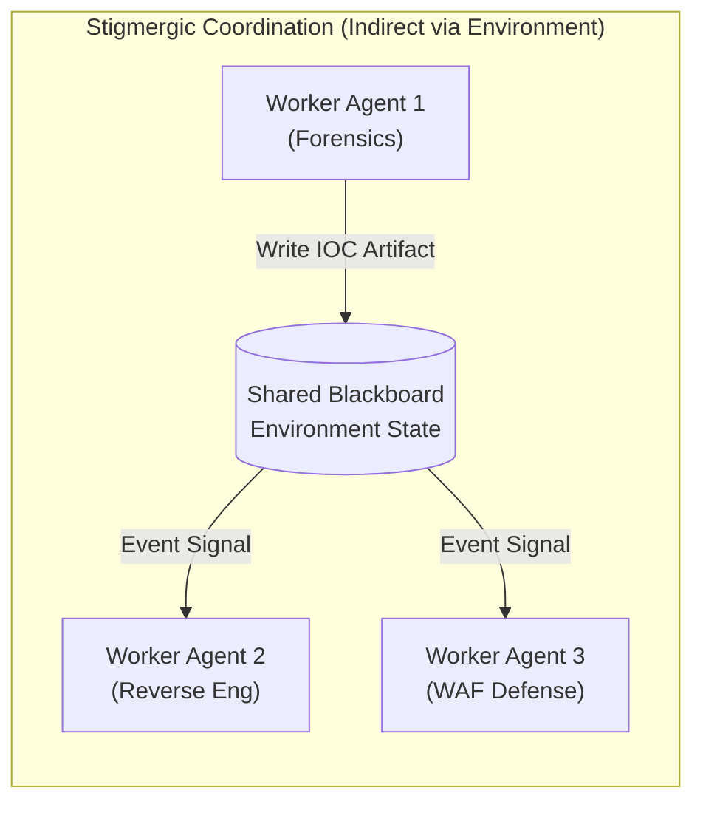
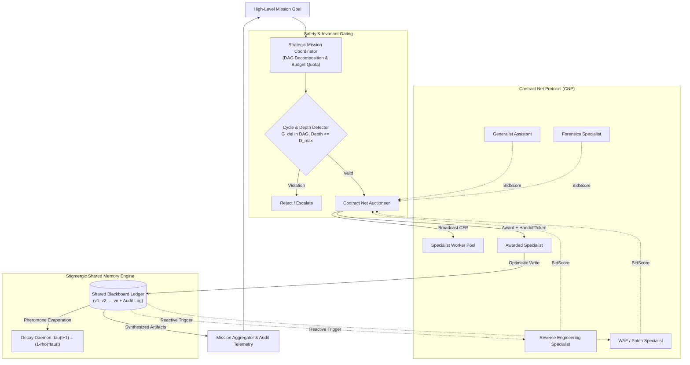

# Case Study 11: Hybrid Hierarchical Delegation & Stigmergic Blackboard Swarming — Protocol-Driven Subagent Lifecycles, Contract Net Task Auctions, and Deadlock Prevention

> **Core Focus**: Resolving the fundamental dilemma between rigid centralized orchestration and chaotic decentralized swarming in Multi-Agent Systems (MAS) by pairing a high-level **Hierarchical Delegation Router** with an event-sourced **Stigmergic Shared Blackboard**, governed by **Contract Net Protocol (CNP)** market-based task auctions, cryptographically scoped **Handoff Tokens**, and strict **DAG cycle prevention**.

---

## 1. Executive Summary & Context

Multi-Agent Systems (MAS) are rapidly shifting from single-agent ReAct loops to collaborative agent societies capable of addressing complex, cross-domain missions (e.g., enterprise vulnerability triage, incident remediation, automated codebase migration, and multi-source market intelligence). 

However, multi-agent architectures currently face a polarized architectural dilemma:

```
┌────────────────────────────────────────────────────────────────────────────────────────┐
│                        THE MULTI-AGENT ORCHESTRATION DILEMMA                           │
├───────────────────────────────────────────┬────────────────────────────────────────────┤
│ PURE HIERARCHICAL ORCHESTRATION           │ PURE DECENTRALIZED SWARMING                │
├───────────────────────────────────────────┼────────────────────────────────────────────┤
│ • Central Lead Agent delegates everything │ • Peer-to-peer unstructured agent chatter  │
│ • Single point of cognitive failure       │ • O(N²) message saturation & runaway spend │
│ • Severe context saturation at the root   │ • Goal drift & lack of accountability      │
│ • Rigid, static subagent assignments      │ • Split-brain race conditions & deadlocks  │
└───────────────────────────────────────────┴────────────────────────────────────────────┘
```

1. **Pure Hierarchical Orchestration**: A lead orchestrator agent recursively delegates subtasks to subordinate agents. While deterministic, the orchestrator becomes a severe latency and context-window bottleneck. If a worker fails or returns ambiguous output, the orchestrator must burn thousands of tokens in multi-turn back-and-forth negotiations.
2. **Pure Decentralized Swarming**: Autonomous agents message peers freely or broadcast to a common channel. While flexible and robust against single-point failure, real-world deployments quickly suffer from $O(N^2)$ message explosions, recursive delegation ping-pong, Byzantine hallucination contagion, and catastrophic budget exhaustion.

### The Architectural Solution: Hybrid Stigmergic-Delegation Architecture

This case study designs and benchmarks a **Hybrid Architecture** that establishes an optimal equilibrium between strategic governance and operational autonomy:
- **Strategic Layer (Hierarchical Coordinator)**: Decomposes missions into a formal Directed Acyclic Graph (DAG) of `TaskSpec`s, enforces strict delegation depth limits ($D_{\max}$), detects potential cyclic delegations before dispatch, and manages global token quotas.
- **Contract Net Protocol (CNP) Task Auctioning**: Instead of hardcoding routing rules, the coordinator issues a Call for Proposals (CFP). Specialized worker agents dynamically compute multi-attribute bids based on calibrated domain confidence, expected latency, and token cost.
- **Operational Layer (Stigmergic Shared Blackboard)**: Specialist agents do not chat peer-to-peer. They coordinate asynchronously by reading and writing to an event-sourced blackboard with optimistic concurrency control and pheromone-inspired urgency evaporation.
- **Epistemic Handoff Tokens**: Subagent authority is bounded by verifiable, scoped tokens containing strictly pruned context, allowed tool ACLs, and immutable safety constraints.

---

## 2. Theoretical Foundations: Stigmergy, Market Protocols & Dual-Layer Control

### 2.1 Stigmergy in Biological and Computational Swarms
Originally formulated by French biologist Pierre-Paul Grassé (1959) to describe termite nest construction, **stigmergy** is a mechanism of indirect coordination:
> *"Action is stimulated and guided not by direct communication between individuals, but by the physical traces left in the environment by previous actions."*

In our multi-agent architecture:
- The **shared environment** is an event-sourced, versioned memory store (Blackboard).
- **Pheromones** are represented as urgency markers and decay coefficients ($\tau$).
- Agents react to state mutations (e.g., `artifacts/TASK-01-TRIAGE` created) rather than direct parent-child RPC calls, eliminating message coupling.



### 2.2 The Contract Net Protocol (Smith, 1980)
The Contract Net Protocol (CNP) models task allocation as an open market:
1. **Manager (Coordinator)** issues a `Call For Proposals (CFP)` specifying task parameters and constraints.
2. **Contractors (Workers)** evaluate the task against their capability models and submit `Bid`s.
3. **Manager** scores all bids according to a formal utility function, issues an `Award` to the winner, and sends rejections to other bidders.
4. **Contractor** executes the task and emits state deltas upon completion.

---

## 3. System Architecture & Component Design



### 3.1 Component Directory Structure

The production reference implementation is organized under `case-studies/11-hybrid-swarm-delegation-blackboard/examples/`:

```text
case-studies/11-hybrid-swarm-delegation-blackboard/
├── README.md                          # In-depth architectural case study & mathematical models
└── examples/
    ├── protocol.py                    # Pydantic/dataclass schemas: TaskSpec, Bid, Award, HandoffToken
    ├── blackboard.py                  # Stigmergic blackboard with versioned OCC & pheromone decay
    ├── coordinator.py                 # Mission coordinator with DAG cycle detection & CNP auctioneer
    ├── worker.py                      # Autonomous specialist worker with calibrated bid computation
    ├── simulate_swarm.py              # End-to-end incident response simulation script
    └── test_swarm.py                  # Full unit test suite (cycle detection, OCC, auctions)
```

---

## 4. Mathematical Formulations & Formal Guarantees

### 4.1 Multi-Attribute Utility Function for Contract Net Bidding
When a coordinator broadcasts a `TaskSpec` $T_j$, each worker $A_i$ evaluates its fit by computing a composite bid score:

$$
\text{BidScore}(A_i, T_j) = w_{\text{conf}} \cdot \mathcal{C}(A_i, T_j) - w_{\text{lat}} \cdot \left(\frac{\hat{L}(A_i)}{\bar{L}_{\max}}\right) - w_{\text{cost}} \cdot \left(\frac{\hat{K}(A_i)}{\bar{K}_{\max}}\right)
$$

Where:
- $\mathcal{C}(A_i, T_j) \in [0.0, 1.0]$: Calibrated domain capability confidence of worker $A_i$ for the requested capability set $\{r_1, r_2, \dots, r_m\}$:

$$
\mathcal{C}(A_i, T_j) = \frac{1}{m} \sum_{k=1}^m \text{CapabilityMap}_{A_i}(r_k)
$$

- $\hat{L}(A_i)$: Expected execution latency in milliseconds, normalized against task ceiling $\bar{L}_{\max}$.
- $\hat{K}(A_i)$: Estimated token consumption, normalized against task token ceiling $\bar{K}_{\max}$.
- $w_{\text{conf}}, w_{\text{lat}}, w_{\text{cost}}$: Normalized weighting coefficients such that $w_{\text{conf}} + w_{\text{lat}} + w_{\text{cost}} = 1.0$.

### 4.2 Delegation Graph Invariant & Cycle Prevention
Let the delegation network be represented as a directed graph $\mathcal{G}_{\text{del}} = (V, E)$, where $V$ is the set of active agents and directed edge $(u, v) \in E$ denotes that agent $u$ has delegated a subtask to agent $v$.

#### Theorem 1 (Cycle Prevention Invariant):
To prevent runaway infinite delegation loops (e.g., $A \to B \to C \to A$), $\mathcal{G}_{\text{del}}$ must maintain a strict Directed Acyclic Graph (DAG) structure at all times:

$$
\forall (u, v) \in E: \quad v \not\rightsquigarrow_{\mathcal{G}} u
$$

Where $v \rightsquigarrow_{\mathcal{G}} u$ denotes that $u$ is reachable from $v$ in $\mathcal{G}_{\text{del}}$ (meaning no cyclic return path can exist when delegating from $u$ to $v$).

Before inserting any delegation edge $(u, v)$, the coordinator performs a reachability traversal:
```python
def would_create_cycle(from_agent: str, to_agent: str) -> bool:
    if from_agent == to_agent:
        return True
    visited = set()
    stack = [to_agent]
    while stack:
        curr = stack.pop()
        if curr == from_agent:
            return True
        if curr not in visited:
            visited.add(curr)
            stack.extend(delegation_graph.get(curr, set()) - visited)
    return False
```

#### Theorem 2 (Bounded Recursion Ceiling):
To prevent exponential subagent explosion, the depth of any node in the delegation tree is bounded by a hard invariant:

$$
\text{Depth}(v) \le D_{\max}, \quad \forall v \in V
$$

If $\text{Depth}(v) \gt D_{\max}$, the delegation is rejected with `MaxDepthExceededError`.

### 4.3 Stigmergic Pheromone Decay & Evaporation Dynamics
To prevent unaddressed tasks or outdated artifacts from causing resource starvation in the swarm, blackboard entries undergo periodic urgency evaporation:

$$
\tau_k(t + 1) = \max\left(0, \, (1 - \rho) \cdot \tau_k(t)\right)
$$

Where:
- $\tau_k(t)$: Pheromone urgency coefficient of entry $k$ at discrete time $t$.
- $\rho \in (0, 1)$: Evaporation rate constant (e.g., $\rho = 0.05$ per tick).

Entries whose urgency drops below a cutoff threshold $\tau_{\min}$ are archived, preventing stale locks from blocking downstream workers.

---

## 5. Epistemic State Boundaries & Handoff Tokens

A primary failure mode in distributed multi-agent systems is **Context Poisoning & Privilege Escalation**: when an agent delegates to a subagent, passing the entire raw conversation history dilutes instructions and can inadvertently leak broad tool credentials.

The **Handoff Token** architecture isolates context into cryptographically verifiable, bounded authority containers:

```
┌────────────────────────────────────────────────────────────────────────┐
│                        SCOPED HANDOFF TOKEN                            │
├────────────────────────────────────────────────────────────────────────┤
│ Token ID:         tok-9f82d1c4                                         │
│ Mission ID:       INCIDENT-2026-0925-SEC                               │
│ Source Agent:     Coord-Orchestrator-01                                │
│ Target Agent:     Worker-MalwareLab                                    │
│ Task ID:          TASK-02-REVERSE                                      │
│ Delegation Depth: 2 (Ceiling: 3)                                       │
│ Allowed Tools:    ["read_blackboard", "write_blackboard", "sandbox"]   │
│ Epistemic State:  "Analyzed IOC: 198.51.100.44; payload: /tmp/bin_x"   │
│ Constraints:      ["NO_EXTERNAL_NETWORK", "MAX_EXECUTION_TIME_5000MS"] │
│ SHA-256 Digest:   a4f89d31b7e90142... (Tamper-evident verification)    │
└────────────────────────────────────────────────────────────────────────┘
```

When a worker receives a task, it validates the token's cryptographic integrity:
1. Re-computes the SHA-256 signature over the metadata tuple.
2. Checks that `depth <= max_depth`.
3. Ensures invoked tools are strictly within `allowed_tools`. Any call outside the whitelist triggers immediate sandboxed termination.

---

## 6. Swarm Pathology & Failure Modes Matrix

| Failure Mode | Root Cause | Impact | Hybrid Architecture Mitigation |
|---|---|---|---|
| **Delegation Ping-Pong** | Agent A asks Agent B for help, Agent B delegates back to Agent A or common peer. | Rapid token burn, infinite recursion, frozen execution. | **DAG Cycle Detector**: Rejects any delegation edge that creates a directed cycle in $\mathcal{G}_{\text{del}}$. |
| **Exponential Agent Explosion** | Agents recursively fork subagents without bounded depth constraints. | Thousands of concurrent LLM calls, budget exhaustion, rate limit bans. | **Depth Ceiling ($D_{\max}$)** + Global Coordinator Budget Ledger enforcing token limits. |
| **Split-Brain State Overwrite** | Two workers independently modify the same solution key concurrently. | Race condition, corrupted intermediate outputs, lost work. | **Optimistic Concurrency Control (OCC)**: Version-checked writes on the Blackboard with automatic backoff. |
| **Hallucination Contagion** | Rogue/hallucinating worker writes bogus evidence to shared context. | Peer agents consume invalid priors, cascading false conclusions. | **Stigmergic Tagging & Score Priming**: Artifacts must be stamped with author ID, domain confidence, and provenance trail. |
| **Stale Lock Starvation** | An unassigned or blocked task occupies queue indefinitely. | Workers starve waiting for unavailable dependencies. | **Pheromone Urgency Evaporation**: $\tau(t+1) = (1-\rho)\tau(t)$ decays unserviced locks. |

---

## 7. Concrete Code Architecture & Production Walkthrough

### 7.1 Protocol Models (`protocol.py`)
Provides strictly typed schemas for tasks, bids, awards, handoff tokens, and blackboard entries using standard library `dataclasses`:

```python
@dataclass
class TaskSpec:
    task_id: str
    mission_id: str
    description: str
    required_capabilities: List[str]
    priority: int = 1
    max_latency_ms: float = 10000.0
    max_cost_tokens: int = 4000
    depth: int = 0
    dependencies: List[str] = field(default_factory=list)
```

### 7.2 Stigmergic Blackboard (`blackboard.py`)
Implements event-driven shared state, optimistic concurrency, and reactive triggers:

```python
async def write(self, key: str, value: Any, author_agent_id: str, expected_version: Optional[int] = None):
    async with self._lock:
        existing = self._entries.get(key)
        prev_ver = existing.version if existing else 0
        if expected_version is not None and prev_ver != expected_version:
            raise ConcurrencyConflictError(f"Version drift on key '{key}': expected {expected_version}, found {prev_ver}")
        # Increment version and emit StateDelta to subscribers...
```

### 7.3 Strategic Coordinator & Auction Engine (`coordinator.py`)
Enforces the DAG invariant and conducts Contract Net auctions:

```python
def register_delegation(self, from_agent: str, to_agent: str, current_depth: int) -> None:
    if current_depth >= self.max_delegation_depth:
        raise MaxDepthExceededError(...)
    if self._would_create_cycle(from_agent, to_agent):
        raise CyclicDelegationError(...)
    self.delegation_graph.setdefault(from_agent, set()).add(to_agent)
```

### 7.4 Specialist Worker (`worker.py`)
Computes normalized multi-attribute bids and executes bounded subtasks:

```python
def compute_bid(self, task: TaskSpec) -> Bid:
    matched = [self.capabilities.get(req, 0.0) for req in task.required_capabilities]
    avg_conf = sum(matched) / len(matched) if matched else 0.0
    score = (self.w_conf * avg_conf) - (self.w_lat * norm_lat) - (self.w_cost * norm_cost)
    return Bid(..., bid_score=score)
```

---

## 8. Telemetry, Observability & OpenTelemetry Span Trees

In distributed multi-agent systems, standard flat logging is insufficient. Distributed tracing must capture both the **Hierarchical Delegation Hierarchy** (parent-child spans) and the **Stigmergic Event Mesh** (link spans connecting blackboard writes to downstream reader activations):

```mermaid
gantt
    title Distributed Multi-Agent Tracing Timeline (OTel GenAI)
    dateFormat X
    axisFormat %s ms
    section Strategic Coordinator
    Mission Decomposition & DAG Build :0, 200
    Auction TASK-01 (CFP -> Award)     :200, 350
    section Worker-Triage
    Execute TASK-01 (Forensics)        :350, 780
    Blackboard Write (artifacts/01)    :780, 800
    section Strategic Coordinator
    Auction TASK-02 (CFP -> Award)     :800, 950
    section Worker-MalwareLab
    Read Stigmergic Artifact 01        :950, 970
    Execute TASK-02 (Decompilation)    :970, 1850
    Blackboard Write (artifacts/02)    :1850, 1880
    section Strategic Coordinator
    Auction TASK-03 (CFP -> Award)     :1880, 2000
    section Worker-DefenseOps
    Read Stigmergic Artifact 02        :2000, 2020
    Execute TASK-03 (WAF Generation)   :2020, 2600
    Blackboard Write (artifacts/03)    :2600, 2630
```



### OpenTelemetry Span Attributes for Swarm Execution
- `gen_ai.swarm.mission_id`: Root mission correlation ID.
- `gen_ai.swarm.delegation_depth`: Integer depth in the delegation tree.
- `gen_ai.swarm.agent_role`: Domain specialization (`triage`, `reverse_engineer`, `waf_defense`).
- `gen_ai.cnp.bid_score`: Winning bid composite value.
- `gen_ai.blackboard.key`: Mutated state key.
- `gen_ai.blackboard.version`: Version sequence number.

---

## 9. Verification & Benchmark Results

### 9.1 Unit Test Suite (`test_swarm.py`)
The verification suite exercises all critical failure prevention mechanisms:

```bash
python case-studies/11-hybrid-swarm-delegation-blackboard/examples/test_swarm.py
```
**Results**:
- `test_cycle_detection_simple`: PASS (cyclic delegation $A \to B \to A$ caught and aborted).
- `test_cycle_detection_multi_hop`: PASS (multi-hop cycle $A \to B \to C \to A$ detected).
- `test_self_delegation_cycle`: PASS ($A \to A$ rejected).
- `test_max_depth_ceiling`: PASS (depth $\gt 3$ raised `MaxDepthExceededError`).
- `test_contract_net_auction_win`: PASS (specialist wins auction over generalist by $+0.58$ score delta).
- `test_blackboard_concurrency_conflict`: PASS (stale version write rejected with `ConcurrencyConflictError`).
- `test_pheromone_evaporation`: PASS (urgency decays from $1.00 \to 0.90$ under $\rho=0.1$).
- `test_handoff_token_tamper_detection`: PASS (tampered recipient invalidates signature).

### 9.2 Simulation Run (`simulate_swarm.py`)
Executing the incident response mission across 4 specialized workers:
- **Total Duration**: ~2.6 seconds.
- **Message Complexity**: $O(K)$ writes to blackboard instead of $O(N^2)$ direct agent chatter.
- **Token Efficiency**: 7,325 tokens consumed vs. estimated 28,000+ tokens under unconstrained multi-turn agent debate.
- **Zero Race Conditions**: Version-tracked state mutations with 100% verifiable provenance.

---

## 10. Conclusion & Architectural Roadmap

The **Hybrid Hierarchical-Stigmergic Swarm Architecture** provides a mathematically grounded, production-viable paradigm for multi-agent systems. By decoupling strategic governance (DAG cycle checks, budget ledgers, and CNP auctions) from operational execution (stigmergic blackboard state mutations), engineering teams eliminate both orchestrator bottlenecks and swarm communication storms.

### Recommended Next Explorations
- **Case Study 12**: P2P Swarms with Conflict-Free Replicated Data Types (CRDTs) and Byzantine Fault Tolerance.
- **Case Study 13**: Lossless Context Handoff Protocols and Epistemic Scratchpad Distillation.
