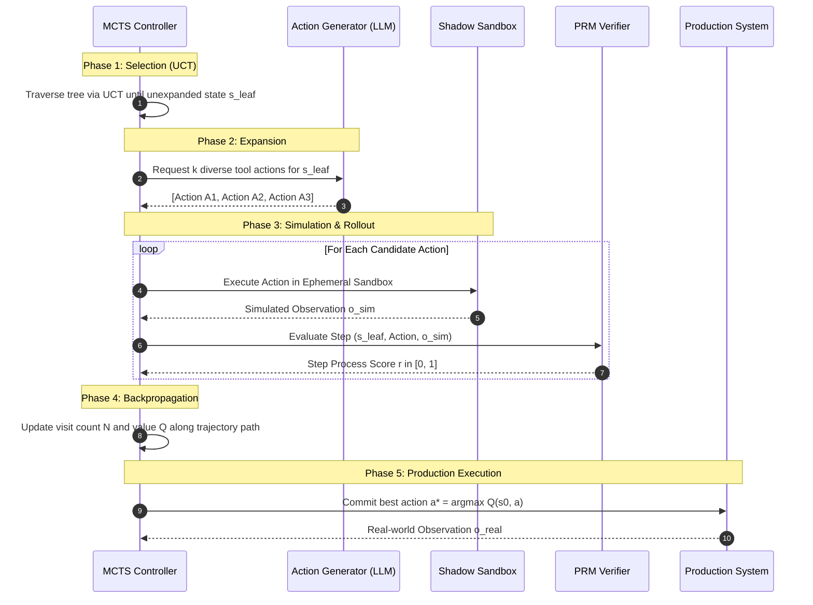

# Case Study 12: Agentic Test-Time Compute — Monte Carlo Tree Search (MCTS) Rollouts, Process Reward Models (PRMs), and Trajectory Backtracking

> **Core Focus**: Scaling test-time compute across autonomous agent trajectories rather than isolated token sampling. Integrating **Monte Carlo Tree Search (MCTS)**, **Process Reward Models (PRMs)** for step-level verification, **Upper Confidence Bounds applied to Trees (UCT)** for action exploration, and **ephemeral shadow rollouts** to allow agents to backtrack out of dead ends before executing state-mutating actions in production environments.

---

## 1. Executive Summary & Context

The dominant paradigm for Large Language Model (LLM) agents—the sequential **ReAct** (Reasoning + Acting) loop—is fundamentally **greedy and myopic**. At each decision step $t$, the agent evaluates its historical context and generates a single action $a_t$. Once dispatched to an external environment (API call, SQL query, container command), the action commits irreversible side effects.

If the action leads to a pathological state, unexpected schema rejection, or combinatorial dead end at step $t+4$, standard ReAct agents exhibit catastrophic failure patterns:
1. **Hallucinatory Ping-Pong**: The agent repeatedly attempts minor syntactic variations of the same broken tool call.
2. **Context Saturation & Runaway Spend**: The context window fills with lengthy error traces, inducing memory drift and budget burnout.
3. **Irreversible Environmental Corruption**: The agent mutates external state (e.g., partial database drops, deleted files, half-configured cloud VPCs) that cannot be cleanly undone.

```
┌────────────────────────────────────────────────────────────────────────────────────────┐
│                        GREEDY REACT vs. AGENTIC TEST-TIME COMPUTE                      │
├───────────────────────────────────────────┬────────────────────────────────────────────┤
│ STANDARD GREEDY REACT AGENT               │ AGENTIC TEST-TIME COMPUTE (MCTS + PRM)     │
├───────────────────────────────────────────┼────────────────────────────────────────────┤
│ • Greedy single-path sampling             │ • Multi-candidate action generation (k > 1)│
│ • No step-level verification prior to run │ • Process Reward Model (PRM) scoring       │
│ • Commits state mutations immediately     │ • Ephemeral sandbox rollouts before commit │
│ • Fails permanently on dead ends          │ • UCT-guided backtracking & path pruning   │
│ • Fixed compute per reasoning turn        │ • Dynamic compute scaling by task hardness │
└───────────────────────────────────────────┴────────────────────────────────────────────┘
```

### The Architectural Paradigm Shift: Test-Time Compute for Agents

Recent frontier research (e.g., OpenAI o1/o3, DeepSeek-R1, AlphaGo, and Process-Supervised Reward Models) demonstrates that scaling compute **during inference** yields logarithmic to exponential gains in problem-solving accuracy. 

Applying test-time compute to **autonomous tool-using agents** shifts the execution paradigm from:

$$
\text{Observe} \longrightarrow \text{Commit}
$$

to:

$$
\text{Propose Candidate Actions} \longrightarrow \text{Shadow Rollout} \longrightarrow \text{PRM Verification} \longrightarrow \text{UCT Selection} \longrightarrow \text{Environment Commit}
$$

---

## 2. Theoretical Foundations: MCTS & Step-Level Process Reward Models

### 2.1 Formal Markov Decision Process (MDP) for Agentic Tool Use

We formulate the autonomous agent environment as an augmented Markov Decision Process:

$$
\mathcal{M} = \langle \mathcal{S}, \mathcal{A}, \mathcal{T}, \mathcal{R}_{\text{step}}, \mathcal{R}_{\text{outcome}}, \gamma \rangle
$$

- $\mathcal{S}$: Cognitive agent states, where $s_t = (g, c_0, a_0, o_1, \dots, a_{t-1}, o_t)$ encompasses the root goal $g$, initial context $c_0$, and history of tool actions $a$ and observations $o$.
- $\mathcal{A}$: Space of structured tool calls $\text{ToolCall}(\text{name}, \text{args})$.
- $\mathcal{T}(s_{t+1} \mid s_t, a_t)$: Transition probability representing the environment response or mock sandbox output.
- $\mathcal{R}_{\text{step}}(s_t, a_t, s_{t+1}) \in [0, 1]$: Process reward assigned by a Process Reward Model (PRM) to step correctness.
- $\mathcal{R}_{\text{outcome}}(s_T) \in \{0, 1\}$: Binary or scalar task success at terminal state $s_T$.

### 2.2 Upper Confidence Bounds for Trees (UCT) in Agent Planning

At each node $s$ representing an agent state in the search tree, the algorithm balances exploiting high-reward tool paths against exploring uncertain tool alternatives using the UCT formula:

$$
UCT(s, a) = Q(s, a) + c_{\text{puct}} \cdot P(s, a) \cdot \frac{\sqrt{N(s)}}{1 + N(s, a)}
$$

Where:
- $Q(s, a) = \frac{1}{N(s, a)} \sum_{i=1}^{N(s, a)} V_i$: Mean empirical value of state-action pair $(s, a)$.
- $P(s, a)$: Prior probability assigned to candidate action $a$ by the Generator LLM.
- $N(s)$: Total visit count of parent state node $s$.
- $N(s, a)$: Visit count of the directed edge $(s, a)$.
- $c_{\text{puct}}$: Exploration constant balancing depth exploitation vs. breadth exploration.

### 2.3 Process Reward Model (PRM) vs. Outcome Reward Model (ORM)

Traditional reinforcement learning uses Outcome Reward Models (ORMs), scoring only the final state $s_T$. However, in multi-step agent workflows:
1. **Credit Assignment Failure**: If an agent executes 8 tool calls and fails at step 8, an ORM penalizes all 8 steps equally, even if steps 1–7 were optimal.
2. **False Positives**: An agent may hallucinate intermediate tool arguments but accidentally stumble upon the right outcome.

A **Process Reward Model (PRM)** decomposes verification into an explicit step-wise likelihood:

$$
r_{\text{PRM}}(s_t, a_t) = \sigma\left(\mathbf{W}_{\phi} \cdot \mathbf{h}_{\text{rep}}(s_t, a_t)\right)
$$

Where $\mathbf{h}_{\text{rep}}(s_t, a_t)$ is the latent representation of the transition, calibrated to detect semantic tool misuse, schema divergence, and logical inconsistencies prior to execution.

---

## 3. System Architecture & Component Design

The Agentic Test-Time Compute system consists of five decoupled architectural components:

```mermaid
flowchart TD
    subgraph ClientLayer["User Request & Root Goal"]
        Goal["Root Objective G"]
    end

    subgraph MCTSOrchestrator["MCTS Search Engine"]
        RootNode["State s0 (Initial Context)"]
        TreePolicy["UCT Selection Engine"]
        Backprop["Backpropagation & Value Aggregator"]
    end

    subgraph GenerationLayer["Candidate Action Generator"]
        LLMGen["Generator LLM (Temperature=0.7)<br/>Proposes k Candidate Actions"]
    end

    subgraph SimulationLayer["Dual-Tier Environment Runtime"]
        ShadowBox["Ephemeral Shadow Sandbox<br/>(Read-Only Mocks, In-Memory DB)"]
        ProdEnv["Production Environment<br/>(State-Mutating APIs, Live DB)"]
    end

    subgraph VerificationLayer["Process Supervision (PRM)"]
        PRM["Step-Level PRM Verifier<br/>Scores Validity, Safety, & Utility"]
    end

    Goal --> RootNode
    RootNode --> TreePolicy
    TreePolicy -->|Select Leaf| LLMGen
    LLMGen -->|k Candidate Actions| ShadowBox
    ShadowBox -->|Simulated Observation| PRM
    PRM -->|Step Score r_t in [0, 1]| Backprop
    Backprop -->|Update N(s, a) & Q(s, a)| TreePolicy
    
    TreePolicy -.->|Search Budget Exhausted<br/>Select argmax Q(s0, a)| ProdEnv
```

### 3.1 The 4 Phases of Agentic MCTS



---

## 4. Implementation Specification

### 4.1 Data Models & Search Node Definition

```python
from __future__ import annotations
import math
from dataclasses import dataclass, field
from typing import Any, Dict, List, Optional

@dataclass
class ToolCall:
    name: str
    arguments: Dict[str, Any]
    id: str

@dataclass
class MCTSNode:
    state_id: str
    observation_history: List[Dict[str, str]]
    parent: Optional[MCTSNode] = None
    incoming_action: Optional[ToolCall] = None
    children: List[MCTSNode] = field(default_factory=list)
    visit_count: int = 0
    total_value: float = 0.0
    prior_probability: float = 1.0
    is_terminal: bool = False

    @property
    def q_value(self) -> float:
        if self.visit_count == 0:
            return 0.0
        return self.total_value / self.visit_count

    def uct_score(self, c_puct: float = 1.414) -> float:
        if not self.parent:
            return 0.0
        exploration = (
            c_puct
            * self.prior_probability
            * (math.sqrt(self.parent.visit_count) / (1 + self.visit_count))
        )
        return self.q_value + exploration
```

### 4.2 Core Search Loop & Backtracking Engine

```python
class AgenticMCTSEngine:
    def __init__(
        self,
        generator_llm: Any,
        prm_verifier: Any,
        shadow_sandbox: Any,
        c_puct: float = 1.414,
        rollout_budget: int = 12,
        branching_factor: int = 3,
    ):
        self.generator = generator_llm
        self.prm = prm_verifier
        self.sandbox = shadow_sandbox
        self.c_puct = c_puct
        self.rollout_budget = rollout_budget
        self.k = branching_factor

    def plan_next_action(self, current_history: List[Dict[str, str]]) -> ToolCall:
        root = MCTSNode(
            state_id="root",
            observation_history=list(current_history),
        )

        for iteration in range(self.rollout_budget):
            # Phase 1: Selection
            leaf = self._select_leaf(root)
            if leaf.is_terminal:
                self._backpropagate(leaf, reward=leaf.q_value)
                continue

            # Phase 2: Expansion & Simulation
            candidate_actions = self.generator.propose_candidates(
                leaf.observation_history, k=self.k
            )
            for action in candidate_actions:
                # Run in isolated shadow sandbox
                sim_obs, is_terminal = self.sandbox.execute_shadow(
                    action, state_context=leaf.observation_history
                )
                
                # Phase 3: Process Reward Verification
                step_reward = self.prm.score_step(
                    context=leaf.observation_history,
                    action=action,
                    observation=sim_obs,
                )

                new_history = list(leaf.observation_history) + [
                    {"role": "assistant", "action": str(action)},
                    {"role": "tool", "observation": str(sim_obs)},
                ]

                child_node = MCTSNode(
                    state_id=f"{leaf.state_id}_{len(leaf.children)}",
                    observation_history=new_history,
                    parent=leaf,
                    incoming_action=action,
                    prior_probability=action.arguments.get("_prior", 1.0 / self.k),
                    is_terminal=is_terminal,
                )
                leaf.children.append(child_node)

                # Phase 4: Backpropagation
                self._backpropagate(child_node, reward=step_reward)

        # Select the most robust child (highest visit count / highest Q)
        best_child = max(root.children, key=lambda c: (c.visit_count, c.q_value))
        if best_child.incoming_action is None:
            raise RuntimeError("MCTS failed to generate valid candidate action")
        return best_child.incoming_action

    def _select_leaf(self, node: MCTSNode) -> MCTSNode:
        curr = node
        while curr.children:
            curr = max(curr.children, key=lambda c: c.uct_score(self.c_puct))
        return curr

    def _backpropagate(self, node: MCTSNode, reward: float):
        curr: Optional[MCTSNode] = node
        while curr is not None:
            curr.visit_count += 1
            curr.total_value += reward
            curr = curr.parent
```

---

## 5. Failure Modes, Edge Cases & Guardrails

| Failure Mode | Root Cause | Detection Mechanism | Mitigation Strategy |
|---|---|---|---|
| **Simulation Divergence (Reality Gap)** | Shadow sandbox returns mocked success, but real API has changed credentials/schema | Delta check between shadow observation and production observation | Tag nodes with environment fidelity score; auto-penalize mock trust if discrepancy `> 0.2` |
| **Search Tree Explosion** | Branching factor $k$ too high or search depth unbounded | Visit counter exceeds token/memory threshold | Fixed depth cap ($D_{\max}=4$), candidate pruning via top-$k$ logprobs cutoff |
| **PRM Reward Hacking** | Agent generates innocuous read-only actions that score safe but make zero progress | Progress detector: $s_{t+1} \approx s_t$ in embedding distance | Distance-to-goal penalty: Discount reward if state representation does not shift towards objective |
| **Exploitation Starvation** | Exploration coefficient $c_{\text{puct}}$ set too high, causing random breadth exploration | Visit distribution variance across children of root is near zero | Dynamic annealing: $c_{\text{puct}}(t) = c_0 \cdot e^{-\lambda t}$ as search iterations advance |

---

## 6. Observability & Telemetry Patterns

To ensure full transparency into test-time compute decisions, all MCTS rollouts must emit structured hierarchical OpenTelemetry spans:

```
[AgenticMCTS.PlanNextAction]
  ├── [MCTS.Iteration 01]
  │     ├── [Generator.ProposeCandidates] -> k=3 actions proposed
  │     ├── [Sandbox.ShadowRollout] -> action="query_db_schema", duration=14ms
  │     ├── [PRM.VerifyStep] -> score=0.88, justification="Valid SQL schema lookup"
  │     └── [MCTS.Backpropagate] -> updated Q(root->a1)=0.88, N=1
  ├── [MCTS.Iteration 02]
  │     ├── [Generator.ProposeCandidates] -> k=3 actions proposed
  │     ├── [Sandbox.ShadowRollout] -> action="drop_cache", duration=8ms
  │     ├── [PRM.VerifyStep] -> score=0.12, justification="Premature destructive cache flush"
  │     └── [MCTS.Backpropagate] -> updated Q(root->a2)=0.12, N=1
  └── [MCTS.Commit] -> selected action="query_db_schema" (visit_count=8, Q=0.89)
```

---

## 7. Key Takeaways & Enterprise Applicability

1. **Test-time compute transforms agent reliability**: High-stakes workflows (financial reconciliation, automated infrastructure operations, medical data pipelines) cannot tolerate greedy trial-and-error in production.
2. **PRMs prevent compounding errors**: Scoring individual steps with a Process Reward Model isolates errors at their origin point instead of diagnosing failure after complete trajectory failure.
3. **Shadow environments unlock safe exploration**: By decoupling read-only shadow exploration from state-mutating production commits, agents can backtrack freely without risking data integrity.
