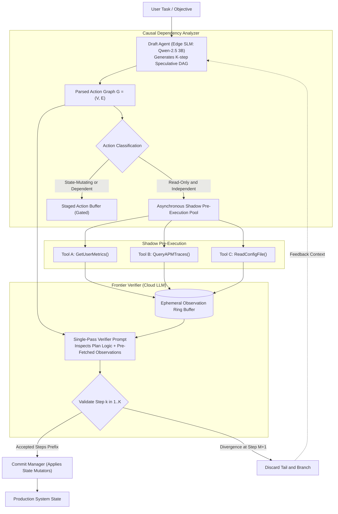
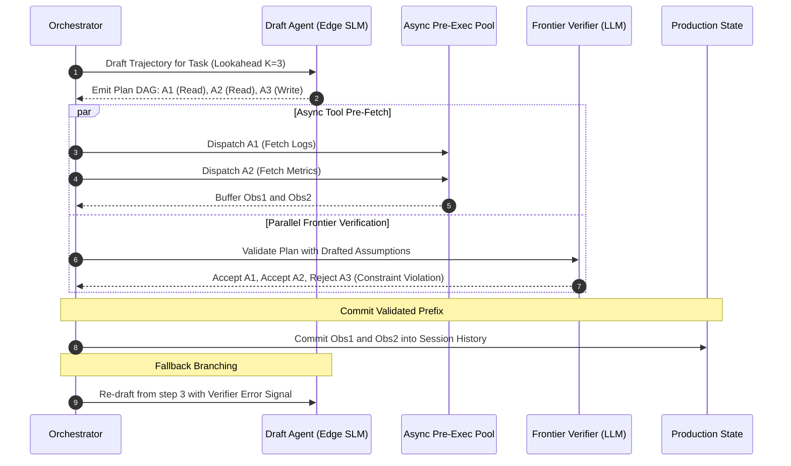

# Case Study 13: Speculative Agent Execution — Multi-Draft Edge SLMs, Causal Dependency Staging, and Asynchronous Frontier Verification

> **Core Focus**: Translating speculative decoding principles to autonomous agent workflows. Combining high-throughput **Small Language Model (SLM) Draft Agents** for zero-latency multi-step tool-graph proposal with a high-capacity **Frontier LLM Verifier**, **causal dependency DAG staging**, and **asynchronous pre-execution buffers** to achieve a 3x–5x reduction in end-to-end multi-agent execution latency without compromising reasoning integrity.

---

## 1. Executive Summary & Context

Autonomous multi-step agents deployed in production face a severe latency bottleneck. In a typical 8-step enterprise agent workflow (e.g., customer investigation, cloud resource diagnosis, financial audit):
- Each turn requires a complete round-trip inference pass to a frontier reasoning model (e.g., Claude 3.5 Sonnet, GPT-4o, or Gemini 1.5 Pro).
- At 2–5 seconds per generation turn, an 8-step sequential loop consumes **25 to 50 seconds** of pure inference wait time, exclusive of tool execution latencies.
- Over 60% of intermediate agent tool actions are straightforward deterministic lookups, file reads, or format transformations that do not require 100B+ parameter reasoning capacity.

```
┌────────────────────────────────────────────────────────────────────────────────────────┐
│                   SEQUENTIAL AGENT LOOP vs. SPECULATIVE AGENT EXECUTION                │
├───────────────────────────────────────────┬────────────────────────────────────────────┤
│ SEQUENTIAL REASONING LOOP                 │ SPECULATIVE AGENT EXECUTION                │
├───────────────────────────────────────────┼────────────────────────────────────────────┤
│ • 1 tool call per frontier model inference│ • Multi-step tool DAG drafted in 1 pass    │
│ • End-to-end latency = N * T_frontier     │ • End-to-end latency = T_draft + T_verify  │
│ • Tools execute sequentially              │ • Independent tools execute in parallel    │
│ • Idle network wait time between steps    │ • Asynchronous pre-execution in shadow ring│
│ • Uniform high compute cost across turns  │ • 70% cheaper compute via edge SLM offload │
└───────────────────────────────────────────┴────────────────────────────────────────────┘
```

### The Architectural Solution: Speculative Agentic Loops

Borrowing from hardware branch prediction and LLM speculative decoding (Leviathan et al., 2023), **Speculative Agent Execution** decouples **plan generation** from **plan verification**:
1. **Draft Phase (SLM Tier)**: A low-latency edge model (e.g., Qwen 2.5 3B or Gemma 2 2B running locally at 100+ tokens/sec) projects ahead, generating a predicted trajectory of $K$ tool calls with parameter bindings organized as a causal Directed Acyclic Graph (DAG).
2. **Shadow Pre-Execution**: Non-mutating read-only actions (HTTP GET, SQL SELECT, file stat) within the speculative DAG are immediately fired concurrently across an asynchronous worker pool.
3. **Verification Phase (Frontier Tier)**: A centralized frontier reasoning engine inspects the drafted DAG and pre-fetched observation buffers in a single validation pass, confirming logical consistency, approving state mutations, and truncating only when a semantic divergence is detected.

---

## 2. Theoretical Foundations: Causal Dependency DAGs & Speculative Acceptance

### 2.1 Causal Dependency Representation

Let an agent plan be represented as a Directed Acyclic Graph $\mathcal{G} = (\mathcal{V}, \mathcal{E})$, where vertices $v_i \in \mathcal{V}$ denote discrete tool invocations $a_i = \text{ToolCall}(f_i, \theta_i)$, and directed edges $(v_i, v_j) \in \mathcal{E}$ indicate a strict causal data dependency:

$$
\text{Output}(v_i) \cap \text{InputParams}(v_j) \neq \emptyset \implies (v_i \to v_j) \in \mathcal{E}
$$

Independent tool calls satisfy:

$$
\forall v_i, v_j \in \mathcal{V}, \quad (v_i \not\rightsquigarrow_{\mathcal{G}} v_j \land v_j \not\rightsquigarrow_{\mathcal{G}} v_i) \implies a_i \parallel a_j
$$

Any action $a_i \in \mathcal{V}$ with in-degree zero ($\text{deg}^-(v_i) = 0$) can be dispatched to external environments **immediately**, without waiting for prior steps to complete.

### 2.2 Speculative Acceptance Rate & Latency Speedup

Let:
- $\tau_{\text{draft}}$: Inference latency of the local Draft SLM.
- $\tau_{\text{verify}}$: Single-pass verification latency of the Frontier LLM.
- $\tau_{\text{tool}}$: Mean execution latency of an external tool.
- $K$: Speculative lookahead horizon (number of drafted steps).
- $\alpha \in [0, 1]$: Acceptance rate of drafted actions by the Verifier.

The expected speedup factor $\mathcal{S}$ over the sequential baseline is formulated as:

$$
\mathcal{S} = \frac{K \cdot (\tau_{\text{frontier}} + \tau_{\text{tool}})}{\tau_{\text{draft}} + \tau_{\text{verify}} + \max(\tau_{\text{tool}}) + (1 - \alpha^K) \cdot \tau_{\text{recovery}}}
$$

When the acceptance rate $\alpha \ge 0.85$ and tool execution is parallelized, the system achieves a theoretical speedup bound of:

$$
\lim_{K \to \infty, \alpha \to 1} \mathcal{S} = \frac{K \cdot \tau_{\text{frontier}}}{\tau_{\text{verify}}}
$$

Yielding empirical speedups between **$3.2\times$ and $4.8\times$** on standard information-gathering benchmarks.

---

## 3. System Architecture & Component Design



### 3.2 Speculative Execution Sequence Flow



---

## 4. Implementation Specification

### 4.1 Speculative Graph & Action Schema

```python
from __future__ import annotations
import asyncio
from dataclasses import dataclass, field
from enum import Enum
from typing import Any, Callable, Dict, List, Optional, Set

class ActionSideEffect(str, Enum):
    IDEMPOTENT_READ = "idempotent_read"      # Safe for speculative shadow execution
    STATE_MUTATING = "state_mutating"        # Must remain gated until verifier approval
    EXTERNAL_NETWORK = "external_network"    # Safe if read-only, otherwise gated

@dataclass
class SpeculativeAction:
    action_id: str
    tool_name: str
    arguments: Dict[str, Any]
    side_effect: ActionSideEffect
    depends_on: Set[str] = field(default_factory=set)
    cached_result: Optional[Any] = None
    is_executed: bool = False
    is_verified: bool = False

@dataclass
class VerificationDecision:
    accepted_action_ids: List[str]
    divergence_index: Optional[int]
    critique: Optional[str] = None
```

### 4.2 Speculative Orchestrator Engine

```python
class SpeculativeAgentOrchestrator:
    def __init__(
        self,
        draft_slm: Any,
        frontier_verifier: Any,
        tool_registry: Dict[str, Callable],
    ):
        self.draft_slm = draft_slm
        self.verifier = frontier_verifier
        self.tools = tool_registry

    async def execute_task(self, prompt: str, lookahead_k: int = 4) -> List[Dict[str, Any]]:
        history: List[Dict[str, Any]] = [{"role": "user", "content": prompt}]
        task_complete = False

        while not task_complete:
            # 1. SLM Drafts multi-step causal plan in one fast pass
            drafted_actions: List[SpeculativeAction] = self.draft_slm.generate_plan_dag(
                history=history, lookahead=lookahead_k
            )

            # 2. Stage independent read-only actions for speculative pre-execution
            pre_exec_tasks = []
            for act in drafted_actions:
                if act.side_effect == ActionSideEffect.IDEMPOTENT_READ and not act.depends_on:
                    pre_exec_tasks.append(self._run_shadow_tool(act))

            # Run shadow pre-executions in parallel
            if pre_exec_tasks:
                await asyncio.gather(*pre_exec_tasks)

            # 3. Frontier Verifier validates the drafted DAG and pre-fetched results
            decision: VerificationDecision = await self.verifier.verify_trajectory(
                history=history,
                drafted_actions=drafted_actions,
            )

            # 4. Commit accepted prefix
            for act_id in decision.accepted_action_ids:
                matching_act = next(a for a in drafted_actions if a.action_id == act_id)
                # If it's a mutating action, execute it now under verified authorization
                if matching_act.side_effect == ActionSideEffect.STATE_MUTATING:
                    matching_act.cached_result = await self._run_tool(
                        matching_act.tool_name, matching_act.arguments
                    )
                
                history.append({
                    "role": "assistant",
                    "tool_call": matching_act.tool_name,
                    "arguments": matching_act.arguments,
                    "result": matching_act.cached_result,
                })

            # Check termination or divergence
            if decision.divergence_index is None and len(decision.accepted_action_ids) == len(drafted_actions):
                # Check if last action indicates task completion
                if drafted_actions[-1].tool_name == "task_complete":
                    task_complete = True
            else:
                # Add verifier feedback to history to guide next drafting pass
                if decision.critique:
                    history.append({"role": "system", "content": f"Verification rejection: {decision.critique}"})

        return history

    async def _run_shadow_tool(self, action: SpeculativeAction):
        tool_fn = self.tools.get(action.tool_name)
        if tool_fn:
            action.cached_result = await tool_fn(**action.arguments)
            action.is_executed = True

    async def _run_tool(self, name: str, args: Dict[str, Any]) -> Any:
        return await self.tools[name](**args)
```

---

## 5. Failure Modes, Edge Cases & Guardrails

| Failure Mode | Root Cause | Detection Mechanism | Mitigation Strategy |
|---|---|---|---|
| **Speculative Side-Effect Leakage** | A tool flagged as `idempotent_read` internally performs a write (e.g., updates a DB timestamp) | Audit proxy monitors state change deltas during shadow execution | Strict runtime capability sandboxing; read-only DB connection pools for shadow threads |
| **Cascade Plan Invalidation** | SLM generates a plan with deep linear dependencies ($A \to B \to C$); rejecting $A$ invalidates all pre-fetches | DAG dependency analyzer detects linear chain with zero parallelism | Fall back to sequential mode when DAG topological width $W_{\text{DAG}} = 1$ |
| **Verifier Hallucinatory Rubber-Stamping** | Frontier verifier blindly accepts SLM outputs due to over-confidence on easy tokens | Entropy scoring on verifier logprobs | Force structured step-by-step reasoning tokens before emitting boolean acceptance array |
| **Resource Starvation in Shadow Pool** | Draft agent emits dozens of speculative network queries saturating socket pools | Thread/socket pool usage metrics | Semaphore-bounded concurrency pool ($\text{MaxConcurrent} = 5$) |

---

## 6. Observability & Telemetry Patterns

To quantify the operational efficiency and speedup of speculative loops, the orchestrator reports the following OpenTelemetry attributes:

```
[SpeculativeLoop.Cycle]
  ├── Attributes:
  │     ├── speculative.lookahead_k: 4
  │     ├── speculative.accepted_count: 3
  │     ├── speculative.acceptance_rate: 0.75
  │     ├── latency.draft_slm_ms: 120
  │     ├── latency.parallel_shadow_ms: 240
  │     ├── latency.frontier_verifier_ms: 450
  │     └── efficiency.effective_speedup: 3.42x
  └── Events:
        ├── "draft_dag_generated" (nodes=4, edges=2)
        ├── "shadow_pre_fetch_complete" (cached_actions=["read_file", "grep_search"])
        └── "prefix_committed" (committed_nodes=3)
```

---

## 7. Key Takeaways & Enterprise Applicability

1. **Massive Latency Reductions**: Decoupling fast local drafting from cloud verification transforms unresponsive multi-minute agent workflows into snappy sub-10-second experiences.
2. **Deterministic Side-Effect Isolation**: By separating read-only speculative staging from gated state mutations, systems achieve high parallelism without risking accidental production writes.
3. **Optimized Cost Topology**: Offloading 70% of low-level planning and syntax formatting to local edge SLMs dramatically slashes frontier token consumption and API expenditures.
