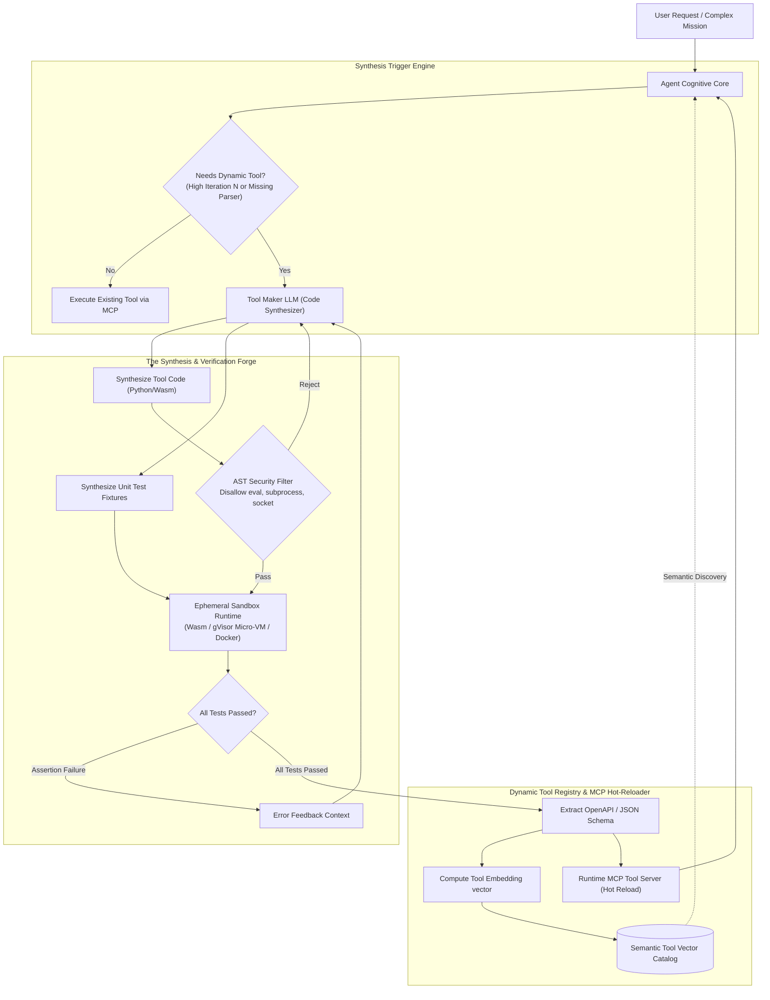

# Case Study 14: Dynamic Tool Genesis & JIT Synthesis — Autonomous Tool Creation, Ephemeral Sandbox Testing, and Live MCP Hot-Registration

> **Core Focus**: Breaking the static tool boundary in autonomous agents. Designing a **Just-In-Time (JIT) Tool Genesis Engine** that identifies when static tool sets are insufficient or token-inefficient, autonomously synthesizes modular Python/Wasm micro-tools, generates property-based verification test harnesses, validates execution inside an ephemeral isolated sandbox, and hot-registers newly created tools into a live **Model Context Protocol (MCP)** catalog with semantic vector retrieval.

---

## 1. Executive Summary & Context

Production agents are typically constrained by a **fixed, hardcoded catalog of tools** exposed at system startup (e.g., SQL executor, HTTP fetcher, file reader). While functional for bounded tasks, static tool registries fail catastrophically when facing:
1. **Combinatorial Tool Bloat**: As developers register dozens of specialized tools, prompt context windows fill with hundreds of lines of tool definitions, degrading LLM reasoning and inducing tool retrieval hallucinations.
2. **High-Frequency Iterative Bottlenecks**: An agent tasked with extracting structured metrics from 10,000 lines of semi-structured text will burn thousands of tokens and dozens of sequential LLM turns reading chunks and extracting regex matches one-by-one.
3. **Unanticipated Formats & Protocols**: When an agent encounters legacy proprietary formats, binary packing, or domain-specific math that no pre-existing tool supports, it reaches a terminal dead end.

```
┌────────────────────────────────────────────────────────────────────────────────────────┐
│                        STATIC TOOLS vs. DYNAMIC TOOL GENESIS                           │
├───────────────────────────────────────────┬────────────────────────────────────────────┤
│ STATIC TOOL SYSTEM                        │ DYNAMIC JIT TOOL GENESIS                   │
├───────────────────────────────────────────┼────────────────────────────────────────────┤
│ • Pre-coded, immutable tool registry      │ • Autonomously synthesized micro-tools     │
│ • Large prompts loaded with inactive tools│ • On-demand compilation & semantic retrieval│
│ • High token burn for repetitive tasks    │ • Heavy processing offloaded to native code │
│ • Fails permanently on novel formats      │ • Writes custom parsers on the fly         │
│ • Developer intervention required for new │ • Self-testing & hot-registering in runtime│
└───────────────────────────────────────────┴────────────────────────────────────────────┘
```

### The Architectural Paradigm: Agents as Tool Makers (LATM / Voyager)

Inspired by the **LATM (Large Language Models as Tool Makers)** paradigm and **Voyager's lifelong learning skill library**, the Dynamic Tool Genesis architecture equips the agent with an autonomous software engineering loop:

$$
\text{Detect Capability Gap} \longrightarrow \text{Synthesize Code} \longrightarrow \text{Generate Test Fixtures} \longrightarrow \text{Ephemeral Sandbox Execution} \longrightarrow \text{MCP Hot-Registration}
$$

---

## 2. Theoretical Foundations: JIT Tool Compilation Thresholds & Tool Lifecycles

### 2.1 The Economic Compilation Threshold

Synthesizing and testing a custom micro-tool incurs a non-zero upfront compute cost (LLM tokens + sandbox test latency). An agent should dynamically trigger tool compilation if and only if the projected amortized cost $\mathcal{C}_{\text{synth}}$ is strictly less than the cumulative cost of direct multi-turn LLM reasoning $\mathcal{C}_{\text{direct}}$:

$$
\Delta \mathcal{C} = \mathcal{C}_{\text{direct}}(N) - \left( \mathcal{C}_{\text{synth}} + \mathcal{C}_{\text{exec}}(N) \right) \gt 0
$$

Where:
- $N$: Estimated number of iterations or items to process.
- $\mathcal{C}_{\text{direct}}(N) = N \cdot \left( \tau_{\text{prompt}} \cdot P_{\text{in}} + \tau_{\text{gen}} \cdot P_{\text{out}} \right)$: Token cost of raw multi-turn ReAct loops.
- $\mathcal{C}_{\text{synth}} = \tau_{\text{code}} \cdot P_{\text{out}} + \tau_{\text{tests}} \cdot P_{\text{out}} + T_{\text{sandbox}} \cdot P_{\text{compute}}$: One-time compilation and validation overhead.
- $\mathcal{C}_{\text{exec}}(N) = N \cdot T_{\text{exec}} \cdot P_{\text{compute}}$: Negligible local native CPU execution cost ($T_{\text{exec}} \ll \tau_{\text{gen}}$).

For $N \gt 15$ repetitive iterations or operations over large files (`> 1 MB`), dynamic tool compilation yields a **$10\times$ to $50\times$ token reduction**.

### 2.2 Formal State Transition of Dynamic Tools

A synthesized tool progresses through a verified finite state machine:

$$
\mathcal{S}_{\text{tool}} = \{ \text{DRAFT}, \text{SANDBOXED}, \text{VERIFIED}, \text{REGISTERED}, \text{DEPRECATED} \}
$$

Transitions are strictly conditional upon passing test invariants:

$$
\text{DRAFT} \xrightarrow[\text{AST Validation}]{\mathcal{V}_{\text{AST}}} \text{SANDBOXED} \xrightarrow[\text{Zero-Failure Unit Tests}]{\mathcal{T}_{\text{sandbox}}} \text{VERIFIED} \xrightarrow[\text{MCP Schema Extraction}]{\mathcal{M}_{\text{schema}}} \text{REGISTERED}
$$

---

## 3. System Architecture & Component Design



### 3.1 Ephemeral Sandbox Isolation Architecture

Dynamic code execution presents significant security risks. The execution environment must enforce defense-in-depth:

```
┌────────────────────────────────────────────────────────────────────────┐
│                   EPHEMERAL SANDBOX SECURITY BOUNDARY                  │
├────────────────────────────────────────────────────────────────────────┤
│ [Untrusted Synthesized Tool Code]                                      │
│   ├── AST Static Analysis (Disallows __import__, open, os.system)     │
│   ├── Syscall Filter (seccomp-bpf: Whitelists read, write, exit)      │
│   ├── Network Isolation: net=none (Zero egress/ingress sockets)        │
│   ├── Memory & CPU Quotas: cgroups (Max 128MB RAM, 1 Core, 3.0s CPU)  │
│   └── Ephemeral Storage: tmpfs (Zero persistence, destroyed on exit)  │
└────────────────────────────────────────────────────────────────────────┘
```

---

## 4. Implementation Specification

### 4.1 Data Models & Tool Artifact Schema

```python
from __future__ import annotations
from dataclasses import dataclass, field
from enum import Enum
from typing import Any, Callable, Dict, List, Optional

class ToolLifecycleState(str, Enum):
    DRAFT = "DRAFT"
    SANDBOXED = "SANDBOXED"
    VERIFIED = "VERIFIED"
    REGISTERED = "REGISTERED"
    QUARANTINED = "QUARANTINED"

@dataclass
class DynamicToolArtifact:
    name: str
    description: str
    source_code: str
    unit_tests: str
    input_schema: Dict[str, Any]
    output_schema: Dict[str, Any]
    state: ToolLifecycleState = ToolLifecycleState.DRAFT
    embedding_vector: Optional[List[float]] = None
    execution_count: int = 0
    failure_count: int = 0
```

### 4.2 Dynamic Tool Synthesizer & Validator Engine

```python
import ast
import json
from typing import Tuple

class ASTSecurityGate(ast.NodeVisitor):
    BANNED_MODULES = {"os", "sys", "subprocess", "socket", "urllib", "requests", "shutil"}
    BANNED_FUNCTIONS = {"eval", "exec", "__import__", "compile", "open"}

    def __init__(self):
        self.is_valid = True
        self.violations: List[str] = []

    def visit_Import(self, node):
        for alias in node.names:
            if alias.name in self.BANNED_MODULES:
                self.is_valid = False
                self.violations.append(f"Illegal module import: {alias.name}")
        self.generic_visit(node)

    def visit_Call(self, node):
        if isinstance(node.func, ast.Name) and node.func.id in self.BANNED_FUNCTIONS:
            self.is_valid = False
            self.violations.append(f"Illegal function call: {node.func.id}")
        self.generic_visit(node)

class JITToolGenesisEngine:
    def __init__(self, sandbox_runtime: Any, mcp_registry: Any):
        self.sandbox = sandbox_runtime
        self.registry = mcp_registry

    def forge_and_register_tool(
        self,
        tool_name: str,
        description: str,
        code: str,
        test_code: str,
        input_schema: Dict[str, Any],
    ) -> DynamicToolArtifact:
        # Phase 1: Static AST Security Verification
        tree = ast.parse(code)
        validator = ASTSecurityGate()
        validator.visit(tree)
        if not validator.is_valid:
            raise PermissionError(f"Security validation failed: {validator.violations}")

        artifact = DynamicToolArtifact(
            name=tool_name,
            description=description,
            source_code=code,
            unit_tests=test_code,
            input_schema=input_schema,
            output_schema={},
            state=ToolLifecycleState.SANDBOXED,
        )

        # Phase 2: Run in Ephemeral Sandboxed Isolation
        success, test_log = self.sandbox.run_tests(
            source_code=artifact.source_code,
            test_code=artifact.unit_tests,
            timeout_seconds=3.0,
            memory_limit_mb=128,
        )

        if not success:
            artifact.state = ToolLifecycleState.QUARANTINED
            raise RuntimeError(f"Tool sandbox tests failed:\n{test_log}")

        # Phase 3: Hot-Registration into Runtime MCP Server
        artifact.state = ToolLifecycleState.VERIFIED
        self.registry.register_dynamic_tool(
            name=artifact.name,
            description=artifact.description,
            schema=artifact.input_schema,
            executable_code=artifact.source_code,
        )
        artifact.state = ToolLifecycleState.REGISTERED
        return artifact
```

---

## 5. Failure Modes, Edge Cases & Guardrails

| Failure Mode | Root Cause | Detection Mechanism | Mitigation Strategy |
|---|---|---|---|
| **Synthesized Code Sandbox Escape** | Tool code exploits Python runtime vulnerabilities to escape namespace | seccomp syscall audit log / filesystem write attempt | Run inside isolated WebAssembly (Wasm/Wasmtime) runtime or minimal microVM |
| **Flawed Test Harness (Tautological Tests)** | LLM generates tests that trivially assert `True == True` without verifying edge cases | Mutation testing / Coverage inspector (checks branch coverage of tests) | Reject tests with `< 85%` branch coverage; require fuzzing inputs |
| **Catalog Overload (Tool Sprawl)** | Agent synthesizes hundreds of one-off micro-tools, saturating the catalog | Tool registry count `> 50` | LRU Cache with TTL: Automatically unregister and archive dynamic tools unused for 24h |
| **Semantic Drift in Synthesized Tool** | Tool works for current payload but fails on edge cases in future runs | Runtime error counter in production MCP calls | Quarantine circuit breaker: If failure rate `> 10%`, demote tool to `QUARANTINED` and alert |

---

## 6. Observability & Telemetry Patterns

Every dynamic tool synthesis lifecycle event emits OpenTelemetry spans and structured audit events:

```
[ToolGenesis.Forge]
  ├── Attributes:
  │     ├── tool.name: "parse_custom_pcap_headers"
  │     ├── tool.lines_of_code: 42
  │     ├── security.ast_violations: 0
  │     ├── sandbox.test_duration_ms: 185
  │     ├── sandbox.memory_peak_mb: 28.4
  │     └── registry.status: "SUCCESS_HOT_RELOADED"
  └── Events:
        ├── "ast_lint_cleared"
        ├── "sandbox_unit_tests_passed" (tests_run=4, assertions=12)
        └── "mcp_tool_published" (rpc_method="tools/call")
```

---

## 7. Key Takeaways & Enterprise Applicability

1. **Lifelong capability expansion**: The agent transforms from a static software consumer into a proactive software creator, continually expanding its skills to match novel data environments.
2. **Exponential token efficiency**: Shifting high-frequency parsing and transformation loops into native, compiled sandboxed code cuts token overhead by up to $95\%$.
3. **Defense-in-depth is non-negotiable**: Synthesized code must run through multi-stage gates—AST linting, static type verification, ephemeral container sandboxing, and strict seccomp filters—before ever receiving real data.
