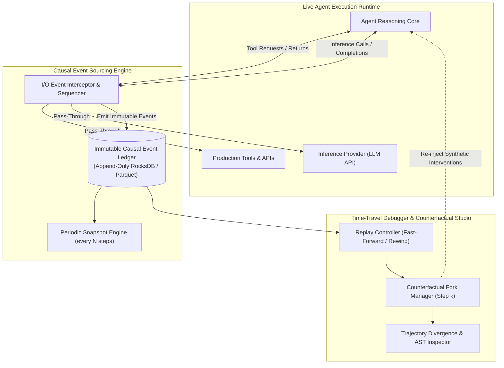
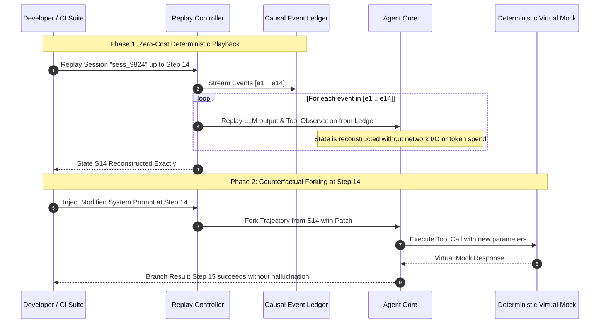

# Case Study 15: Deterministic Event-Sourced Agent Replay — Causal State Ledgers, Time-Travel Debugging, and Counterfactual Trajectory Forking

> **Core Focus**: Overcoming the reproducibility and observability crisis in stochastic multi-step LLM agents. Designing a **Deterministic Event-Sourced Agentic Runtime** that records all prompts, tool side effects, environmental observations, and pseudorandom seeds into an immutable **Causal Event Ledger**, enabling zero-cost offline replay, step-by-step time-travel rewinds, and **counterfactual branch forking** to pinpoint cognitive failure modes and eliminate regressions.

---

## 1. Executive Summary & Context

Debugging autonomous agent failures in production is currently an engineering nightmare. Unlike traditional deterministic software where stack traces and unit tests reliably isolate root causes, multi-step LLM agents exhibit **inherent stochasticity and environmental coupling**:
1. **The Heisenbug Dilemma**: An agent fails at step 14 of 20 due to an ambiguous tool argument. Re-running the agent with the exact same user input produces a completely different reasoning path at step 2, masking the original bug.
2. **Costly Iterative Debugging**: Diagnosing a bug at step 18 requires burning hundreds of thousands of tokens and dozens of external API queries just to reach step 17 again.
3. **Uncontrolled Production Side Effects**: Replaying an agent in production to reproduce a bug risks duplicating financial transactions, modifying live database records, or sending duplicate notifications to users.

```
┌────────────────────────────────────────────────────────────────────────────────────────┐
│                   EPHEMERAL AGENT TRACING vs. EVENT-SOURCED REPLAY                     │
├───────────────────────────────────────────┬────────────────────────────────────────────┤
│ STANDARD APM / SPAN TRACING               │ DETERMINISTIC EVENT-SOURCED REPLAY         │
├───────────────────────────────────────────┼────────────────────────────────────────────┤
│ • Passive text logs & flat JSON traces    │ • Append-only, immutable causal event log  │
│ • Cannot re-execute state transitions     │ • 100% bit-accurate offline playback       │
│ • Live external API calls on re-run       │ • Zero external network calls (mock re-run)│
│ • High token cost per debug attempt       │ • Zero token spend during deterministic run│
│ • Cannot branch or test alternate prompts │ • Counterfactual forking at arbitrary step │
└───────────────────────────────────────────┴────────────────────────────────────────────┘
```

### The Architectural Solution: Event-Sourced Time-Travel Debugging

Borrowing from **Event Sourcing (CQRS)** and **Deterministic Simulation Testing (FoundationDB / Antithesis)**, the system replaces mutable agent memory with an append-only, cryptographically hashed event stream:

$$
\mathcal{S}_t = \text{Fold}(\mathcal{S}_0, [e_1, e_2, \dots, e_t])
$$

Every state of the agent—its working memory, scratchpad, tool results, and token logprobs—is a pure deterministic projection of historical events.

---

## 2. Theoretical Foundations: State Projection & Counterfactual Divergence

### 2.1 Event Sourcing Mathematical Formulation

Let an agent session be represented as an ordered sequence of discrete, immutable events $\mathcal{E} = \langle e_1, e_2, \dots, e_T \rangle$. Each event is defined as:

$$
e_t = \langle \text{seq}_t, \tau_t, \text{Type}_t, \Delta_t, \mathcal{H}_t \rangle
$$

Where:
- $\text{seq}_t \in \mathbb{N}$: Monotonically increasing sequence number.
- $\tau_t$: Monotonic timestamp.
- $\text{Type}_t \in \{ \text{USER\_PROMPT}, \text{MODEL\_INFERENCE}, \text{TOOL\_CALL}, \text{ENV\_OBSERVATION}, \text{STATE\_SNAPSHOT} \}$.
- $\Delta_t$: Payload containing model parameters (seed, temperature, top_p), token completions, tool arguments, or environment diffs.
- $\mathcal{H}_t = \text{SHA256}(\mathcal{H}_{t-1} \parallel e_t)$: Cryptographic tamper-evident hash chain.

The agent's cognitive state at any discrete step $k \le T$ is computed by a pure reducer function:

$$
\mathcal{S}_k = \text{Reduce}(\text{InitState}, [e_1, \dots, e_k])
$$

### 2.2 Counterfactual Trajectory Divergence

When debugging an agent failure, developers want to test an intervention $\mathcal{I}$ (e.g., modified prompt instructions, updated tool schema) at step $k$.

We define the **Counterfactual Trajectory** $\mathcal{E}'$:

$$
\mathcal{E}' = [e_1, \dots, e_{k-1}] \circ [e_k^{\mathcal{I}}] \circ [e_{k+1}', \dots, e_{T'}']
$$

The **Cognitive Divergence Distance** $D_{\text{div}}(k)$ between the original failed trajectory and the counterfactual recovery trajectory is quantified using normalized Levenshtein edit distance over action sequences:

$$
D_{\text{div}}(\mathcal{E}, \mathcal{E}') = \frac{\text{EditDistance}(\mathcal{A}_{\text{orig}}, \mathcal{A}_{\text{fork}})}{\max(|\mathcal{A}_{\text{orig}}|, |\mathcal{A}_{\text{fork}}|)}
$$

Where $\mathcal{A}$ is the ordered projection of tool actions executed along each trajectory.

---

## 3. System Architecture & Component Design



### 3.1 Deterministic Replay vs. Counterfactual Fork Flow



---

## 4. Implementation Specification

### 4.1 Causal Event Schema & Types

```python
from __future__ import annotations
import hashlib
import json
import time
from dataclasses import asdict, dataclass, field
from enum import Enum
from typing import Any, Dict, List, Optional

class EventType(str, Enum):
    USER_INPUT = "USER_INPUT"
    LLM_CALL = "LLM_CALL"
    LLM_RESPONSE = "LLM_RESPONSE"
    TOOL_CALL = "TOOL_CALL"
    TOOL_RESULT = "TOOL_RESULT"
    STATE_CHECKPOINT = "STATE_CHECKPOINT"

@dataclass
class CausalEvent:
    seq: int
    timestamp: float
    session_id: str
    event_type: EventType
    payload: Dict[str, Any]
    parent_hash: str
    event_hash: str = field(init=False)

    def __post_init__(self):
        canonical_repr = f"{self.seq}:{self.timestamp}:{self.session_id}:{self.event_type}:{json.dumps(self.payload, sort_keys=True)}:{self.parent_hash}"
        self.event_hash = hashlib.sha256(canonical_repr.encode("utf-8")).hexdigest()
```

### 4.2 Causal Ledger & Time-Travel Debug Engine

```python
class CausalEventLedger:
    def __init__(self):
        self._events: List[CausalEvent] = []
        self._last_hash: str = "0" * 64

    def append(self, session_id: str, event_type: EventType, payload: Dict[str, Any]) -> CausalEvent:
        evt = CausalEvent(
            seq=len(self._events) + 1,
            timestamp=time.time(),
            session_id=session_id,
            event_type=event_type,
            payload=payload,
            parent_hash=self._last_hash,
        )
        self._last_hash = evt.event_hash
        self._events.append(evt)
        return evt

    def get_events_until(self, step_k: int) -> List[CausalEvent]:
        return [e for e in self._events if e.seq <= step_k]


class TimeTravelReplayEngine:
    def __init__(self, ledger: CausalEventLedger):
        self.ledger = ledger

    def replay_to_step(self, step_k: int) -> Dict[str, Any]:
        """Reconstructs exact agent cognitive state at step k with zero LLM API calls."""
        events = self.ledger.get_events_until(step_k)
        reconstructed_state: Dict[str, Any] = {
            "conversation_history": [],
            "tool_executions": [],
            "current_step": 0,
        }

        for evt in events:
            reconstructed_state["current_step"] = evt.seq
            if evt.event_type == EventType.USER_INPUT:
                reconstructed_state["conversation_history"].append(
                    {"role": "user", "content": evt.payload["text"]}
                )
            elif evt.event_type == EventType.LLM_RESPONSE:
                reconstructed_state["conversation_history"].append(
                    {"role": "assistant", "content": evt.payload["completion"]}
                )
            elif evt.event_type == EventType.TOOL_RESULT:
                reconstructed_state["tool_executions"].append({
                    "tool": evt.payload["tool_name"],
                    "output": evt.payload["result"],
                })

        return reconstructed_state

    def fork_counterfactual(
        self,
        step_k: int,
        prompt_intervention: str,
        live_llm_runner: Any,
    ) -> Dict[str, Any]:
        """Branches off from step k with modified instructions and observes divergence."""
        state = self.replay_to_step(step_k)
        # Apply intervention
        state["conversation_history"].append(
            {"role": "system", "content": f"[INTERVENTION]: {prompt_intervention}"}
        )
        
        # Execute forward from step k on the alternate branch
        forked_response = live_llm_runner.generate(state["conversation_history"])
        return {
            "branch_origin_step": step_k,
            "base_history_len": len(state["conversation_history"]),
            "intervention": prompt_intervention,
            "forked_response": forked_response,
        }
```

---

## 5. Failure Modes, Edge Cases & Guardrails

| Failure Mode | Root Cause | Detection Mechanism | Mitigation Strategy |
|---|---|---|---|
| **Non-Deterministic Tool Replay Drift** | An external tool payload was only partially logged, preventing accurate mock reconstruction | Ledger validator detects missing return fields in `TOOL_RESULT` payload | Strict contract validation: serialize full tool stdout, stderr, and HTTP response bodies |
| **Storage Explosion from Bloated Observations** | Agent ingests large files or database dumps, ballooning event ledger size | Storage monitor alerts on ledger growth `> 100 MB/session` | Content-addressable chunk deduplication (CAS) with zstandard compression |
| **Counterfactual State Invalidation** | Modifying step $k$ invalidates pre-existing state assumptions at step $k+1$ | Schema divergence detector on fork point | Isolate forked branch in virtual sandbox with its own copy-on-write event branch |
| **Timestamp Dependency Inversion** | Agent logic relies on real-world `time.now()`, causing replay divergence | Time-dependent logic detector | Inject a virtual synthetic clock into agent runtime synchronized with event timestamps |

---

## 6. Observability & Telemetry Patterns

To monitor replay integrity and counterfactual branch performance, the runtime emits OpenTelemetry traces:

```
[AgentReplay.Execute]
  ├── Attributes:
  │     ├── replay.session_id: "sess_9824"
  │     ├── replay.target_step: 14
  │     ├── replay.total_events_processed: 28
  │     ├── replay.network_calls_saved: 14
  │     ├── replay.tokens_saved: 42,500
  │     └── replay.bit_accuracy: 1.00
  └── Events:
        ├── "checkpoint_loaded" (seq=10)
        ├── "events_fast_forwarded" (count=4)
        └── "target_state_materialized" (memory_vars=6)
```

---

## 7. Key Takeaways & Enterprise Applicability

1. **Zero-cost, bit-accurate debugging**: Developers and automated CI/CD suites can replay complex production incidents locally in milliseconds without making single LLM API calls or re-running live cloud actions.
2. **Systematic counterfactual testing**: By rewinding to the exact step preceding a failure and testing prompt/tool patches, engineering teams can mathematically verify bug fixes before deploying them.
3. **Auditability and compliance**: In heavily regulated domains (healthcare, fintech, legal AI), an immutable, tamper-evident hash chain provides a provable forensic audit trail of every agent thought, tool call, and decision.
