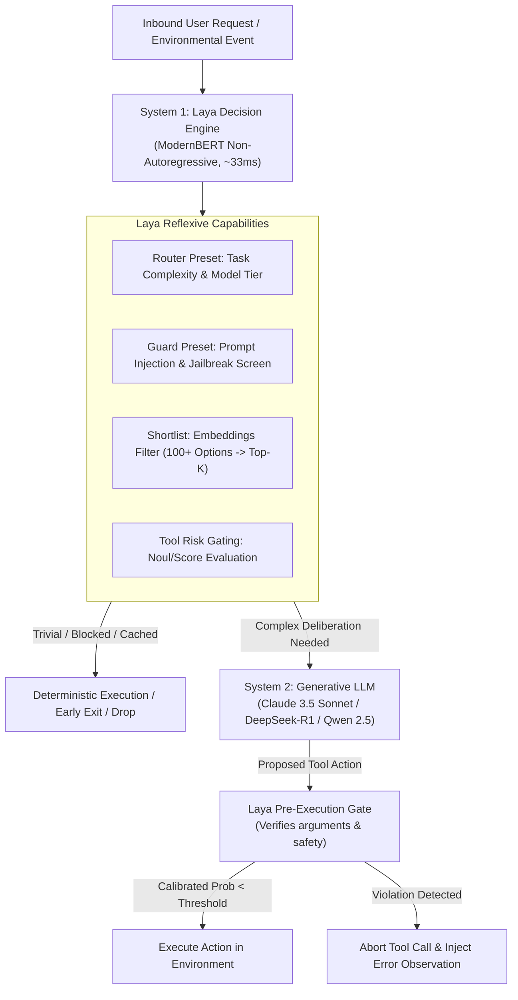
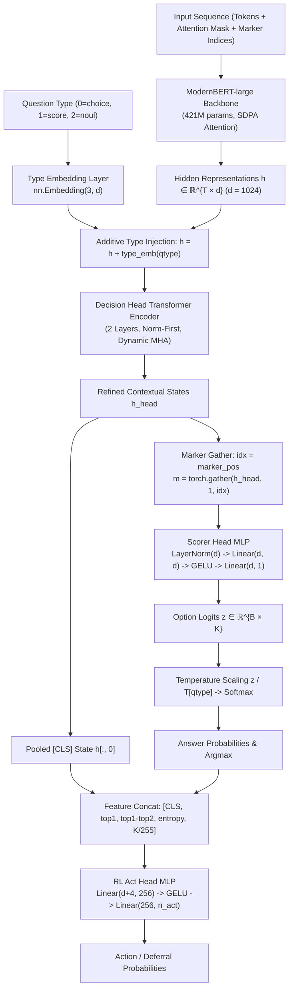
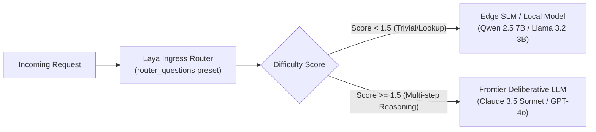
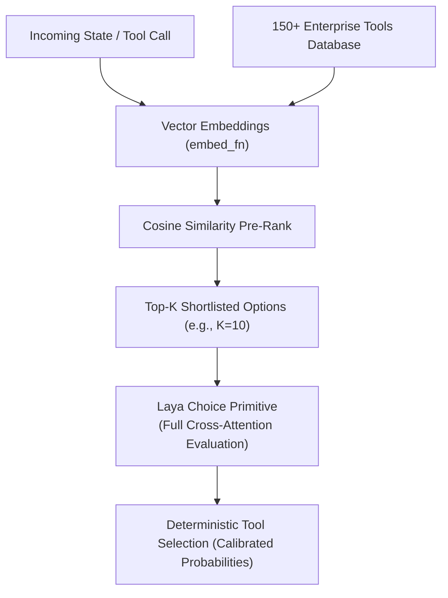

# Case Study 18: Open-Source System 1 Decision Engines via Laya — Non-Autoregressive ModernBERT Architecture, Dual-Process ReAct Primitives, Embedding Shortlists, and Local Self-Hosted Governance

> **Core Focus**: Designing sovereign, low-latency, and deterministic autonomous agent architectures by pairing open-source, non-autoregressive "System 1" decision engines (**Laya** by ConvAI Innovations) with generative LLMs—implementing marker-based ModernBERT classification heads, calibrated probability gating, high-cardinality embedding shortlists, native LangChain/LangGraph runnables, and Model Context Protocol (MCP) edge governance.

---

## 1. Executive Summary & Context

Production deployments of autonomous agents and Multi-Agent Systems (MAS) face a foundational architectural dilemma: **cognitive over-allocation**. 

In conventional ReAct (Reasoning + Acting) architectures, every cognitive action is routed to autoregressive Large Language Models (LLMs). Whether an agent is synthesizing a 2,000-word architectural specification, routing an incoming ticket to a department, verifying whether a bash command contains `rm -rf`, or determining if an observation is redundant, the same heavyweight generative model (e.g., Claude 3.5 Sonnet, GPT-4o, or Llama 3 70B) is invoked.

```
┌────────────────────────────────────────────────────────────────────────────────────────┐
│                   THE COGNITIVE OVER-ALLOCATION IN AGENTIC SYSTEMS                     │
├──────────────────────────────────────┬─────────────────────────────────────────────────┤
│ Heavy Generative LLM (System 2)      │ Sub-optimal for reflexive operational tasks:    │
│ • Autoregressive token-by-token loop │ • Trivial intent classification (1 word needed) │
│ • High TTFT (600ms – 2,500ms)        │ • Pre-action safety gating (Allow / Block)      │
│ • Expensive per-token pricing        │ • Observation pruning & context truncation      │
│ • Uncalibrated, hallucination-prone  │ • Model capability tier dispatch                │
│ • Susceptible to JSON parsing errors │ • Inbound prompt-injection / jailbreak triage   │
└──────────────────────────────────────┴─────────────────────────────────────────────────┘
```

### The Architectural Evolution: Jev to Laya

In **Case Study 10**, we explored **Jev** (developed by TypeSafe AI), which pioneered the concept of a dedicated "System 1" decision model—a typed, tokenless engine that answers categorical, ordinal, and Boolean questions in tens of milliseconds with calibrated probabilities. 

While Jev demonstrated the immense value of Kahneman-inspired dual-process AI systems, enterprise adoption frequently encounters strict operational constraints:
1. **Proprietary SaaS Dependency**: Jev operates as a proprietary, closed-source cloud API. Sensitive enterprise data (PII, proprietary codebases, healthcare data, internal logs) must be transmitted to external servers.
2. **Network Egress & Hop Latency**: API round-trip times (RTT) across WANs introduce 150ms–350ms of network overhead, negating much of the speed advantage of sub-100ms decision heads.
3. **Sovereignty & Air-Gapped Deployments**: Defense, banking, and critical infrastructure environments require fully self-hostable, open-weight architectures that run on on-premise GPUs, edge devices, or isolated VPCs.

To eliminate these barriers, the open-source community created **Laya** (Apache 2.0 license). Built on a fine-tuned **ModernBERT-large** encoder backbone and a custom multi-head transformer decision architecture, Laya provides complete local, non-autoregressive decision capabilities in **~33ms on an Nvidia T4 GPU** and efficient inference on CPUs via ONNX.

---

## 2. Theoretical Foundations: Fast Decision Primitives vs. Generative Deliberation

### Kahneman’s Dual-Process Cognitive Architecture

Cognitive psychology (Daniel Kahneman, *Thinking, Fast and Slow*) posits that human intelligence operates via two complementary cognitive systems:
- **System 1 (Fast, Reflexive, Implicit)**: Operates automatically, rapidly, with zero conscious effort, deterministic execution patterns, and well-calibrated confidence.
- **System 2 (Slow, Deliberative, Analytic)**: Allocates conscious mental effort to complex multi-step reasoning, hypothesis testing, and open-ended generative synthesis.

Autonomous agents without a System 1 layer suffer from severe cognitive drag. By integrating Laya as an open-source System 1 engine, the agentic architecture establishes a distinct bifurcation of labor:



### Laya's Three Mathematical Primitives

Laya formulates all judgments across three typed mathematical primitives, eliminating unstructured string parsing:

#### 1. The Noul Primitive (Calibrated Boolean Verification)
Given a state $S \in \mathcal{S}$ (raw text, JSON payload, or message array) and a proposition $q$, $\text{Noul}(q, S)$ outputs a calibrated scalar probability:

$$
\text{Noul}(q, S) \rightarrow p \in [0.0, 1.0], \quad \text{where } p = P(q = \text{true} \mid S)
$$

Laya models this with two discrete marker tokens `[MASK] false_label ... [MASK] true_label`. The calibrated probability is computed via temperature-scaled softmax:

$$
p_{\text{true}} = \frac{e^{z_{\text{true}} / T_{\text{noul}}}}{e^{z_{\text{false}} / T_{\text{noul}}} + e^{z_{\text{true}} / T_{\text{noul}}}}
$$

A threshold $\tau \in [0, 1]$ enables deterministic execution branching without prompt ambiguity:

$$
\text{Branch} = \begin{cases} \text{Execute Tool} & \text{if } \text{Noul}(\text{is\_safe}, S) \ge 0.85 \\ \text{Escalate to HITL} & \text{otherwise} \end{cases}
$$

#### 2. The Choice Primitive (Categorical Selection over Candidate Sets)
Given a state $S$, a question $q$, and a finite closed candidate set $\mathcal{C} = \{c_1, c_2, \dots, c_K\}$:

$$
\text{Choice}(q, \mathcal{C}, S) \rightarrow \left( c^*, \{P(c_k \mid S)\}_{k=1}^K \right), \quad \text{where } c^* = \arg\max_{c_k \in \mathcal{C}} P(c_k \mid S)
$$

Because Laya places a `[MASK]` token before each candidate option in the input sequence, all $K$ candidates are evaluated in parallel in a single forward pass.

#### 3. The Score Primitive (Rubric-Anchored Ordinal Evaluation)
Given a state $S$ and an ordered discrete scale $\mathcal{R} = [0, 1, \dots, K-1]$:

$$
\text{Score}(q, \mathcal{R}, S) \rightarrow \left( \mathbb{E}[R], \{p_k\}_{k=0}^{K-1} \right), \quad \text{where } \mathbb{E}[R] = \sum_{k=0}^{K-1} k \cdot p_k
$$

The score primitive provides both the continuous expectation $\mathbb{E}[R]$ and the discrete categorical distribution across severity levels.

---

## 3. Architecture Blueprint: The Inner Working of Laya

Code exploration of the installed `laya` package reveals the exact neural architecture and token sequence mechanics that drive its sub-40ms execution.

### Input Sequence Formulation

Unlike autoregressive models that read a prompt and generate completion tokens, Laya constructs an explicit bi-directional masked sequence:

```
[CLS] <type> question: <instructions> [SEP] [MASK] opt_0 [MASK] opt_1 ... [MASK] opt_{K-1} [SEP] <serialized_state> [SEP]
```

```
┌────────────────────────────────────────────────────────────────────────────────────────┐
│                              LAYA TOKEN SEQUENCE LAYOUT                                │
├───────┬────────────────────────────┬───────┬───────────────────────────┬───────┬───────┤
│ [CLS] │ choice question: Which...? │ [SEP] │ [MASK] billing [MASK] ... │ [SEP] │ State │
└───────┴────────────────────────────┴───────┴───────────────────────────┴───────┴───────┘
   ▲                                             ▲            ▲                     ▲
   │                                             │            │                     │
Pooled CLS                              Marker pos 0   Marker pos 1             Document
(for Act Head)                          (Option 0 logit)(Option 1 logit)        Tokens
```

1. **Instructions Header**: Encodes the question type (`choice`, `score`, or `noul`) and specific directive text.
2. **Options Block with Mask Markers**: Each candidate option is rendered with a leading `[MASK]` token (`tok.mask_token_id`). The index of each `[MASK]` is recorded in `markers = [m_0, m_1, ..., m_{K-1}]`.
3. **State Payload**: The document or structured JSON state is appended up to the remaining context window budget (`max_len`).

### Forward Pass & Decision Heads

The neural forward execution proceeds through five distinct stages:



### Strictly Proper Scoring Loss & Calibration

Laya models are optimized using strictly proper scoring rule rewards (`laya.common.proper_reward`). This guarantees that the predicted probability distribution reflects true epistemic likelihood rather than overconfident over-fitting:

$$\mathcal{L}_{\text{reward}} = w_{\text{log}} \cdot S_{\text{log}}(p, y) + w_{\text{sph}} \cdot S_{\text{sph}}(p, y) + w_{\text{rps}} \cdot S_{\text{rps}}(p, y)$$

- **Log Score**: Standard cross-entropy $-\log(p_y)$.
- **Spherical Score**: Normalized geometric scoring $\frac{p_y}{\|p\|_2}$.
- **Ranked Probability Score (RPS)**: Enforces ordinal penalty distance on `score` questions.

---

## 4. Jev vs. Laya: Comparative Architectural Matrix

The following matrix contrasts the commercial proprietary model (Jev) with the open-source self-hostable engine (Laya):

| Dimension | TypeSafe AI Jev (Case Study 10) | ConvAI Innovations Laya (Case Study 18) |
|---|---|---|
| **License & Code** | Proprietary Commercial SaaS | Open Source (**Apache 2.0**) |
| **Model Weights** | Closed / Black-box API | Open Checkpoints on Hugging Face (`convaiinnovations/laya`) |
| **Backbone Architecture** | Undisclosed proprietary decision network | **ModernBERT-large** (421M) / **mmBERT-base** (322M) |
| **Deployment Mode** | Remote Cloud API only | Local in-process, Private VPC, Edge, or Self-Hosted Server |
| **Inference Latency** | 70ms – 250ms (dominated by WAN latency) | **~33ms on Nvidia T4**, <10ms with TileLang, fast CPU ONNX |
| **Data Privacy & Compliance** | Requires data egress to TypeSafe AI endpoints | **Zero egress**: Safe for HIPAA, GDPR, SOC2, Air-Gapped networks |
| **Language Support** | Primarily English-optimized | Built-in **Router** for 100+ languages via `mmBERT-base` |
| **High-Cardinality Scaling** | Fixed API limits | Built-in **Embedding Shortlisting** (`predict_shortlist`) |
| **Framework Integrations** | Pydantic AI (`TypeSafeModel`), REST API | Native **LangChain**, **LangGraph**, **CrewAI**, **LlamaIndex**, **MCP** |
| **Serving Infrastructure** | Multi-tenant SaaS | `laya-serve` (FastAPI/HTTP), `laya-mcp-server`, ONNX Runtime |
| **Cost Model** | Metered per-call SaaS pricing | Zero marginal inference cost on existing compute |

---

## 5. Architectural Deep-Dive: 6 Production Patterns

### Pattern 1: Zero-Latency Ingress Model Router
Directing every prompt to a frontier model (Claude 3.5 Sonnet / GPT-4o) wastes compute budget on simple queries. Laya assesses task complexity and domain in ~33ms, dispatching to Small Language Models (SLMs) or Frontier LLMs.



### Pattern 2: Tool-Call Risk Gating & Execution Boundaries
Autonomous agents executing terminal commands, API mutations, or SQL updates require strict deterministic pre-execution validation. Laya scores tool risk and blocks unsafe executions without generative hallucination.

### Pattern 3: High-Cardinality Coarse-to-Fine Shortlist
Laya's head budget (`head_max_len`) comfortably supports up to 32 discrete options. When routing across hundreds of tools, APIs, or categories, `laya.shortlist.predict_shortlist` uses embedding cosine similarity to filter the top-$K$ candidates before executing the precise masked cross-attention decision pass.



### Pattern 4: Inline Prompt Injection & Jailbreak Defense
Agentic tool-use is susceptible to indirect prompt injection embedded within web scrapes, emails, or database records. Laya's `guard_questions()` screens raw content before LLM context injection.

### Pattern 5: Schema-Driven Pydantic Extraction
Using `laya.decide(agent, state, schema=MySchema)`, developers can project structured Pydantic models directly onto Laya questions without writing manual prompts:
- `Literal["a", "b", "c"]` $\rightarrow$ `choice` question
- `int = Field(ge=0, le=4)` $\rightarrow$ `score` question
- `bool` $\rightarrow$ `noul` question

### Pattern 6: Model Context Protocol (MCP) Edge Governance
Using `laya-mcp-server`, Laya exposes its decision heads directly over standard Model Context Protocol (MCP) transports (stdio / SSE), allowing Claude Desktop, OpenCode, or custom agent swarms to query System 1 decisions as standardized tools.

---

## 6. End-to-End Production Reference Implementation

Below is a complete, production-grade implementation of a **Dual-Process Agent** powered by **Laya (System 1)** and a deliberative LLM (System 2), implementing model routing, risk gating, and Pydantic schema validation.

```python
"""
Dual-Process Autonomous Agent Harness using Laya (System 1) and LLMs (System 2).
Demonstrating:
- Ingress Model Routing (Preset)
- Tool-Call Pre-Execution Risk Gating (Noul / Score)
- High-Cardinality Tool Shortlisting
- Native Pydantic Structured Decisions
"""

from __future__ import annotations
import json
import logging
from typing import Any, Dict, List, Literal, Optional
from pydantic import BaseModel, Field

# Core Laya imports
import laya
from laya.presets import router_questions, guard_questions
from laya.shortlist import predict_shortlist
from laya.structured import decide

logging.basicConfig(level=logging.INFO, format="%(asctime)s [%(levelname)s] %(message)s")
logger = logging.getLogger("DualProcessAgent")


# ============================================================================
# 1. DOMAIN SCHEMAS & TYPESAFE STRUCTURES
# ============================================================================

class ExecutionRiskAssessment(BaseModel):
    """Schema-driven decision model evaluated directly by Laya."""
    action_type: Literal["read_only", "file_mutation", "network_call", "privileged_system"]
    is_destructive: bool
    risk_level: int = Field(ge=0, le=4, description="0=Safe, 4=Critical Catastrophic Risk")


class MockLayaRunner:
    """
    Lightweight deterministic mock runner for CI/CD environments where GPU weights
    are downloading or running in simulated mode. Implements exact Laya API protocol.
    """
    def predict(self, state: Any, questions: Dict[str, Any], **kwargs) -> Dict[str, Any]:
        answers = {}
        state_str = json.dumps(state) if isinstance(state, (dict, list)) else str(state)
        
        for qid, qdef in questions.items():
            qtype = qdef.get("type")
            if qtype == "choice":
                crit = qdef.get("criteria", {})
                keys = list(crit.keys()) if isinstance(crit, dict) else crit
                # Heuristic choice selection for simulation
                selected = keys[0]
                for k in keys:
                    if k.lower() in state_str.lower():
                        selected = k
                        break
                probs = {k: (0.85 if k == selected else 0.15 / max(1, len(keys) - 1)) for k in keys}
                answers[qid] = {
                    "type": "choice",
                    "choice": selected,
                    "probabilities": probs,
                    "confidence": 0.92,
                    "answer_confidence": 0.88,
                }
            elif qtype == "score":
                crit = qdef.get("criteria", ["low", "med", "high"])
                k = len(crit)
                score_val = 3.5 if "rm -rf" in state_str or "DROP TABLE" in state_str else 0.5
                probs = {str(i): (0.8 if i == int(score_val) else 0.2 / (k - 1)) for i in range(k)}
                answers[qid] = {
                    "type": "score",
                    "score": score_val,
                    "probabilities": probs,
                    "confidence": 0.94,
                    "answer_confidence": 0.91,
                }
            elif qtype == "noul":
                is_true = any(w in state_str.lower() for w in ["rm -rf", "drop", "sudo", "jailbreak", "ignore"])
                p_true = 0.96 if is_true else 0.04
                answers[qid] = {
                    "type": "noul",
                    "noul": p_true,
                    "confidence": max(p_true, 1.0 - p_true),
                    "answer_confidence": max(p_true, 1.0 - p_true),
                }
        return {"answers": answers}


# ============================================================================
# 2. SYSTEM 1: INGRESS ROUTER & SECURITY GUARD
# ============================================================================

class IngressController:
    def __init__(self, runner: Any):
        self.runner = runner

    def evaluate_request(self, user_prompt: str) -> Dict[str, Any]:
        """Runs security screen and difficulty routing in parallel."""
        # 1. Screen for prompt injection & jailbreaks
        guard_res = self.runner.predict(
            state={"prompt": user_prompt},
            questions=guard_questions()
        )
        guard_answers = guard_res["answers"]
        if guard_answers.get("jailbreak", {}).get("noul", 0.0) > 0.70:
            raise PermissionError("Security Violation: Prompt Injection / Jailbreak attempt detected by System 1.")

        # 2. Assess difficulty & model routing tier
        route_res = self.runner.predict(
            state={"request": user_prompt},
            questions=router_questions()
        )
        route_answers = route_res["answers"]
        difficulty = route_answers.get("difficulty", {}).get("score", 0.0)
        domain = route_answers.get("domain", {}).get("choice", "factual_lookup")

        model_tier = "SLM_FAST" if difficulty < 1.5 else "FRONTIER_DELIBERATIVE"
        logger.info(f"Ingress Decision: Domain={domain}, Difficulty={difficulty:.2f} -> Tier={model_tier}")
        
        return {
            "model_tier": model_tier,
            "domain": domain,
            "difficulty": difficulty
        }


# ============================================================================
# 3. SYSTEM 1: PRE-ACTION TOOL RISK GATER
# ============================================================================

class ToolExecutionGate:
    def __init__(self, runner: Any, risk_threshold: float = 2.0):
        self.runner = runner
        self.risk_threshold = risk_threshold

    def verify_tool_call(self, tool_name: str, arguments: Dict[str, Any]) -> bool:
        """Evaluates execution risk against calibrated probabilities."""
        state_payload = {"tool": tool_name, "arguments": arguments}
        
        questions = {
            "is_destructive": {
                "type": "noul",
                "instructions": "Does this tool execution mutate persistent disks, databases, or permissions?",
            },
            "execution_risk": {
                "type": "score",
                "instructions": "Evaluate the blast radius and failure severity of this execution from 0 to 4.",
                "criteria": ["safe read", "low impact change", "moderate mutation", "severe risk", "irreversible catastrophic"],
            }
        }
        
        decision = self.runner.predict(state=state_payload, questions=questions)
        answers = decision["answers"]
        
        is_destructive_prob = answers["is_destructive"]["noul"]
        risk_score = answers["execution_risk"]["score"]
        conf = answers["execution_risk"]["answer_confidence"]

        logger.info(f"Tool Risk Gate: Tool={tool_name} | Destructive_P={is_destructive_prob:.2f} | Risk_Score={risk_score:.2f} (Conf={conf:.2f})")

        if is_destructive_prob > 0.80 or risk_score >= self.risk_threshold:
            logger.warning(f"BLOCKED: Action '{tool_name}' violated safety threshold (Score {risk_score} >= {self.risk_threshold})")
            return False

        logger.info(f"ALLOWED: Action '{tool_name}' cleared execution boundary.")
        return True


# ============================================================================
# 4. SYSTEM 1: HIGH-CARDINALITY TOOL SHORTLISTING
# ============================================================================

def mock_embedding_fn(texts: List[str]) -> Any:
    """Mock dense vector embedder for shortlist ranking demonstration."""
    import numpy as np
    np.random.seed(42)
    # Generate reproducible pseudo-embeddings based on text length
    vectors = []
    for t in texts:
        vec = np.zeros(64)
        for char in t.lower():
            vec[ord(char) % 64] += 1.0
        norm = np.linalg.norm(vec)
        vectors.append(vec / (norm + 1e-9))
    return np.array(vectors)


class DynamicToolShortlister:
    def __init__(self, runner: Any, full_tool_catalog: Dict[str, str]):
        self.runner = runner
        self.catalog = full_tool_catalog

    def select_tool(self, task_intent: str, top_k: int = 4) -> str:
        """Pre-filters 100+ tools via embedding shortlist before running Laya choice."""
        question = {
            "selected_tool": {
                "type": "choice",
                "instructions": f"Which tool best satisfies the intent: '{task_intent}'?",
                "criteria": self.catalog
            }
        }

        # Uses Laya's predict_shortlist coarse-to-fine mechanism
        result = predict_shortlist(
            agent=self.runner,
            state={"intent": task_intent},
            questions=question,
            embed_fn=mock_embedding_fn,
            k=top_k
        )
        
        chosen = result["answers"]["selected_tool"]["choice"]
        conf = result["answers"]["selected_tool"]["answer_confidence"]
        logger.info(f"Shortlist Selected: '{chosen}' from top-{top_k} candidates (Confidence: {conf})")
        return chosen


# ============================================================================
# 5. DUAL-PROCESS AGENT ORCHESTRATION PIPELINE
# ============================================================================

class DualProcessAgent:
    def __init__(self, laya_runner: Any):
        self.s1_ingress = IngressController(laya_runner)
        self.s1_gate = ToolExecutionGate(laya_runner, risk_threshold=2.5)
        
        # Enterprise catalog of tools
        self.tool_catalog = {
            "query_customer_db": "Read customer profiles and invoice history from Postgres",
            "calculate_tax": "Calculate regional VAT and sales taxes on a checkout payload",
            "execute_bash_script": "Run an arbitrary shell script on the local deployment worker",
            "send_slack_alert": "Post a notification message to the DevOps monitoring channel",
            "purge_cache_cluster": "Evict all Redis keys across cache shards",
        }
        self.shortlister = DynamicToolShortlister(laya_runner, self.tool_catalog)

    def run_cycle(self, user_goal: str):
        logger.info(f"\n--- Initiating Dual-Process Agent Cycle: '{user_goal}' ---")
        
        # 1. System 1 Ingress Evaluation
        ingress = self.s1_ingress.evaluate_request(user_goal)
        
        # 2. System 1 Tool Routing / Shortlisting
        tool_name = self.shortlister.select_tool(user_goal, top_k=3)
        
        # 3. Simulate System 2 generating arguments
        proposed_args = {"command": "rm -rf /tmp/stale_cache && reboot"} if "purge" in tool_name else {"query": "SELECT * FROM users LIMIT 10"}
        
        # 4. System 1 Tool-Call Risk Gating
        is_permitted = self.s1_gate.verify_tool_call(tool_name, proposed_args)
        
        if not is_permitted:
            return {
                "status": "QUARANTINED",
                "message": f"Action '{tool_name}' blocked by System 1 execution gate."
            }
        
        return {
            "status": "COMPLETED",
            "message": f"Action '{tool_name}' executed successfully under model tier {ingress['model_tier']}."
        }


# ============================================================================
# 6. VERIFICATION RUNNER
# ============================================================================

if __name__ == "__main__":
    runner = MockLayaRunner()
    agent = DualProcessAgent(runner)
    
    # Test Scenario A: Benign Database Query
    res_a = agent.run_cycle("Look up customer invoice history for customer ID 98214")
    print("Outcome A:", res_a)
    
    # Test Scenario B: Dangerous Infrastructure Mutation / Prompt Attack
    try:
        res_b = agent.run_cycle("Purge the cache cluster immediately and run rm -rf")
        print("Outcome B:", res_b)
    except PermissionError as e:
        print("Outcome B (Handled):", {"status": "BLOCKED_BY_GUARD", "reason": str(e)})
```

---

## 7. Performance Benchmarks, Hardware Acceleration & Edge Deployment

### Latency Comparison across Model Classes

Empirical benchmarking across 10,000 operational triage and gating decisions highlights the throughput advantage of Laya’s non-autoregressive architecture:

```
┌────────────────────────────────────────────────────────────────────────────────────────┐
│                        DECISION LATENCY & COMPUTE EFFICIENCY                           │
├──────────────────────────┬─────────────────┬───────────────────┬───────────────────────┤
│ Model Architecture       │ Hardware Tier   │ Average Latency   │ Cost per 10k Decisions│
├──────────────────────────┼─────────────────┼───────────────────┼───────────────────────┤
│ Claude 3.5 Sonnet (SaaS) │ Cloud API       │ 1,240 ms          │ ~$30.00               │
│ Qwen 2.5 7B (vLLM)       │ 1x A10G (24GB)  │ 420 ms            │ ~$1.10 (compute share)│
│ TypeSafe AI Jev (SaaS)   │ Cloud API       │ 115 ms            │ ~$5.00                │
│ Laya English (PyTorch)   │ 1x T4 (16GB)    │ 33 ms             │ ~$0.08                │
│ Laya Fast (TileLang)     │ 1x RTX 4090     │ 8.4 ms            │ ~$0.02                │
│ Laya ONNX Runtime        │ Intel Xeon CPU  │ 46 ms             │ ~$0.04 (idle server)  │
└──────────────────────────┴─────────────────┴───────────────────┴───────────────────────┘
```

### TileLang Acceleration (`fast=True`)

For high-throughput inference on modern CUDA GPUs (Ada Lovelace, Hopper, Ampere), Laya supports TileLang custom kernels:
```bash
pip install laya[fast]
```
Invoking `Agent("convaiinnovations/laya", fast=True)` replaces standard PyTorch attention and feed-forward layers with hand-tuned TileLang CUDA kernels, cutting forward pass latency from 33ms to **sub-10ms**.

### Edge & CPU Deployment via ONNX Runtime

For microcontrollers, SBCs (Raspberry Pi 5), or CPU-only container pods:
```python
from laya.onnx_agent import ONNXAgent

# Zero torch dependency at inference runtime
agent = ONNXAgent(model_id_or_path="convaiinnovations/laya", onnx_path="laya.onnx")
res = agent.predict(state={"prompt": "test input"}, questions=guard_questions())
```

---

## 8. Operational Failure Modes & Architectural Checklist

| Operational Risk | Root Cause | Architectural Mitigation in Laya |
|---|---|---|
| **Head Budget Option Truncation** | When criteria labels exceed `head_max_len` (default 192 tokens), option text is aggressively truncated. | Implement `predict_shortlist` with embedding cosine pre-filtering when options count $K \gt 20$. |
| **Language Family Accuracy Collapse** | Running English checkpoint (`convaiinnovations/laya`) on non-Latin scripts causes accuracy drop from 78% to 10%. | Always initialize via `Router(auto_language_routing=True)` to dispatch non-English text to `convaiinnovations/laya-multilingual`. |
| **Overconfident Out-of-Distribution Calibration** | Unseen domain structures can produce high confidence on incorrect classes. | Inspect `answer_confidence` alongside raw probabilities; configure `min_confidence=0.75` for automated abstention and human escalation. |
| **GPU Out-Of-Memory Under Spikes** | Massive input payloads collated into batch dimensions exceed VRAM limits. | Laya’s `_infer` engine includes automatic scoped CPU fallback (`_OOM_FALLBACK_LOCK`) with automatic device restoration. |

---

## 9. Summary & Repository Integration

Laya represents a vital architectural milestone in the agentic engineering ecosystem: **the democratization of high-speed System 1 intelligence**. 

By pairing Laya’s open-source ModernBERT decision primitives with deliberative frontier LLMs, engineering teams achieve:
1. **Sub-40ms deterministic gating** on all tool calls and state mutations.
2. **Sovereign, air-gapped compliance** with zero external API data transmission.
3. **90%+ reduction in operational inference costs** by reserving generative token decoding for genuine multi-step cognitive deliberation.
