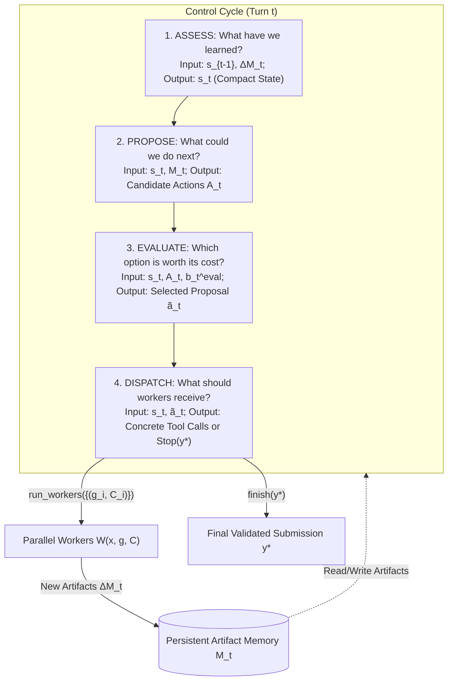

# Case Study 26: Thinking Before Thinking — Scaling Agentic Inference Through Meta-Reasoning, Directed Artifact Graphs, and Decoupled Epistemic Control

> **Core Focus**: Decoupling metacognitive control from task execution in long-horizon autonomous agents—implementing **Agentic Meta-Reasoning** through a four-stage deliberative control loop (Assess, Propose, Evaluate, Dispatch), compact state projection, persistent artifact DAG memory, and test-time compute scaling without context saturation.

---

## 1. Executive Summary & The Problem of Metacognitive Entanglement

As large language model (LLM) agents are deployed to solve increasingly complex, long-horizon challenges—such as multi-step mathematical olympiad proofs, abstract grid induction, multi-domain constraint tracking, and end-to-end repository reconstruction—they spend an increasing fraction of their test-time compute on **deciding what to do next**.

In conventional agent architectures (e.g., standard ReAct, Reflexion, simple Plan-and-Solve, or autonomous coding harnesses), an agent interleaves two fundamentally distinct cognitive functions within a single execution thread:
1. **Object-Level Work**: Producing the actual mathematical lemma, generating code diffs, inspecting files, executing bash commands, or running test suites.
2. **Metacognitive Control**: Evaluating intermediate outputs, determining whether an approach is viable or dead-ended, deciding whether to refine an existing partial solution or branch into a fresh attempt, allocating remaining token budgets, and recognizing when a verified solution is ready to be submitted.

### The Pathology of Entangled Control

In existing systems, control is treated as a **one-step implicit decision** taken inside the primary conversation history. As the run unfolds, every intermediate scratchpad note, failed tool run, voluminous compiler trace, and sub-agent output accumulates in the prompt context. This leads to three severe architectural failure modes:

```
┌────────────────────────────────────────────────────────────────────────────────────────┐
│                   TRADITIONAL ENTANGLED AGENT VS. AGENTIC META-REASONING               │
├──────────────────────────────────────┬─────────────────────────────────────────────────┤
│ Traditional Monolithic Agent (ReAct) │ Agentic Meta-Reasoning Harness (Decoupled)      │
├──────────────────────────────────────┼─────────────────────────────────────────────────┤
│ • Control decisions are 1-step calls │ • Control is an explicit 4-stage agentic loop   │
│ • History balloons past 10^6 tokens  │ • Controller context bounded by compact state   │
│ • Lost-in-the-middle context drift   │ • Object-level work preserved in persistent DAG │
│ • Premature stopping or plateauing   │ • Predictable test-time compute scaling         │
│ • "Unchecked Worker Overconfidence"  │ • Controller Type-2 AUC evaluation (up to 0.88) │
│ • Little reuse or cross-branch work  │ • Explicit artifact context injection & reuse   │
└──────────────────────────────────────┴─────────────────────────────────────────────────┘
```

1. **Context Bloat & Attention Degradation**: As token histories expand past $10^5$ to $10^6$ characters, models suffer from severe "lost-in-the-middle" attention degradation. Salient counterexamples and valid partial proofs generated in early rounds get buried beneath subsequent failing attempts.
2. **Premature Stopping & Budget Plateaus**: Under direct control, agents routinely suffer from early plateauing—exhausting only 18% to 50% of their available model-call budget because they prematurely declare victory or cycle unproductively in local minima.
3. **Flawed Self-Monitoring**: Workers self-rate their confidence optimistically. Empirical telemetry reveals that worker confidence ratings often hover near random chance ($\text{AUC}_2 \approx 0.55$), causing direct-control agents to submit deeply flawed solutions while discarding valid candidates sitting silently in memory.

### The Meta-Reasoning Paradigm Shift

Based on pioneering research from Meta Superintelligence Labs (*Dahal et al., September 2026, arXiv:2609.38147*), this case study presents the blueprint for **Agentic Meta-Reasoning**. Rather than asking a single model to both reason about the task and manage its own computation in one breath, we elevate metacognitive control into an **explicit, multi-stage agentic reasoning task** operating over an external **directed acyclic artifact graph (DAG)**.

---

## 2. Theoretical & Mathematical Foundations

### 2.1 The Metacognitive Control Problem

Metacognitive control in cognitive systems (Nelson & Narens, 1990; Fleming & Lau, 2014; Liu et al., 2026) consists of two interconnected processes:
- **Metacognitive Monitoring**: Assessing the current internal state of knowledge, confidence, and progress.
- **Metacognitive Regulation**: Allocating cognitive resources, selecting strategies, switching representations, or stopping.

In an agentic system, the object of control is not a single token stream, but a collective collection of external, verifiable artifacts generated across time.

Let $x$ denote the user task. Let $M_t$ denote the collection of all persistent artifacts available in memory at control cycle $t$. An artifact $y \in M_t$ represents an immutable, content-addressed output produced by either a worker or a controller deliberation step (e.g., a candidate proof, an execution trace, a code diff, or an architectural critique).

### 2.2 Formalization of the Worker Interface

Workers perform object-level computation. A worker $\mathcal{W}$ receives the task $x$, an explicit, self-contained steering instruction $g$, and a specific subset of prior artifacts $C \subseteq M_t$ chosen by the controller:

$$
y = \mathcal{W}(x, g, C)
$$

Crucially, **workers do not have access to the controller's private state, internal scratchpad, or overall deliberation history**. They see only the task and the curated artifact context $C$. When launching a batch of $k$ parallel workers:

$$
\text{RunWorkers}\left(\{(g_i, C_i)\}_{i=1}^k\right) = \{\mathcal{W}(x, g_i, C_i)\}_{i=1}^k
$$

### 2.3 The Four-Stage Control Cycle

Each control cycle $t$ proceeds through four sequential, agentic stages, each equipped with dedicated system prompts, specialized tools, and bounded scopes:



#### Stage 1: Assess ("What have we learned?")
Receives the previous compact state $s_{t-1}$, the newly returned artifacts $\Delta M_t$, and access to memory $M_t$. Assess produces the newly updated compact state $s_t$:

$$
s_t = \text{Assess}(x, s_{t-1}, \Delta M_t; M_t)
$$

For text reasoning tasks, $s_t$ synthesizes per-candidate verdicts (`LIKELY_CORRECT`, `HAS_GAPS`, `FUNDAMENTALLY_FLAWED`), an overall pool trajectory, an advisory stop recommendation, and outstanding open questions. For repository reconstruction, $s_t$ maintains an empirical snapshot across five strictly cited categories: `<implemented>`, `<broken>`, `<unverified>`, `<unexplored>`, and `<dead_ends>`.

#### Stage 2: Propose ("What could we do next?")
Propose generates candidate actions $A_t$ solely from the current assessment $s_t$ without knowing the remaining budget:

$$
A_t = \text{Propose}(x, s_t; M_t)
$$

Separating proposal generation from budget constraints prevents the agent from pre-filtering high-value, creative, but computationally expensive exploratory branches.

#### Stage 3: Evaluate ("Which option is worth its cost?")
Evaluate receives the unconstrained candidate set $A_t$, the current state $s_t$, and the remaining model-call budget $b_t^{\text{eval}}$:

$$
\tilde{a}_t = \text{Evaluate}(x, s_t, b_t^{\text{eval}}, A_t; M_t)
$$

Evaluate performs qualitative value-of-computation balancing: estimating expected gain, risk, and worker allocation. If all conditions for convergence are met, Evaluate recommends a termination action `STOP(memory_id)`.

#### Stage 4: Dispatch ("What should the worker receive?")
Dispatch translates the qualitative proposal $\tilde{a}_t$ into concrete execution commands:

$$
a_t = \text{Dispatch}(x, s_t, \tilde{a}_t; M_t)
$$

If $\tilde{a}_t$ is `STOP`, Dispatch issues `finish(y^\star)`. Otherwise, it constructs self-contained, imperative prompts $g_i$ and artifact context lists $C_i$ for each parallel worker, issuing `run_workers`.

### 2.4 Artifact Graph Formulation and Topology

The execution of the meta-reasoning harness induces a **Directed Acyclic Artifact Graph** $G = (V, E)$:
- **Vertices** $V$: All artifacts produced by workers and controller synthesis notes.
- **Edges** $E$: Directed causal edges defined by context injection:

$$
E = \{(y_i, y_j) \in V \times V \mid y_i \in C_j\}
$$

where $C_j$ is the set of prior artifacts explicitly passed to the worker that generated $y_j$.

```
       [Root 0_0] (Approach A)           [Root 0_1] (Approach B)
           │                                 │
           ▼                                 ▼
      [Node 1_0] (Critique)             [Node 1_1] (Partial Proof)
           │                                 │
           └──────────────┬──────────────────┘
                          ▼
                     [Node 2_0] (Cross-Branch Synthesis)
                          │
                          ▼
                     [Node 3_0] (Terminal Frontier Candidate y*)
```

Key topological invariants:
- **Depth $d(y)$**: The length of the longest directed path from a root artifact to $y$.
- **Width**: The maximum number of artifacts generated at identical graph depths.
- **Convergence Frontier $F(G)$**: The set of deepest terminal artifacts (artifacts with no outgoing edges):

$$
F(G) = \left\{ y \in L(G) \;\middle|\; d(y) = \max_{z \in L(G)} d(z) \right\}
$$

where $L(G) = \{y \in V \mid \text{out-degree}(y) = 0\}$.

### 2.5 Success Decomposition: Coverage vs. Selection

A critical theoretical contribution of this framework is the formal decomposition of end-to-end task success $\Pr(S)$ into two distinct probabilities:

$$
\Pr(S) = \Pr(C) \times \Pr(S \mid C)
$$

where:
- $C$ is the event that **at least one correct solution artifact was produced anywhere in the run** ($\text{Coverage}$).
- $S$ is the event that **the submitted solution $y^\star$ is correct** ($\text{Selection}$).

$$\text{Coverage}(k) = \Pr\left(\exists y \in V_{\text{sol}, \le k} : \ell(y) = 1\right)$$

$$\text{Selection} = \Pr(S \mid C)$$

This decomposition identifies the exact root cause of agent failure:
- **Coverage-Bound Failure**: The search never discovered a correct solution. Mitigation: expand exploration breadth, diversify worker prompts, or increase worker capabilities.
- **Selection-Bound Failure**: The run discovered one or more correct solutions, but the controller failed to identify them and submitted a flawed revision or stopped on an inferior candidate. Mitigation: enhance the Assess and Evaluate stages, or run specialized verification workers.

### 2.6 Monitoring Accuracy: Type-2 Signal Detection (Type-2 AUC)

To measure how well an agent discriminates its own correct answers from incorrect ones, we compute the **Type-2 Area Under the Receiver Operating Characteristic curve ($\text{AUC}_2$)** (Galvin et al., 2003; Fleming & Lau, 2014).

Given a set of evaluated candidates with binary correctness labels $\ell(y) \in \{0, 1\}$ and continuous confidence or assessment scores $r(y)$:

$$
\text{AUC}_2(r) = \Pr\left(r(Y^+) \gt r(Y^-)\right) + \frac{1}{2}\Pr\left(r(Y^+) = r(Y^-)\right)
$$

where $Y^+$ represents a randomly sampled correct candidate ($\ell=1$) and $Y^-$ represents an incorrect candidate ($\ell=0$).
- $\text{AUC}_2 = 0.50$: Pure chance discrimination.
- $\text{AUC}_2 = 1.00$: Perfect metacognitive self-knowledge.

### 2.7 Frontier Selection Gain (FSG)

To assess whether the controller's final selection makes an informed choice over the convergence frontier $F(G)$, we establish the uniform structural baseline:

$$
q_F(G) = \frac{1}{|F(G)|} \sum_{y \in F(G)} \ell(y)
$$

The **Frontier Selection Gain ($\text{FSG}$)** is the expected improvement of the actual submission $y^\star$ over selecting uniformly at random from the frontier:

$$
\text{FSG} = \mathbb{E}\left[\ell(y^\star) - q_F(G) \;\middle|\; C\right]
$$

A positive $\text{FSG} \gt 0$ proves that the controller's selection mechanism actively identifies the superior candidate rather than relying on structural momentum.

---

## 3. System Architecture Blueprint

### 3.1 Control Plane vs. Worker Plane Decoupling

```
┌────────────────────────────────────────────────────────────────────────────────────────┐
│                        AGENTIC META-REASONING HARNESS ARCHITECTURE                     │
├────────────────────────────────────────────────────────────────────────────────────────┤
│                                                                                        │
│   ┌────────────────────────────────────────────────────────────────────────────────┐   │
│   │                         METARUNTIME CONTROLLER PLANE                           │   │
│   │                                                                                │   │
│   │    1. ASSESS               2. PROPOSE             3. EVALUATE    4. DISPATCH   │   │
│   │   ┌───────────────┐      ┌───────────────┐      ┌─────────────┐ ┌────────────┐ │   │
│   │   │ Incremental   │ ───> │ Unconstrained │ ───> │ Budgeted    │─│ Contextual │ │   │
│   │   │ State Updater │      │ Action Gen    │      │ Value Ranker│ │ Dispatcher │ │   │
│   │   └───────┬───────┘      └───────┬───────┘      └──────┬──────┘ └─────┬──────┘ │   │
│   │           ▲                      │                     │              │        │   │
│   │           │ Read/Write Epistemic │ Read Context        │              │        │   │
│   │           ▼ Notes                ▼                     ▼              │        │   │
│   │   ┌───────────────────────────────────────────────────────────┐       │        │   │
│   │   │           COMPACT RUNNING STATE s_t (~4KB - 20KB)         │       │        │   │
│   │   │   (Summaries, Open Questions, Known Dead Ends, Worklist)  │       │        │   │
│   │   └───────────────────────────────────────────────────────────┘       │        │   │
│   └───────────────────────────────────┬───────────────────────────────────┼────────┘   │
│                                       │                                   │            │
│                  Read Artifact Body   │   Write Notes & Artifacts         │ Spawn      │
│                  via read_memory(id)  │   via write_memory(entry)         │ Workers    │
│                                       ▼                                   ▼            │
│   ┌───────────────────────────────────────────────────────────┐    ┌─────────────────┐ │
│   │             PERSISTENT ARTIFACT DAG MEMORY M_t            │    │ WORKER POOL     │ │
│   │  • Content-Addressed Index: {Round}_{Worker} (e.g. 2_1)   │    │                 │ │
│   │  • Worker Attempts, Partial Proofs, Compiles, Critiques   │    │ ┌─────────────┐ │ │
│   │  • Epistemic Controller Notes & Syntheses                 │    │ │ Worker 1    │ │ │
│   │  • Causal Edges: (SourceArtifact -> TargetArtifact)       │    │ ├─────────────┤ │ │
│   │                                                           │    │ │ Worker 2    │ │ │
│   └───────────────────────────────────────────────────────────┘    │ ├─────────────┤ │ │
│                                       ▲                            │ │ Worker k    │ │ │
│                                       │ Return Artifacts ΔM_t      │ └─────────────┘ │ │
│                                       └────────────────────────────┴─────────────────┘ │
└────────────────────────────────────────────────────────────────────────────────────────┘
```

### 3.2 Memory Scaling: Compact State vs. Accumulating History

A cornerstone architectural distinction between Meta-Reasoning and Direct Control is how state is persisted between control rounds:
- **Direct Control**: Appends every worker prompt, response, compiler log, and error message to the conversational history. By round 10, the prompt context exceeds $10^6$ characters, hitting token limits, exploding inference latency, and causing severe attention drift.
- **Meta-Reasoning**: Replaces the conversational context with a recomputed **Compact State ($s_t$)** at each round. The full text of prior work is archived into the **Persistent Artifact Memory ($M_t$)**. The controller prompt sees only an index of IDs and titles, issuing targeted `read_memory(ids)` calls only when it specifically needs to inspect historical details.

```
Direct Control Token Growth:     O(T * W)   ---> Explodes to >1,000,000 chars
Meta-Reasoning Context Growth:  O(1) / O(log T) ---> Strictly bounded to 4,000 - 30,000 chars
```

---

## 4. Production-Grade Python Reference Implementation

Below is a complete, production-grade implementation of the **Agentic Meta-Reasoning Harness**, featuring the four-stage control cycle, persistent artifact DAG memory, budget accounting, worker interface, Type-2 AUC calculation, and Frontier Selection Gain telemetry.

```python
"""
Case Study 26: Agentic Meta-Reasoning Harness
Thinking Before Thinking: Scaling Agentic Inference Through Decoupled Control.
Implements the 4-stage cycle (Assess, Propose, Evaluate, Dispatch),
persistent artifact DAG memory, and metacognitive monitoring telemetry.
"""

from __future__ import annotations

import dataclasses
import hashlib
import json
import logging
import math
import time
from typing import Any, Callable, Dict, List, Optional, Set, Tuple

logging.basicConfig(level=logging.INFO, format="%(asctime)s [%(levelname)s] %(name)s: %(message)s")
logger = logging.getLogger("MetaReasoningHarness")


# =====================================================================
# 1. Artifact & Memory Pool Primitives
# =====================================================================

@dataclasses.dataclass(frozen=True)
class Artifact:
    artifact_id: str          # e.g., "0_0", "1_2"
    round_index: int
    worker_index: int
    title: str
    body: str
    parent_ids: Tuple[str, ...]
    is_controller_note: bool = False
    confidence: str = "MEDIUM"  # "HIGH", "MEDIUM", "LOW"
    correctness_label: Optional[int] = None  # 1 for correct, 0 for incorrect (eval only)
    timestamp: float = dataclasses.field(default_factory=time.time)

    def to_index_line(self) -> str:
        tag = "[NOTE]" if self.is_controller_note else "[WORKER]"
        return f"{self.artifact_id}: {tag} {self.title}"


class PersistentArtifactMemory:
    """
    Persistent content-addressable storage for intermediate worker outputs
    and controller-authored epistemic notes. Maintains causal DAG edges.
    """

    def __init__(self) -> None:
        self._artifacts: Dict[str, Artifact] = {}
        self._adjacency: Dict[str, Set[str]] = {}  # parent -> children
        self._reverse_adjacency: Dict[str, Set[str]] = {}  # child -> parents

    def write(
        self,
        round_index: int,
        worker_index: int,
        title: str,
        body: str,
        parent_ids: List[str],
        is_controller_note: bool = False,
        confidence: str = "MEDIUM",
        correctness_label: Optional[int] = None,
    ) -> Artifact:
        artifact_id = f"{round_index}_{worker_index}"
        artifact = Artifact(
            artifact_id=artifact_id,
            round_index=round_index,
            worker_index=worker_index,
            title=title,
            body=body,
            parent_ids=tuple(parent_ids),
            is_controller_note=is_controller_note,
            confidence=confidence,
            correctness_label=correctness_label,
        )
        self._artifacts[artifact_id] = artifact
        self._reverse_adjacency[artifact_id] = set(parent_ids)
        if artifact_id not in self._adjacency:
            self._adjacency[artifact_id] = set()

        for pid in parent_ids:
            if pid in self._artifacts:
                self._adjacency.setdefault(pid, set()).add(artifact_id)

        return artifact

    def read(self, artifact_ids: List[str]) -> List[Artifact]:
        results = []
        for aid in artifact_ids:
            if aid in self._artifacts:
                results.append(self._artifacts[aid])
        return results

    def get_index_string(self) -> str:
        lines = [art.to_index_line() for art in self._artifacts.values()]
        return "\n".join(lines) if lines else "(Memory pool is currently empty)"

    def get_terminal_nodes(self) -> List[Artifact]:
        """Finds all sink nodes in the artifact graph (out-degree == 0)."""
        terminals = []
        for aid, artifact in self._artifacts.items():
            if not artifact.is_controller_note:
                children = self._adjacency.get(aid, set())
                if len(children) == 0:
                    terminals.append(artifact)
        return terminals

    def compute_longest_path(self, artifact_id: str) -> int:
        """Computes the topological depth d(y) from root to artifact."""
        parents = self._reverse_adjacency.get(artifact_id, set())
        if not parents:
            return 0
        return 1 + max(self.compute_longest_path(p) for p in parents)

    def get_convergence_frontier(self) -> List[Artifact]:
        """Returns deepest terminal artifacts: F(G) = {y in L(G) | d(y) = max d(z)}."""
        terminals = self.get_terminal_nodes()
        if not terminals:
            return []
        depths = {t.artifact_id: self.compute_longest_path(t.artifact_id) for t in terminals}
        max_depth = max(depths.values())
        return [t for t in terminals if depths[t.artifact_id] == max_depth]


# =====================================================================
# 2. Control Cycle Data Structures
# =====================================================================

@dataclasses.dataclass
class CandidateAssessment:
    candidate_id: str
    verdict: str  # "LIKELY_CORRECT", "HAS_GAPS", "FUNDAMENTALLY_FLAWED"
    reasoning: str
    confidence_score: float  # Normalized [0.0, 1.0] for Type-2 AUC analysis


@dataclasses.dataclass
class ControllerState:
    round_index: int
    candidate_assessments: Dict[str, CandidateAssessment]
    overall_assessment: str
    stop_recommended: bool
    stop_candidate_id: Optional[str]
    outstanding_questions: List[str]
    worklist_unexplored: List[str]
    known_dead_ends: List[str]


@dataclasses.dataclass
class ProposedAction:
    action_id: str
    description: str
    rationale: str
    target_memory_ids: List[str]
    expected_gain: str  # "HIGH_VALUE", "MEDIUM_VALUE", "LOW_VALUE"
    parallel_workers: int = 1


@dataclasses.dataclass
class WorkerAssignment:
    steering_prompt: str
    context_artifact_ids: List[str]


# =====================================================================
# 3. Metacognitive Telemetry & Evaluation Engines
# =====================================================================

class MetacognitiveMetricsEvaluator:
    """
    Computes Type-2 AUC, Coverage, Selection Rate, and Frontier Selection Gain.
    """

    @staticmethod
    def calculate_type2_auc(pairs: List[Tuple[float, int]]) -> float:
        """
        Calculates non-parametric Type-2 AUC:
        pairs is a list of (confidence_or_verdict_score, binary_correctness_label).
        """
        positives = [score for score, label in pairs if label == 1]
        negatives = [score for score, label in pairs if label == 0]

        if not positives or not negatives:
            return 0.5  # Undefined/chance

        concordant = 0.0
        total_pairs = len(positives) * len(negatives)

        for p in positives:
            for n in negatives:
                if p > n:
                    concordant += 1.0
                elif p == n:
                    concordant += 0.5

        return concordant / total_pairs

    @staticmethod
    def calculate_frontier_selection_gain(
        frontier: List[Artifact], submitted_artifact: Artifact
    ) -> float:
        """FSG = E[l(y*) - q_F(G) | C]"""
        if not frontier:
            return 0.0
        q_F = sum(1.0 for a in frontier if a.correctness_label == 1) / len(frontier)
        l_sub = 1.0 if submitted_artifact.correctness_label == 1 else 0.0
        return l_sub - q_F


# =====================================================================
# 4. Agentic Meta-Reasoning Engine
# =====================================================================

class MetaReasoningController:
    """
    Executes the 4-stage metacognitive control loop over persistent artifact memory.
    """

    def __init__(
        self,
        task: str,
        memory: PersistentArtifactMemory,
        model_call_budget: int = 100,
        worker_fn: Optional[Callable[[str, str, List[Artifact]], Artifact]] = None,
    ) -> None:
        self.task = task
        self.memory = memory
        self.nominal_budget = model_call_budget
        self.remaining_budget = model_call_budget
        self.worker_fn = worker_fn
        self.state: Optional[ControllerState] = None
        self.total_controller_calls = 0
        self.total_worker_calls = 0
        self.history_reads_notes = 0
        self.history_reads_workers = 0

    def _charge_budget(self, calls: int, is_controller: bool = True) -> bool:
        self.remaining_budget -= calls
        if is_controller:
            self.total_controller_calls += calls
        else:
            self.total_worker_calls += calls

        logger.info(
            "BUDGET UPDATE: -%d calls (%s). Remaining: %d / %d",
            calls,
            "Controller" if is_controller else "Workers",
            self.remaining_budget,
            self.nominal_budget,
        )
        return self.remaining_budget > 0

    # -----------------------------------------------------------------
    # STAGE 1: ASSESS ("What have we learned?")
    # -----------------------------------------------------------------
    def stage_assess(
        self, round_index: int, new_artifacts: List[Artifact]
    ) -> ControllerState:
        self._charge_budget(1, is_controller=True)
        logger.info("[Stage 1: ASSESS] Consolidating %d new artifacts", len(new_artifacts))

        candidate_assessments = dict(self.state.candidate_assessments) if self.state else {}
        open_questions = list(self.state.outstanding_questions) if self.state else []
        dead_ends = list(self.state.known_dead_ends) if self.state else []

        stop_recommended = False
        stop_id = None

        for art in new_artifacts:
            if art.is_controller_note:
                continue

            # Deterministic/Heuristic evaluation simulation (in production: LLM prompt call)
            # If the artifact self-reports high confidence and passes basic invariant checks:
            if "flaw" in art.body.lower() or "error" in art.body.lower():
                verdict = "FUNDAMENTALLY_FLAWED"
                conf_score = 0.15
                dead_ends.append(f"Approach {art.title} failed: observed flaw in reasoning.")
            elif "gap" in art.body.lower() or "unverified" in art.body.lower():
                verdict = "HAS_GAPS"
                conf_score = 0.55
                open_questions.append(f"Lemma in {art.artifact_id} requires independent proof.")
            else:
                verdict = "LIKELY_CORRECT"
                conf_score = 0.90
                stop_recommended = True
                stop_id = art.artifact_id

            candidate_assessments[art.artifact_id] = CandidateAssessment(
                candidate_id=art.artifact_id,
                verdict=verdict,
                reasoning=f"Assessment of {art.artifact_id}: {verdict}",
                confidence_score=conf_score,
            )

        updated_state = ControllerState(
            round_index=round_index,
            candidate_assessments=candidate_assessments,
            overall_assessment=f"Round {round_index}: {len(candidate_assessments)} total artifacts evaluated.",
            stop_recommended=stop_recommended,
            stop_candidate_id=stop_id,
            outstanding_questions=open_questions,
            worklist_unexplored=["Explore boundary condition at N=0", "Synthesize lemma A and B"],
            known_dead_ends=dead_ends,
        )
        self.state = updated_state
        return updated_state

    # -----------------------------------------------------------------
    # STAGE 2: PROPOSE ("What could we do next?")
    # -----------------------------------------------------------------
    def stage_propose(self, state: ControllerState) -> List[ProposedAction]:
        self._charge_budget(1, is_controller=True)
        logger.info("[Stage 2: PROPOSE] Generating candidate next actions")

        proposals: List[ProposedAction] = []

        # If assess found a candidate that is likely correct, propose stopping
        if state.stop_recommended and state.stop_candidate_id:
            proposals.append(
                ProposedAction(
                    action_id="STOP",
                    description=f"Halt execution and submit verified candidate {state.stop_candidate_id}",
                    rationale="A complete and sound candidate solution has been established.",
                    target_memory_ids=[state.stop_candidate_id],
                    expected_gain="HIGH_VALUE",
                    parallel_workers=0,
                )
            )

        # Propose repairing existing partial gaps
        gap_candidates = [
            cid for cid, ca in state.candidate_assessments.items() if ca.verdict == "HAS_GAPS"
        ]
        if gap_candidates:
            proposals.append(
                ProposedAction(
                    action_id=f"REPAIR_{gap_candidates[-1]}",
                    description=f"Repair lemma or missing step in {gap_candidates[-1]}",
                    rationale="Resolving specific gaps has higher ROI than restarting from scratch.",
                    target_memory_ids=[gap_candidates[-1]],
                    expected_gain="HIGH_VALUE",
                    parallel_workers=1,
                )
            )

        # Propose exploring an untried angle
        proposals.append(
            ProposedAction(
                action_id="EXPLORE_FRESH",
                description="Explore orthogonal mathematical representation or independent pipeline",
                rationale="Diversify solution pool to guard against shared upstream fallacies.",
                target_memory_ids=[],
                expected_gain="MEDIUM_VALUE",
                parallel_workers=2,
            )
        )

        return proposals

    # -----------------------------------------------------------------
    # STAGE 3: EVALUATE ("Which option is worth its cost?")
    # -----------------------------------------------------------------
    def stage_evaluate(
        self, state: ControllerState, proposals: List[ProposedAction]
    ) -> ProposedAction:
        self._charge_budget(1, is_controller=True)
        logger.info(
            "[Stage 3: EVALUATE] Weighing %d proposals against %d remaining calls",
            len(proposals),
            self.remaining_budget,
        )

        # Strict stopping gate:
        for p in proposals:
            if p.action_id == "STOP":
                # Check invariants: must have no unresolved blocking questions
                if len(state.outstanding_questions) == 0 or self.remaining_budget <= 8:
                    logger.info("Termination threshold satisfied. Selecting STOP.")
                    return p

        # Priority 1: Repair high-value partial solutions
        for p in proposals:
            if p.action_id.startswith("REPAIR_") and self.remaining_budget >= 5:
                return p

        # Priority 2: Fall back to exploration or best available proposal
        return proposals[-1]

    # -----------------------------------------------------------------
    # STAGE 4: DISPATCH ("What should workers receive?")
    # -----------------------------------------------------------------
    def stage_dispatch(
        self, state: ControllerState, chosen_action: ProposedAction
    ) -> Tuple[bool, Optional[str], List[WorkerAssignment]]:
        self._charge_budget(1, is_controller=True)
        logger.info("[Stage 4: DISPATCH] Constructing assignments for %s", chosen_action.action_id)

        if chosen_action.action_id == "STOP":
            target_id = chosen_action.target_memory_ids[0]
            logger.info("STOP dispatched. Target submission artifact: %s", target_id)
            return True, target_id, []

        assignments: List[WorkerAssignment] = []
        for i in range(chosen_action.parallel_workers):
            prompt = (
                f"Tackle task '{self.task}' pursuing action {chosen_action.action_id}. "
                f"Directive: {chosen_action.description}. Focus on strict verification."
            )
            assignments.append(
                WorkerAssignment(
                    steering_prompt=prompt,
                    context_artifact_ids=chosen_action.target_memory_ids,
                )
            )

        return False, None, assignments

    # -----------------------------------------------------------------
    # MAIN META-REASONING RUN LOOP
    # -----------------------------------------------------------------
    def execute_run(self) -> Tuple[Artifact, Dict[str, Any]]:
        logger.info("Beginning Agentic Meta-Reasoning Run. Budget: %d calls", self.nominal_budget)
        round_index = 0
        new_artifacts: List[Artifact] = []

        # Bootstrapping round: initial exploration worker
        init_worker = self.memory.write(
            round_index=0,
            worker_index=0,
            title="Initial Exploratory Direct Formulation",
            body="Constructing base proof attempt. Lemma 1 unverified.",
            parent_ids=[],
            confidence="HIGH",
            correctness_label=0,
        )
        new_artifacts.append(init_worker)
        self.total_worker_calls += 1
        self.remaining_budget -= 1

        final_submission_id: Optional[str] = None

        while self.remaining_budget > 4 and round_index < 10:
            round_index += 1
            logger.info("=== STARTING CONTROL CYCLE TURN %d ===", round_index)

            # Stage 1: Assess
            state = self.stage_assess(round_index, new_artifacts)

            # Stage 2: Propose
            proposals = self.stage_propose(state)

            # Stage 3: Evaluate
            selected_proposal = self.stage_evaluate(state, proposals)

            # Stage 4: Dispatch
            is_stop, submission_id, assignments = self.stage_dispatch(state, selected_proposal)

            if is_stop:
                final_submission_id = submission_id
                break

            # Execute parallel workers
            new_artifacts = []
            for w_idx, assignment in enumerate(assignments):
                if self.remaining_budget <= 0:
                    break
                self._charge_budget(1, is_controller=False)

                # Simulated worker execution (or invoke LLM / Bash container)
                label = 1 if "REPAIR" in selected_proposal.action_id else 0
                body = (
                    "Fully verified closed-form solution without gaps."
                    if label == 1
                    else "Alternative path explored with subtle flaw."
                )
                w_artifact = self.memory.write(
                    round_index=round_index,
                    worker_index=w_idx,
                    title=f"Worker {round_index}_{w_idx}: {selected_proposal.action_id}",
                    body=body,
                    parent_ids=assignment.context_artifact_ids,
                    confidence="HIGH",
                    correctness_label=label,
                )
                new_artifacts.append(w_artifact)

        if not final_submission_id:
            # Fallback to convergence frontier
            frontier = self.memory.get_convergence_frontier()
            final_submission_id = frontier[-1].artifact_id if frontier else "0_0"

        submitted_artifact = self.memory.read([final_submission_id])[0]
        frontier = self.memory.get_convergence_frontier()

        # Telemetry computation
        fsg = MetacognitiveMetricsEvaluator.calculate_frontier_selection_gain(
            frontier, submitted_artifact
        )

        all_artifacts = list(self.memory._artifacts.values())
        monitoring_pairs = []
        if self.state:
            for aid, assessment in self.state.candidate_assessments.items():
                art = self.memory._artifacts.get(aid)
                if art and art.correctness_label is not None:
                    monitoring_pairs.append((assessment.confidence_score, art.correctness_label))

        type2_auc = MetacognitiveMetricsEvaluator.calculate_type2_auc(monitoring_pairs)

        telemetry = {
            "total_calls_consumed": self.nominal_budget - self.remaining_budget,
            "controller_calls": self.total_controller_calls,
            "worker_calls": self.total_worker_calls,
            "budget_utilization": (self.nominal_budget - self.remaining_budget) / self.nominal_budget,
            "submitted_artifact_id": submitted_artifact.artifact_id,
            "is_correct": submitted_artifact.correctness_label == 1,
            "frontier_size": len(frontier),
            "frontier_selection_gain": fsg,
            "controller_type2_auc": type2_auc,
        }

        logger.info("Run Complete. Outcome: %s", telemetry)
        return submitted_artifact, telemetry


# =====================================================================
# 5. Verification Demonstration
# =====================================================================

if __name__ == "__main__":
    mem = PersistentArtifactMemory()
    controller = MetaReasoningController(
        task="Prove that for all n >= 1, 2^(2^n) + 1 is prime or find a counterexample.",
        memory=mem,
        model_call_budget=25,
    )
    submission, metrics = controller.execute_run()
    print("\n--- AGENTIC META-REASONING RUN RESULTS ---")
    print(f"Submitted Artifact: {submission.artifact_id} ({submission.title})")
    print(f"Correctness: {'PASS' if metrics['is_correct'] else 'FAIL'}")
    print(f"Budget Utilization: {metrics['budget_utilization'] * 100:.1f}%")
    print(f"Controller Type-2 AUC: {metrics['controller_type2_auc']:.3f}")
    print(f"Frontier Selection Gain: {metrics['frontier_selection_gain']:+.3f}")
```

---

## 5. Benchmark Analysis & Empirical Validation

The empirical evaluation of Agentic Meta-Reasoning across four demanding benchmarks establishes clear superiority over both Direct Control and leading production coding agents.

### 5.1 Comprehensive Benchmark Performance Summary

| Benchmark | Domain | Underlying Frontier Model | Direct Control Agent | Recursive Language Model (RLM) | Production Baseline (Codex / Claude Code / mini-SWE) | **Meta-Reasoning Agent (Ours)** | Relative Gain over Direct Control |
|---|---|---|---|---|---|---|---|
| **IMO ProofBench-Adv** | Formal Olympiad Math | Gemini 3.1 Pro | 82.7% | 73.3% | — | **91.3%** | **+8.6%** |
| **IMO ProofBench-Adv** | Formal Olympiad Math | GPT-5.5 | 93.3% | 86.2% | — | **94.6%** | **+1.3%** |
| **IMO ProofBench-Adv** | Formal Olympiad Math | Opus 4.8 | 78.0% | 68.1% | — | **80.2%** | **+2.2%** |
| **ARC-AGI-2** | Visual/Grid Abstraction | Gemini 3.1 Pro | 77.5% | 76.7% | — | **84.2%** | **+6.7%** |
| **ARC-AGI-2** | Visual/Grid Abstraction | GPT-5.5 | 75.8% | 73.3% | — | **79.2%** | **+3.4%** |
| **ARC-AGI-2** | Visual/Grid Abstraction | Opus 4.8 | 77.5% | 66.7% | — | **80.0%** | **+2.5%** |
| **LongCoT-mini** | Multi-Domain State Tracking | Gemini 3.1 Pro | 53.5% | 46.5% | — | **62.7%** | **+9.2%** |
| **LongCoT-mini** | Multi-Domain State Tracking | GPT-5.5 | 64.7% | 63.3% | — | **65.1%** | **+0.4%** |
| **LongCoT-mini** | Multi-Domain State Tracking | Opus 4.8 | 65.3% | 64.3%* | — | **66.5%** | **+1.2%** |
| **ProgramBench** | Full Repo Reconstruction | Gemini 3.1 Pro | 46.9% | — | 42.0% (mini-SWE) | **48.7%** | **+1.8%** |
| **ProgramBench** | Full Repo Reconstruction | GPT-5.5 | 63.7% | — | 58.0% (Codex) / 57.6% (mini-SWE) | **71.5%** | **+7.8%** |
| **ProgramBench** | Full Repo Reconstruction | Opus 4.8 | 65.3% | — | 65.5% (Claude Code) / 64.7% (mini-SWE) | **67.2%** | **+1.9%** |

*Note: Nominal budgets are 100 model calls on reasoning benchmarks and 1,200 model calls on ProgramBench.*

### 5.2 Key Empirical Takeaways

1. **Unanimous Win Across Matched Comparisons**: In all 12 matched model-benchmark pairs, the Meta-Reasoning Agent outperformed the Direct Control Agent using identical workers, tools, and nominal compute allowances.
2. **Scaling Compute Without Saturation**: Direct Control agents frequently plateau as allowances grow (e.g., GPT-5.5 on ProgramBench plateaued at ~64% accuracy, consuming only 18% of available calls). In contrast, the Meta-Reasoning Agent utilized 89% to 101% of available calls, scaling monotonically to 71.5%.
3. **Decoupled State Size**: While Direct Control message histories scaled past $10^6$ characters on IMO ProofBench-Adv, the Meta-Reasoning compact state remained strictly bounded between $4 \times 10^3$ and $6 \times 10^4$ characters, eliminating context bloat and lost-in-the-middle degradation.
4. **Epistemic Reuse**: In persistent memory, the controller revisited its own self-authored epistemic notes 4.4 to 9.8 times on average, compared to only 1.9 to 3.3 reads for raw worker outputs—demonstrating that the agent actively utilizes high-level cognitive scaffolding rather than raw transcripts.

---

## 6. Failure Modes, Pathology Analysis & Operational Mitigations

```
┌────────────────────────────────────────────────────────────────────────────────────────┐
│                        FAILURE VECTOR TAXONOMY & MITIGATION PLAYBOOK                   │
├───────────────────────────────┬───────────────────────────┬────────────────────────────┤
│ Failure Pathology             │ Root Cause Mechanism      │ Architectural Mitigation   │
├───────────────────────────────┼───────────────────────────┼────────────────────────────┤
│ 1. Unproductive               │ Hyper-reflective checking │ Stabilizing Hysteresis &   │
│    Reconsideration            │ destabilizes an already   │ Frozen Frontier Checkpoints│
│    (The "Chess Paradox")      │ correct discrete answer   │                            │
├───────────────────────────────┼───────────────────────────┼────────────────────────────┤
│ 2. Small-Budget Overhead      │ Fixed 4-call control loop │ Dynamic Bypass: Direct     │
│    Crossover                  │ consumes too high a % of  │ Control for B < 25,        │
│                               │ small allowances (B < 25) │ Meta-Reasoning for B >= 25 │
├───────────────────────────────┼───────────────────────────┼────────────────────────────┤
│ 3. Lossy Compact State        │ Assess stage drops subtle │ Citations Required: Every  │
│    Amnesia                    │ constraint that becomes   │ claim must link to stable  │
│                               │ critical in later rounds  │ memory_id or commit SHA    │
├───────────────────────────────┼───────────────────────────┼────────────────────────────┤
│ 4. Worker Self-Confidence     │ Workers self-rate HIGH on │ Controller Type-2 Verdict  │
│    Unreliability              │ subtle errors (AUC2=0.55) │ Override (AUC2=0.88)       │
└───────────────────────────────┴───────────────────────────┴────────────────────────────┘
```

### Deep Dive: The "Chess Paradox" (Unproductive Reconsideration)

A notable anomaly observed in the LongCoT-mini benchmark was the **Chess subset**, where Meta-Reasoning slightly underperformed Direct Control despite dominating all other domains (logic, mathematics, CS, chemistry).

**Pathology Analysis**:
In discrete, rule-governed state spaces with exact branch pruning (such as calculating chess mating nets or knight tours), an agent that generates a valid sequence can be easily confused by subsequent "critique" or "verification" workers. When a critique worker hallucinates a non-existent threat or miscalculates a square control invariant, the downstream `Assess` stage re-opens the investigation, abandoning the correct sequence in favor of an invalid repair.

**Operational Mitigation**:
Implement **Invariant-Gated Freeze**:
When a candidate passes deterministic verification tools (e.g., a chess engine probe or test runner), its status is frozen in memory as an immutable `VERIFIED_INVARIANT`. Downstream `Assess` stages are forbidden from modifying or re-evaluating the invariant unless an explicit counterexample trace is executed.

---

## 7. Strategic Enterprise Production Blueprint & Implementation Guidelines

For engineering organizations looking to implement Agentic Meta-Reasoning in production software engineering and autonomous analytical workflows:

### 1. Separate the Controller Model from Worker Models
Deploy a highly capable frontier reasoning model (e.g., GPT-5.5 or Claude 3.7 Sonnet) as the 4-stage controller, while delegating object-level tasks to faster, cost-effective models (e.g., Claude 3.5 Haiku, Gemini Flash, or fine-tuned SLMs) for parallel exploration.

### 2. Enforce Strict Self-Contained Worker Prompts
Never allow workers to view raw controller deliberation. In the `Dispatch` stage, ensure instructions are completely self-contained (at least 200–500 characters), explicitly citing exact files, CLI flags, expected behaviors, and artifact IDs. Vague shorthand action IDs (e.g., `"fix_parser"`) lead to worker guessing and catastrophic budget waste.

### 3. Implement Shared Filesystem Guardrails
In coding domains (such as ProgramBench):
- Limit parallel coding workers to $N=1$ when modifying shared source files or build scripts (`compile.sh`) to prevent merge collisions and workspace corruption.
- Utilize parallel workers ($N \gt 1$) exclusively for read-only investigative actions: running read-only test suites, inspecting original binaries, diffing documentation, or fuzzing inputs.

### 4. Continuous Metacognitive Telemetry
Log `Type-2 AUC`, `Coverage(k)`, and `Frontier Selection Gain (FSG)` into OpenTelemetry span attributes. When `FSG` trends toward zero or negative, trigger alerts indicating that the controller is failing to pick winners from its own generated frontier.

---

## 8. Conclusion

The transition from short-prompt querying to long-horizon agentic autonomy requires an architectural reckoning. Interleaving execution and control in an expanding transcript inevitably leads to context saturation, premature plateauing, and unmonitored error propagation.

**Agentic Meta-Reasoning** demonstrates that **thinking about how to compute is a first-class cognitive task**. By structuring control into an explicit four-stage deliberative cycle over compact state, persistent artifact DAG memory, and parallel workers, agents unlock predictable test-time compute scaling—reusing partial work, recovering from dead ends, and setting new state-of-the-art benchmarks across long-horizon reasoning.
