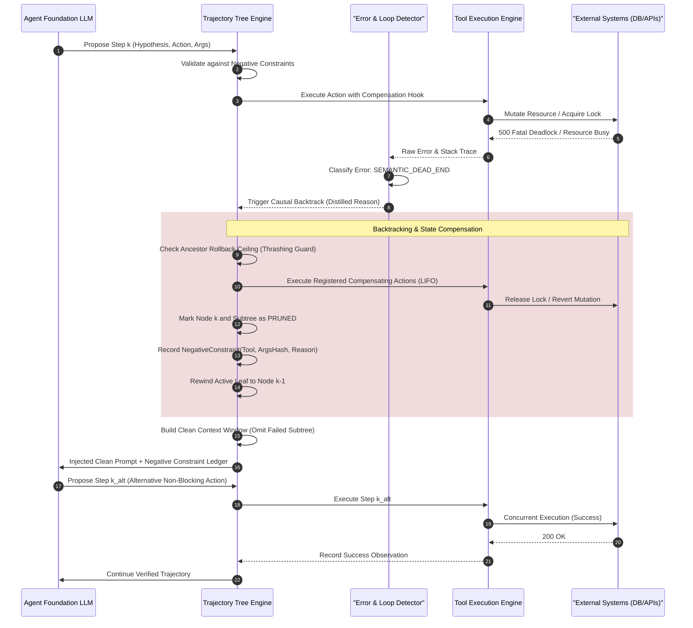
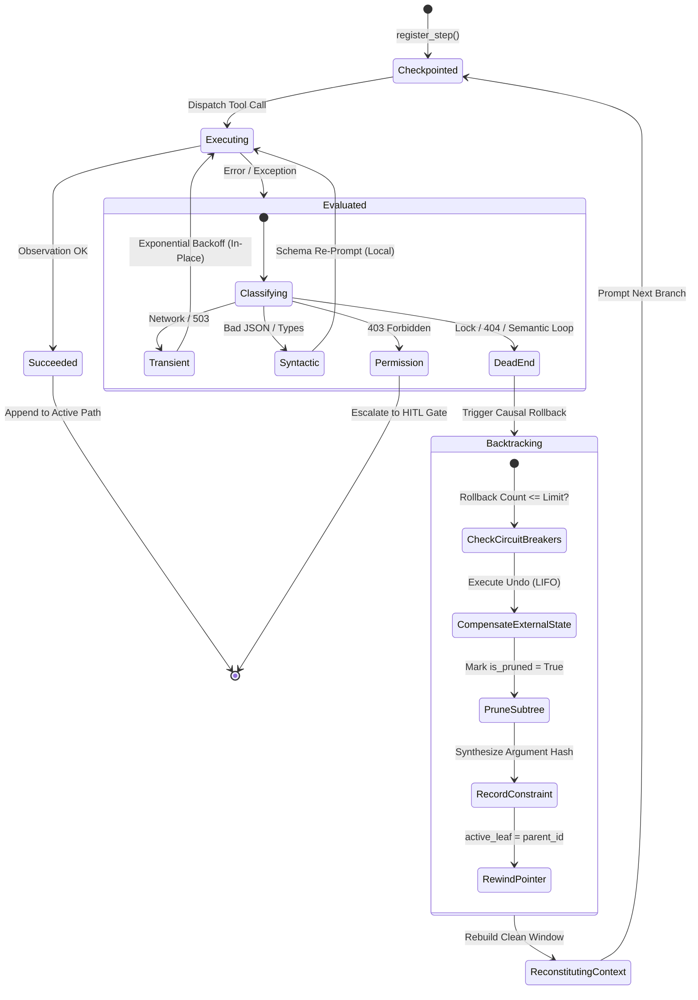

# Case Study 27: Autonomous Reflection Loops & Directed Graph Backtracking — Anti-Loop Budgeting, Causal State Invalidation, and Dynamic Context Pruning

> **Core Focus**: Replacing naive in-context self-correction with a formal **Causal Graph Backtracking Engine**—modeling trajectories as Directed Acyclic Graphs (DAGs), classifying semantic dead-ends, executing Saga-style compensating undo actions, pruning failed subtrees from the prompt window, and injecting authoritative Negative Constraint Ledgers to eliminate runaway token loops.

---

## 1. Executive Summary & The Pathology of Naive Reflection

Autonomous agents deployed on long-horizon, multi-step workflows—such as enterprise infrastructure migrations, automated code refactoring, distributed data pipelines, and multi-tenant API integrations—frequently encounter unexpected runtime anomalies. These include tool invocation exceptions, permission denials, database deadlocks, missing remote entities, and rigid API schema mismatches.

In conventional agent architectures (standard ReAct, Reflexion, or simple conversational loops), systems rely on **naive in-context self-correction**:

```
[Agent Action] ──> [Tool Failure / Stack Trace] ──> [Append to Scratchpad] ──> "Reflect & Try Again"
```

The system appends the failure output or raw multi-kilobyte stack trace directly to the conversational scratchpad and prompts the model: *"That attempt failed. Please reflect on the error and try a different approach."*

In enterprise production environments, this naive pattern is catastrophic, inducing three distinct structural failure modes:

```
┌────────────────────────────────────────────────────────────────────────────────────────┐
│               THE THREE PATHOLOGIES OF NAIVE IN-CONTEXT REFLECTION                     │
├──────────────────────────────────────┬─────────────────────────────────────────────────┤
│ Degenerative Repetition Loops        │ • The LLM generates near-identical arguments    │
│ (Semantic Equivalence Cycling)      │ • Toggling between two invalid flag variations  │
│                                      │ • Hamming distance between attempts ≈ 0         │
├──────────────────────────────────────┼─────────────────────────────────────────────────┤
│ Context Poisoning & Saturation       │ • Accumulating raw 500-line stack traces        │
│ (Attention Window Degradation)       │ • Model outputs verbose apologies & excuses     │
│                                      │ • KV cache memory explosion & high token burn   │
├──────────────────────────────────────┼─────────────────────────────────────────────────┤
│ Absence of Branch Invalidation       │ • Trajectory is trapped in a linear chat log   │
│ (No State Rollback / Pruning)        │ • Inability to revert to a verified safe state │
│                                      │ • Model cannot formally invalidate a hypothesis│
└──────────────────────────────────────┴─────────────────────────────────────────────────┘
```

1. **Degenerative Repetition Loops**: Because large language models exhibit strong auto-regressive recency bias, seeing the failed action immediately above the generation token horizon often causes the model to reproduce the same action with superficial, inconsequential variations (e.g., swapping double quotes for single quotes, or cycling between two invalid parameter names).
2. **Context Poisoning & Saturation**: Appending multiple failed attempts, vendor stack traces, network timeouts, and lengthy apology tokens pollutes the model's active attention window. Critical system instructions, initial constraints, and earlier valid observations get pushed out of the high-attention region ("lost in the middle"), leading to severe instruction drift.
3. **Absence of Systematic Branch Invalidation**: A linear conversation log cannot distinguish between a *temporary parameter mistake* and a *fundamentally invalid hypothesis*. The agent lacks a mechanism to unwind external side effects, abandon a dead-end branch, and revert its internal attention context to the exact ancestor node where the flawed hypothesis was first adopted.

### The Solution: Causal Graph Backtracking & Anti-Loop Budgeting

To achieve deterministic resilience, execution trajectories are decoupled from linear chat histories and modeled as a **Directed Acyclic Graph (DAG) of State Nodes**. When execution encounters a semantic dead-end:
- The engine classifies the failure mode.
- The active execution leaf is **rewound** to the nearest valid ancestor decision point.
- The failed sub-tree is **pruned** from the active context window, eliminating stack traces and toxic apologies.
- An immutable, structured **Negative Constraint Ledger** (invalidation vector) is synthesized and prepended to the system prompt, formally prohibiting the agent from retrying the disproven path.
- Compensating undo actions are executed in reverse order to revert partial mutations in external systems.

---

## 2. Theoretical & Mathematical Foundations

### 2.1 Trajectory State Space as a Directed Tree

Let the agent's problem-solving trajectory be represented as an evolving directed tree:

$$
\mathcal{T} = (\mathcal{V}, \mathcal{E}, v_0)
$$

where $v_0$ is the root state representing the initial user request and system instruction. Each state node $v_k \in \mathcal{V}$ is an immutable tuple:

$$
v_k = \langle \sigma_k, h_k, a_k, \vec{\theta}_k, o_k, \tau_k, \phi_k \rangle
$$

- $\sigma_k$: The environment snapshot or state delta hash at step $k$.
- $h_k$: The agent's explicit hypothesis or sub-goal rationale.
- $a_k$: The selected tool or action primitive ($a_k \in \mathcal{A}$).
- $\vec{\theta}_k$: The exact parameter payload passed to $a_k$.
- $o_k$: The observation or execution response returned by the environment.
- $\tau_k$: The token cost incurred during step $k$.
- $\phi_k$: An ordered list of registered compensating actions (undo operations).

Directed edges $(v_i, v_j) \in \mathcal{E}$ define parent-to-child lineage, where $v_i = \text{parent}(v_j)$.

### 2.2 Causal Error Classification

When an observation $o_k$ signals an anomaly, a deterministic classifier or edge Small Language Model (SLM) evaluates the failure:

$$
\mathcal{C}(a_k, \vec{\theta}_k, o_k) \to \kappa \in \{\text{TRANSIENT}, \text{SYNTACTIC}, \text{SEMANTIC\_DEAD\_END}, \text{PERMISSION\_DENIED}\}
$$

The transition rules are defined as follows:

$$
\text{Action}(\kappa) = \begin{cases}
\text{ExponentialBackoff}(v_k), & \text{if } \kappa = \text{TRANSIENT} \\
\text{LocalSchemaReprompt}(v_k), & \text{if } \kappa = \text{SYNTACTIC} \\
\text{CausalBacktrack}(v_k), & \text{if } \kappa = \text{SEMANTIC\_DEAD\_END} \\
\text{EscalateToHITL}(v_k), & \text{if } \kappa = \text{PERMISSION\_DENIED}
\end{cases}
$$

### 2.3 Causal Invalidation Vectors & Negative Constraint Projection

When a node $v_{\text{fail}}$ is classified as a `SEMANTIC_DEAD_END`, the engine synthesizes an invalidation vector $\nu$:

$$
\nu = \left( h_{\text{fail}}, a_{\text{fail}}, \mathcal{H}(\vec{\theta}_{\text{fail}}), \rho_{\text{causal}}, \Omega \right)
$$

where:
- $\mathcal{H}(\vec{\theta}) = \text{SHA256}(\text{sort}(\vec{\theta}))_{1:16}$ is the canonical argument hash.
- $\rho_{\text{causal}}$ is the concise distilled explanation of the failure (stripped of raw stack traces).
- $\Omega \in \{\text{EXACT\_ARGUMENTS}, \text{TOOL\_TARGET}, \text{SUBTREE\_HYPOTHESIS}\}$ denotes the invalidation scope.

The system maintains a monotonic **Negative Constraint Ledger** $\mathcal{N}$:

$$
\mathcal{N}_{t+1} = \mathcal{N}_t \cup \{\nu\}
$$

A proposed candidate action $(a', \vec{\theta}')$ is admitted if and only if it satisfies the admissibility condition:

$$
\forall \nu_i \in \mathcal{N}: \quad \neg \left( a' = a_{\nu_i} \wedge \mathcal{H}(\vec{\theta}') = \mathcal{H}(\vec{\theta}_{\nu_i}) \right)
$$

### 2.4 Clean Context Reconstruction Operator

Let $v_{\text{active}}$ be the active leaf pointer. The ancestor lineage path from root $v_0$ to $v_{\text{active}}$ is given by:

$$
\mathcal{P}(v_{\text{active}}) = [v_0, v_1, \dots, v_{\text{active}}] \quad \text{such that } v_{i-1} = \text{parent}(v_i)
$$

When a backtrack occurs from $v_{\text{fail}}$ to ancestor $v_{\text{ancestor}} = \text{parent}(v_{\text{fail}})$, the entire subtree rooted at $v_{\text{fail}}$ is marked pruned:

$$
\mathcal{V}_{\text{pruned}} = \{ u \in \mathcal{V} \mid v_{\text{fail}} \rightsquigarrow_{\mathcal{T}} u \}
$$

The **Clean Context Reconstruction Operator** $\Pi_{\text{clean}}$ constructs the prompt context $\mathcal{M}$:

$$
\mathcal{M} = \Pi_{\text{clean}}(\mathcal{T}, v_{\text{ancestor}}, \mathcal{N}) = \mathbf{S}(\mathcal{N}) \oplus \bigoplus_{v_i \in \mathcal{P}(v_{\text{ancestor}})} \mathbf{Turn}(v_i)
$$

where $\mathbf{S}(\mathcal{N})$ is the authoritative system prompt containing the Negative Constraint Ledger, and $\mathbf{Turn}(v_i)$ formats only verified, unpruned steps. All failed attempts and multi-kilobyte stack traces are strictly excluded:

$$
\forall u \in \mathcal{V}_{\text{pruned}}, \quad \mathbf{Turn}(u) \notin \mathcal{M}
$$

### 2.5 Anti-Loop Budgeting & Global Token Accounting

To prevent token creep where an agent repeatedly explores and prunes failing branches indefinitely, the engine enforces a strict two-tier budgeting envelope:

$$
\text{Depth}(v_{\text{active}}) \le D_{\max}
$$

$$
\mathcal{B}_{\text{total}} = \sum_{v \in \mathcal{V}_{\text{active}}} \tau(v) + \sum_{u \in \mathcal{V}_{\text{pruned}}} \tau(u) \le B_{\max}
$$

If $\mathcal{B}_{\text{total}} \gt B_{\max}$, the anti-loop circuit breaker trips immediately, terminating the trajectory and preventing financial depletion.

Furthermore, to prevent **Backtracking Thrashing** (cycling back and forth at the same ancestor), each node tracks its rollback frequency $\mu(v)$:

$$
\mu(v) = \sum_{t} \mathbf{1}_{\{ \text{rewind\_to}(v) \}} \le \mu_{\max}
$$

If $\mu(v) \gt \mu_{\max}$, the ancestor itself is invalidated, forcing the engine to backtrack further up the tree or halt.

---

## 3. System Architecture & Design Pattern

The Causal Graph Backtracking Engine integrates into the autonomous agent loop as an intelligent state supervisor and context governor.

```
                           [Agent Executive Loop]
                                     │
                               Generates Step
                                     ▼
                         ┌───────────────────────┐
                         │   State Node (k)      │
                         │  - Plan / Hypothesis  │
                         │  - Tool Call Action   │
                         └───────────┬───────────┘
                                     │
                            Dispatches Tool Call
                                     ▼
                         ┌───────────────────────┐
                         │ Tool Execution Engine │
                         └───────────┬───────────┘
                                     │
                         Observation / Execution Error
                                     ▼
                         ┌───────────────────────┐
                         │  Causal Error & Loop  │
                         │    Detector (SLM)     │
                         └───────────┬───────────┘
                                     │
            ┌────────────────────────┴────────────────────────┐
       [Deterministic Success]                       [Dead-End / Repeat Error]
            │                                                 │
            ▼                                                 ▼
    ┌──────────────────┐                           ┌─────────────────────┐
    │ Append Node (k+1)│                           │ Graph Backtracking  │
    │ Continue Linear  │                           │ Engine              │
    │ Trajectory       │                           └──────────┬──────────┘
    └──────────────────┘                                      │
                                      ┌───────────────────────┴───────────────────────┐
                                      ▼                                               ▼
                         ┌───────────────────────────┐                 ┌───────────────────────────┐
                         │ 1. Rollback State Tree    │                 │ 2. Synthesize Negative    │
                         │ Rewind to valid Node(k-1);│                 │    Constraint Ledger      │
                         │ prune failed sub-tree     │                 │ "Path X invalidated: Y"   │
                         └─────────────┬─────────────┘                 └─────────────┬─────────────┘
                                       │                                             │
                                       └──────────────────────┬──────────────────────┘
                                                              ▼
                                                 [Clean Injected Prompt]
                                             (Zero Token Bloat / Fresh Branch)
```

### Component Architecture Overview

1. **Agent Executive Loop**: Orchestrates high-level planning, querying the foundation LLM with clean, pruned context windows.
2. **Immutable State Tree Journal**: Maintains the full DAG $\mathcal{T} = (\mathcal{V}, \mathcal{E})$, recording state deltas, cumulative token counts, and compensating actions for every step.
3. **Causal Error & Loop Detector**: An edge SLM or deterministic rule-engine that classifies observations into transient, syntactic, or semantic dead-ends, checking proposed actions against active constraints.
4. **Saga Compensation Coordinator**: Manages external state mutations. When a node is pruned, its registered compensating actions are executed in reverse order (LIFO) to ensure external consistency.
5. **Context Reconstitution Governor**: Generates the next prompt context $\Pi_{\text{clean}}$ for the LLM, injecting the updated Negative Constraint Ledger and entirely omitting dead-end subtrees.

### End-to-End Sequence Diagram

The following sequence diagram details the full lifecycle of a detected dead-end, rollback, compensation execution, constraint injection, and clean path exploration:



---

## 4. The Backtracking Lifecycle & State Invalidation Protocol

The state machine governing a node's lifecycle ensures that failed attempts are handled cleanly without runaway token inflation:



### Stage 1: Immutable Node Checkpointing & State Delta Capture
Every action produces an immutable state node containing:
- Unique node ID and parent reference.
- Explicit hypothesis string stating *why* this action is expected to succeed.
- Exact tool name and JSON-serializable argument dictionary.
- Step token cost and cumulative token counters.
- Zero or more `CompensatingAction` instances defining how to undo external mutations if this branch is subsequently abandoned.

### Stage 2: Causal Error Classification & Loop Detection
Errors are categorized into four distinct classes:
- **`TRANSIENT`**: Network dropouts, rate limits (HTTP 429), or temporary socket timeouts. Handled *in-place* using exponential backoff with jitter without graph rollback.
- **`SYNTACTIC`**: Malformed JSON arguments, missing required dictionary keys, or parameter type mismatches. Handled *in-place* via a single targeted schema re-prompt.
- **`SEMANTIC_DEAD_END`**: Missing entities, deadlocks, logical contradictions, unsupported operations, or repeated parameter patterns. Triggers **Causal Graph Backtracking**.
- **`PERMISSION_DENIED`**: Insufficient credentials or authorization failure. Triggers immediate escalation to a Human-in-the-Loop (HITL) gate or security sentinel.

### Stage 3: Context Pruning & Tree Rewind
When `SEMANTIC_DEAD_END` is confirmed:
1. The engine identifies the failed node's direct ancestor $v_{\text{parent}}$.
2. The entire subtree descending from the failed node is recursively marked `is_pruned = True`.
3. Registered compensating undo actions are executed in reverse topological order (LIFO).
4. The active leaf pointer is reset to $v_{\text{parent}}$.
5. All pruned nodes, observations, and stack traces are excluded from subsequent LLM prompt assemblies.

### Stage 4: Negative Constraint Ledger Synthesis
The engine extracts the failed action, argument hash, and a distilled causal explanation (e.g., *"ExclusiveLock deadlock on relation 'orders' under live write load"*), creating an immutable `NegativeConstraint`. 

This constraint is injected directly into the system prompt:
```text
### CRITICAL NEGATIVE CONSTRAINT LEDGER (PRUNED DEAD-ENDS):
The following execution trajectories were formally disproven. Do not attempt them:
- AVOID tool 'drop_constraint' with args {'cascade': False, 'constraint': 'fk_user_id', 'table': 'orders'} | Failure: ExclusiveLock deadlock on relation 'orders' under live write load
```

If the agent subsequently attempts to call this tool with matching arguments, the engine's pre-execution interceptor rejects the step *before* calling the tool or billing downstream inference tokens.

---

## 5. Production Implementation Specification

The following reference implementation demonstrates the core data structures and backtracking engine. The complete, fully tested runner is available in [`examples/graph_backtracking_engine.py`](examples/graph_backtracking_engine.py).

### Core Data Models & Schemas

```python
from enum import Enum
import hashlib
import json
import time
from typing import Any, Dict, List, Optional
import uuid
from pydantic import BaseModel, Field


class ErrorClass(str, Enum):
    TRANSIENT = "TRANSIENT"
    SYNTACTIC = "SYNTACTIC"
    SEMANTIC_DEAD_END = "SEMANTIC_DEAD_END"
    PERMISSION_DENIED = "PERMISSION_DENIED"


class CompensatingAction(BaseModel):
    """Represents an undo operation for external mutations."""
    tool_name: str
    arguments: Dict[str, Any]
    description: str


class NegativeConstraint(BaseModel):
    """An immutable invalidation vector preventing retries of failed branches."""
    invalidated_hypothesis: str
    failed_tool: str
    invalid_argument_patterns: Dict[str, Any]
    argument_hash: str
    causal_reason: str
    invalidation_scope: str = "EXACT_ARGUMENTS"
    timestamp: float = Field(default_factory=time.time)

    def matches(self, tool_name: str, arguments: Dict[str, Any]) -> bool:
        if tool_name != self.failed_tool:
            return False
        if self.invalidation_scope == "TOOL_TARGET":
            return True
        arg_hash = hashlib.sha256(
            json.dumps(arguments, sort_keys=True).encode("utf-8")
        ).hexdigest()[:16]
        return arg_hash == self.argument_hash


class TrajectoryNode(BaseModel):
    """An immutable node in the trajectory execution tree."""
    node_id: str = Field(default_factory=lambda: str(uuid.uuid4())[:8])
    parent_id: Optional[str] = None
    step_depth: int = 0
    hypothesis: str
    action_tool_name: str
    action_arguments: Dict[str, Any]
    observation: Optional[str] = None
    error_class: Optional[ErrorClass] = None
    cumulative_tokens: int = 0
    step_tokens: int = 0
    is_terminal: bool = False
    is_pruned: bool = False
    children_ids: List[str] = Field(default_factory=list)
    compensating_actions: List[CompensatingAction] = Field(default_factory=list)
    timestamp: float = Field(default_factory=time.time)
```

### Causal Backtracking & Tree Reconstitution Engine

```python
class TrajectoryTreeEngine:
    """
    Manages the Directed Acyclic Graph (DAG) of agent states, enforcing anti-loop budgeting,
    causal backtracking, negative constraint generation, and clean context reconstruction.
    """

    def __init__(
        self,
        max_step_budget: int = 15,
        max_cost_tokens: int = 25_000,
        max_rollbacks_per_ancestor: int = 3,
        max_global_rollbacks: int = 5,
    ):
        self.nodes: Dict[str, TrajectoryNode] = {}
        self.negative_constraints: List[NegativeConstraint] = []
        self.active_leaf_id: Optional[str] = None
        self.max_step_budget = max_step_budget
        self.max_cost_tokens = max_cost_tokens
        self.max_rollbacks_per_ancestor = max_rollbacks_per_ancestor
        self.max_global_rollbacks = max_global_rollbacks
        
        self.rollback_counts: Dict[str, int] = {}
        self.total_rollbacks: int = 0
        self.total_tokens_consumed: int = 0
        self.tokens_wasted_on_pruned_branches: int = 0
        self.compensation_log: List[str] = []

    def register_step(
        self,
        hypothesis: str,
        tool: str,
        arguments: Dict[str, Any],
        step_token_cost: int = 350,
        compensating_action: Optional[CompensatingAction] = None,
    ) -> str:
        # 1. Enforce negative constraints
        for constraint in self.negative_constraints:
            if constraint.matches(tool, arguments):
                raise ValueError(
                    f"Blocked by Negative Constraint: Action {tool}({arguments}) violates "
                    f"invalidation vector from hypothesis '{constraint.invalidated_hypothesis}'. "
                    f"Reason: {constraint.causal_reason}"
                )

        parent = self.nodes.get(self.active_leaf_id) if self.active_leaf_id else None
        parent_depth = parent.step_depth if parent else 0
        cumulative = (parent.cumulative_tokens if parent else 0) + step_token_cost
        self.total_tokens_consumed += step_token_cost

        # 2. Enforce Anti-Loop Budget thresholds
        if parent_depth + 1 > self.max_step_budget:
            raise RuntimeError(f"Step Budget Exceeded: Max depth {self.max_step_budget} reached.")

        if self.total_tokens_consumed > self.max_cost_tokens:
            raise RuntimeError(f"Token Budget Exceeded: Cumulative {self.total_tokens_consumed} > {self.max_cost_tokens}.")

        node = TrajectoryNode(
            parent_id=self.active_leaf_id,
            step_depth=parent_depth + 1,
            hypothesis=hypothesis,
            action_tool_name=tool,
            action_arguments=arguments,
            cumulative_tokens=cumulative,
            step_tokens=step_token_cost,
        )

        if compensating_action:
            node.compensating_actions.append(compensating_action)

        self.nodes[node.node_id] = node
        if parent:
            parent.children_ids.append(node.node_id)
        self.active_leaf_id = node.node_id
        return node.node_id

    def record_observation(
        self,
        node_id: str,
        observation: str,
        error_class: Optional[ErrorClass] = None,
        tool_executor_callback: Optional[Callable[[str, Dict[str, Any]], Any]] = None,
        distilled_reason: Optional[str] = None,
    ) -> bool:
        node = self.nodes[node_id]
        node.observation = observation
        node.error_class = error_class

        if error_class == ErrorClass.SEMANTIC_DEAD_END:
            reason = distilled_reason or observation.split("\n")[0][:120]
            self.backtrack(node_id, reason=reason, tool_executor_callback=tool_executor_callback)
            return False
        return True

    def backtrack(
        self,
        failed_node_id: str,
        reason: str,
        tool_executor_callback: Optional[Callable[[str, Dict[str, Any]], Any]] = None,
    ):
        failed_node = self.nodes[failed_node_id]
        ancestor_id = failed_node.parent_id

        # Circuit breaker: Check rollback count
        rollback_key = ancestor_id or "ROOT"
        curr_rollbacks = self.rollback_counts.get(rollback_key, 0) + 1
        self.rollback_counts[rollback_key] = curr_rollbacks
        self.total_rollbacks += 1

        if curr_rollbacks > self.max_rollbacks_per_ancestor:
            raise RuntimeError(
                f"Backtracking Thrashing: Ancestor [{rollback_key}] exceeded rollback limit "
                f"({curr_rollbacks} > {self.max_rollbacks_per_ancestor})."
            )

        if self.total_rollbacks > self.max_global_rollbacks:
            raise RuntimeError(f"Global Rollback Limit Exceeded: {self.total_rollbacks} rollbacks performed.")

        # Prune subtree and execute compensating actions
        pruned_nodes = self._prune_subtree(failed_node_id, tool_executor_callback)
        wasted = sum(n.step_tokens for n in pruned_nodes)
        self.tokens_wasted_on_pruned_branches += wasted

        # Synthesize negative constraint
        arg_hash = hashlib.sha256(
            json.dumps(failed_node.action_arguments, sort_keys=True).encode("utf-8")
        ).hexdigest()[:16]

        constraint = NegativeConstraint(
            invalidated_hypothesis=failed_node.hypothesis,
            failed_tool=failed_node.action_tool_name,
            invalid_argument_patterns=failed_node.action_arguments,
            argument_hash=arg_hash,
            causal_reason=reason,
            invalidation_scope="EXACT_ARGUMENTS",
        )
        self.negative_constraints.append(constraint)

        # Rewind pointer to ancestor
        self.active_leaf_id = ancestor_id

    def _prune_subtree(
        self,
        root_node_id: str,
        tool_executor_callback: Optional[Callable[[str, Dict[str, Any]], Any]] = None,
    ) -> List[TrajectoryNode]:
        pruned: List[TrajectoryNode] = []
        queue = [root_node_id]

        while queue:
            nid = queue.pop(0)
            node = self.nodes[nid]
            node.is_pruned = True
            pruned.append(node)
            queue.extend(node.children_ids)

        # Execute compensating actions in reverse topological order (LIFO)
        for node in reversed(pruned):
            for comp in reversed(node.compensating_actions):
                self.compensation_log.append(f"{comp.tool_name}({comp.arguments})")
                if tool_executor_callback:
                    tool_executor_callback(comp.tool_name, comp.arguments)

        return pruned

    def build_clean_context_window(self, system_instruction: str = "") -> List[Dict[str, str]]:
        active_path: List[TrajectoryNode] = []
        curr_id = self.active_leaf_id

        while curr_id:
            node = self.nodes[curr_id]
            if not node.is_pruned:
                active_path.append(node)
            curr_id = node.parent_id

        active_path.reverse()
        messages: List[Dict[str, str]] = []

        base_system = system_instruction or "You are an autonomous agent with causal graph backtracking."
        if self.negative_constraints:
            ledger_lines = [
                f"- AVOID tool '{c.failed_tool}' with args {c.invalid_argument_patterns} | Failure: {c.causal_reason}"
                for c in self.negative_constraints
            ]
            full_system = (
                f"{base_system}\n\n"
                f"### CRITICAL NEGATIVE CONSTRAINT LEDGER (PRUNED DEAD-ENDS):\n"
                f"The following execution trajectories were formally disproven. Do not attempt them:\n"
                + "\n".join(ledger_lines)
            )
        else:
            full_system = base_system

        messages.append({"role": "system", "content": full_system})

        for step in active_path:
            messages.append({
                "role": "assistant",
                "content": f"Thought: {step.hypothesis}\nAction: {step.action_tool_name}({json.dumps(step.action_arguments)})",
            })
            if step.observation:
                messages.append({
                    "role": "user",
                    "content": f"Observation: {step.observation}",
                })

        return messages
```

---

## 6. Failure Modes, Trade-Offs, & Edge-Case Mitigations

| Failure Mode | Root Cause | Impact | Architectural Mitigation |
|---|---|---|---|
| **Negative Constraint Over-Generalization** | Agent misinterprets a parameter-level failure as an invalidation of the entire tool. | Agent prematurely bans valid tools, blocking legitimate alternative paths. | Enforce structured constraint schemas with deterministic argument hashing (`SHA-256(args)`) rather than blanket tool bans. |
| **Backtracking Thrashing** | Agent continually rolls back to the exact same ancestor without proposing viable alternatives. | Infinite cycling between shallow branch probes and immediate rollbacks. | Implement an ancestor-specific circuit breaker limiting rollbacks to $\mu_{\max} = 3$. Once exceeded, invalidate the ancestor itself. |
| **Token Budget Creep** | Repeated exploration of multiple pruned paths consumes cumulative tokens without progress. | High API costs and eventual run failure without completing the primary goal. | Global cumulative token accounting tracks spend across *both* active and pruned branches against a hard ceiling ($B_{\max}$). |
| **State Drift in External Systems** | A rolled-back branch executed state-mutating external side effects (e.g., database inserts, cloud resource provisioning). | Environment becomes desynchronized from the pruned internal state tree. | Mandate tool-level idempotency and register explicit `CompensatingAction` hooks (Saga pattern) executed during subtree pruning. |
| **Phantom Tool Hallucination** | Injected Negative Constraints cause model attention to focus on the prohibited tool names. | Model attempts syntactic variations to bypass the constraint. | Pre-execution deterministic gating intercepts tool calls matching constraint hashes before dispatching to the executor. |

---

## 7. Telemetry, Observability & OpenTelemetry Tracing

In enterprise production deployments, causal backtracking requires first-class OpenTelemetry (OTel) span trees to monitor branch divergence, prune depth, and wasted token burn.

### OpenTelemetry Span Hierarchy

```text
[Trace: agent.task.execution]
├── span: agent.node.step_1 [inspect_schema]
│   ├── attribute: gen_ai.prompt.tokens = 420
│   └── attribute: agent.trajectory.state = "SUCCEEDED"
├── span: agent.node.step_2 [drop_constraint]  <-- FAILED
│   ├── attribute: error.type = "SEMANTIC_DEAD_END"
│   ├── attribute: exception.message = "FATAL DEADLOCK 40P01"
│   └── span: agent.backtrack
│       ├── span: agent.compensation.release_advisory_lock
│       │   └── attribute: compensation.target_resource = "migration_phase_1"
│       ├── attribute: backtrack.ancestor_id = "step_1"
│       ├── attribute: backtrack.pruned_nodes_count = 1
│       └── attribute: backtrack.wasted_tokens = 650
└── span: agent.node.step_3 [create_index_concurrently]  <-- RECOVERY BRANCH
    ├── attribute: agent.context.negative_constraints_count = 1
    ├── attribute: gen_ai.prompt.tokens = 480
    └── attribute: agent.trajectory.state = "SUCCEEDED"
```

### Key Production Metrics

- `agent.trajectory.nodes_created_total`: Total number of state nodes created across all branches.
- `agent.trajectory.nodes_pruned_total`: Number of nodes pruned during causal backtracks.
- `agent.backtrack.events_total`: Count of rollback events segmented by `error_class`.
- `agent.tokens.wasted_pruned_ratio`: Ratio of tokens consumed on discarded branches relative to total spend:

$$
\mathcal{R}_{\text{waste}} = \frac{\sum_{u \in \mathcal{V}_{\text{pruned}}} \tau(u)}{\mathcal{B}_{\text{total}}}
$$

- `agent.negative_constraints.active_gauge`: Number of active invalidation vectors steering the current executive loop.

---

## 8. End-to-End Walkthrough Scenario: Autonomous Database Migration

Consider an autonomous Site Reliability Engineering (SRE) agent tasked with optimizing table indexes on a high-throughput enterprise database.

### The Naive ReAct Failure (Linear Append)

1. **Step 1**: Agent inspects `orders` table. Observation notes active write traffic and foreign key constraints.
2. **Step 2**: Agent issues `drop_constraint(table='orders', constraint='fk_user_id')`.
3. **Execution Failure**: Postgres returns `FATAL DEADLOCK: PostgresException 40P01: Deadlock detected while waiting for ExclusiveLock on relation 'orders'`.
4. **Naive Self-Correction**: 
   - Error stack trace appended to prompt scratchpad.
   - LLM: *"I apologize for the deadlock error. Let me reflect. I will try dropping the constraint again with cascade=True."*
   - Step 3 fails again with deadlock. Context grows by 1,200 tokens.
   - LLM: *"I apologize again. Let me retry with an alter table command."*
   - Context saturates, earlier safety instructions are pushed out of context, and the agent exhausts its budget trapped in a **Degenerative Repetition Loop**.

### The Causal Graph Backtracking Resolution

1. **Step 1**: Agent inspects `orders` table. State node check-pointed.
2. **Step 2**: Agent issues `drop_constraint`, registering a compensating action to release advisory lock `migration_phase_1`.
3. **Execution Failure**: Tool returns deadlock exception.
4. **Detector Evaluation**: The error detector identifies `SEMANTIC_DEAD_END`.
5. **Causal Graph Backtrack**:
   - Engine executes compensation hook: `release_advisory_lock('migration_phase_1')`.
   - Node 2 is marked `is_pruned = True`. 650 tokens marked as wasted.
   - Engine synthesizes negative constraint: `AVOID drop_constraint with {'table': 'orders', 'constraint': 'fk_user_id'}`.
   - Active leaf pointer rewound to Step 1.
6. **Clean Prompt Generation**:
   - The 500-token PostgreSQL deadlock stack trace is **completely excised** from the dialog history.
   - Negative Constraint Ledger injected into system instructions.
7. **Step 4 (Alternative Branch)**:
   - LLM observes clean history and the prohibition against exclusive table locks.
   - LLM selects: `create_index_concurrently(table='orders', column='user_id', index_name='orders_idx_user_concurrent')`.
   - Action succeeds in 1.42 seconds without taking an exclusive table lock.
   - Task completed cleanly with zero context saturation.

---

## 9. Verification & Executable Reference Implementation

The complete reference implementation is packaged with an end-to-end simulation test suite.

### Running the Reference Pipeline

```bash
# Execute the standalone verification script
python case-studies/27-autonomous-reflection-loops-graph-backtracking/examples/graph_backtracking_engine.py
```

### Verification Assertions Verified by Test Suite

- **Active Leaf Rewind**: Verifies pointer correctly resets to ancestor node upon semantic failure.
- **Negative Constraint Gating**: Confirms that identical or equivalent failing actions are intercepted and rejected prior to execution.
- **Compensating Action Order**: Ensures external undo actions execute in reverse topological order (LIFO).
- **Clean Context Integrity**: Asserts that raw stack traces and pruned assistant actions are completely absent from conversation turns.
- **Anti-Loop Budgeting Telemetry**: Verifies that tokens wasted on pruned subtrees are accurately tracked in cumulative expenditure metrics.

---

## 10. Summary & Architectural Checklist

When implementing Directed Graph Backtracking in production agent systems, verify adherence to this architectural checklist:

- [x] **Immutable State Nodes**: Every action, argument payload, and observation is persisted in a content-addressed DAG.
- [x] **Discrete Error Taxonomy**: Errors are rigorously partitioned into transient backoff, syntactic re-prompt, semantic dead-ends, and permission escalation.
- [x] **Subtree Pruning**: Failed branches, raw stack traces, and verbose apology turns are strictly purged from the active prompt context.
- [x] **Negative Constraint Ledgers**: Disproven hypotheses and argument hashes are injected into system prompts as authoritative invalidation vectors.
- [x] **Saga Undo Hooks**: State-mutating tools register explicit compensating actions executed upon branch rollback.
- [x] **Two-Tier Anti-Loop Budgets**: Step depth and cumulative token limits apply across both active and pruned branches to prevent runaway loops.
- [x] **Thrashing Circuit Breakers**: Ancestor rollback frequencies are capped to prevent endless cycling in unproductive subtrees.
