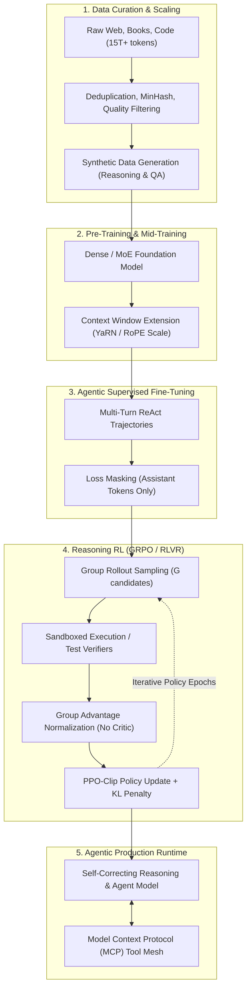

# Case Study 28: Modern LLM & Agent Training Lifecycles — From Pre-Training and Agentic SFT to RLVR (GRPO) and Sandboxed Tool Grounding

> **Core Focus**: Demystifying how modern reasoning models and autonomous agents are built—progressing beyond naive next-token prediction and standard Supervised Fine-Tuning (SFT) into multi-turn agentic loss masking, Direct Preference Optimization (DPO), and Reinforcement Learning with Verifiable Rewards (RLVR / GRPO) within sandboxed tool environments.

---

## 1. Executive Summary & The Evolution of LLM Post-Training

A widespread misconception in applied machine learning is that Large Language Models (LLMs) are simply "trained on next-word prediction and then fine-tuned on instruction-answer pairs." 

While this two-stage mental model accurately describes early generative systems (such as GPT-3 and initial InstructGPT releases), it fails completely to explain the capabilities of modern **Reasoning Models and Autonomous Agents** (e.g., DeepSeek-R1, OpenAI o1/o3, Claude 3.5 Sonnet, and Llama 3.3).

```
┌────────────────────────────────────────────────────────────────────────────────────────┐
│                        THE EVOLUTION OF LLM TRAINING PARADIGMS                         │
├──────────────────────────────────────┬─────────────────────────────────────────────────┤
│ Classical Two-Stage Pipeline         │ Modern 6-Stage Agentic Pipeline                 │
├──────────────────────────────────────┼─────────────────────────────────────────────────┤
│ 1. Pre-Training (Next-Token Pred)    │ 1. Pre-Training (Massive Causal Pre-training)   │
│ 2. Supervised Fine-Tuning (SFT)      │ 2. Mid-Training (Context Scaling & Math/Code)   │
│                                      │ 3. Agentic SFT (Tool-calling & Loss Masking)    │
│                                      │ 4. Preference Alignment (DPO / KTO / ORPO)      │
│                                      │ 5. Reasoning RL / RLVR (GRPO without Critics)   │
│                                      │ 6. Sandboxed Tool Grounding (SWE / Execution)   │
└──────────────────────────────────────┴─────────────────────────────────────────────────┘
```

### The "SFT Wall" & Why Supervised Fine-Tuning Fails for Autonomous Agents

Supervised Fine-Tuning (SFT) trains a model by maximizing the log-likelihood of target tokens written by human annotators or teacher models. In complex agentic trajectories, SFT encounters fundamental limitations known as the **SFT Wall**:

1. **Sycophancy and Hallucination**: When an SFT model does not possess the factual knowledge required to complete a step, cross-entropy loss penalizes saying "I do not know" or backtracking just as severely as guessing an incorrect fact. The model learns to generate fluent, highly confident hallucinations.
2. **Exposure Bias in Multi-Step Trajectories**: During SFT, the model is always fed ground-truth prefixes (teacher forcing). At inference time, once the agent makes a single suboptimal tool call or parameter mistake, it encounters a state distribution never seen during training, triggering cascading failure.
3. **Inability to Discover Novel Search Strategies**: SFT can only mimic trajectories present in its training corpus. It cannot discover counter-intuitive search paths, self-correction strategies, or algorithmic backtracking that human annotators did not explicitly draft.
4. **Environment Execution Disconnect**: Human annotators cannot write millions of authentic compiler errors, database locks, or API rate-limit traces. Training models on static SFT pairs leaves them ill-prepared for dynamic, stochastic tool environments.

Modern agent training overcomes these barriers by integrating **Reinforcement Learning with Verifiable Rewards (RLVR)** and **Group Relative Policy Optimization (GRPO)**, empowering models to explore, self-correct, and optimize their own test-time reasoning tokens.

---

## 2. Theoretical & Mathematical Foundations

### 2.1 Stage 1: Causal Next-Token Pre-Training & Compute Scaling

During pre-training, the model with parameters $\theta$ learns foundational world representations, linguistic grammar, mathematical logic, and syntax over an uncurated or deduplicated corpus $\mathcal{D}_{\text{pre}}$ of trillions of tokens:

$$
\mathcal{L}_{\text{pre}}(\theta) = - \mathbb{E}_{x \sim \mathcal{D}_{\text{pre}}} \left[ \sum_{t=1}^T \log P_\theta(x_t \mid x_{\lt t}) \right]
$$

According to the Chinchilla scaling laws (Hoffmann et al.), compute-optimal frontier models balance parameter count $N$ and token count $D$ under a floating-point operations budget $C \approx 6 N D$:

$$
N_{\text{opt}} \propto C^a, \quad D_{\text{opt}} \propto C^b \quad \text{where } a \approx 0.5, \; b \approx 0.5
$$

In modern post-Chinchilla pre-training, models are deliberately over-trained past the compute-optimal point (e.g., Llama 3 training an 8B parameter model on $15 \times 10^{12}$ tokens, where $D/N \approx 1875 \gg 20$) to minimize downstream inference latency.

### 2.2 Stage 2: Supervised Fine-Tuning (SFT) with Multi-Turn Agentic Loss Masking

In an autonomous agent interaction, a conversation consists of multiple turns: user queries, system instructions, agent thought traces, structured tool calls, and external tool observations.

Mathematically, the sequence is represented as:

$$
X = [x_1, x_2, \dots, x_T]
$$

A critical architectural requirement is **Token Loss Masking**. The loss must **only** be calculated over tokens authored by the assistant. Calculating loss over user prompts or environment tool observations forces the model to waste capacity memorizing third-party responses:

$$
\mathcal{L}_{\text{SFT}}(\theta) = - \sum_{t=1}^T m_t \cdot \log P_\theta(x_t \mid x_{\lt t})
$$

where the binary mask $m_t$ is defined as:

$$
m_t = \begin{cases}
1, & \text{if } x_t \in \text{AssistantThoughtTokens} \cup \text{ToolCallTokens} \cup \text{FinalAnswerTokens} \\
0, & \text{if } x_t \in \text{SystemPrompt} \cup \text{UserTurn} \cup \text{ToolObservationTokens}
\end{cases}
$$

### 2.3 Stage 3: Direct Preference Optimization (DPO)

Following SFT, models undergo preference alignment to penalize harmful outputs, eliminate defensive refusal loops, and favor concise, structured outputs. 

Rather than fitting an explicit reward model $r_\psi(x, y)$ and using unstable reinforcement learning (PPO), Direct Preference Optimization (DPO) leverages a mathematical equivalence between the Bradley-Terry preference model and the optimal policy:

$$
\mathcal{L}_{\text{DPO}}(\theta; \pi_{\text{ref}}) = - \mathbb{E}_{(x, y_w, y_l) \sim \mathcal{D}_{\text{pref}}} \left[ \log \sigma \left( \beta \log \frac{\pi_\theta(y_w \mid x)}{\pi_{\text{ref}}(y_w \mid x)} - \beta \log \frac{\pi_\theta(y_l \mid x)}{\pi_{\text{ref}}(y_l \mid x)} \right) \right]
$$

where $y_w$ is the winning (preferred) response, $y_l$ is the losing response, $\pi_{\text{ref}}$ is the frozen SFT reference policy, and $\beta$ is a temperature hyperparameter controlling divergence from $\pi_{\text{ref}}$.

### 2.4 Stage 4: Group Relative Policy Optimization (GRPO / RLVR)

For complex reasoning and autonomous tool-use, human preference labels fail because humans cannot evaluate subtle algorithmic correctness across thousands of steps. Instead, modern training uses **Reinforcement Learning with Verifiable Rewards (RLVR)**.

Pioneered by DeepSeekMath and DeepSeek-R1, **Group Relative Policy Optimization (GRPO)** eliminates the separate Value (Critic) network used in Proximal Policy Optimization (PPO), saving up to 50% of GPU VRAM and eliminating critic estimation bias.

For each query prompt $q$, GRPO samples a group of $G$ independent rollouts from the old policy:

$$
\mathcal{O} = \{o_1, o_2, \dots, o_G\} \sim \pi_{\theta_{\text{old}}}(o \mid q)
$$

Each rollout $o_i$ is evaluated by a rule-based deterministic verifier (e.g., Python test runner, formal math proof solver, JSON schema validator) returning a scalar reward $r_i$.

The advantage $A_i$ for candidate $o_i$ is computed by normalizing against the group's empirical mean and standard deviation:

$$
A_i = \frac{r_i - \frac{1}{G}\sum_{j=1}^G r_j}{\sqrt{\frac{1}{G}\sum_{j=1}^G \left( r_j - \bar{r} \right)^2} + \epsilon}
$$

The GRPO objective maximized by the policy parameters $\theta$ is:

$$
\mathcal{J}_{\text{GRPO}}(\theta) = \mathbb{E}_{q \sim \mathcal{D}, \{o_i\}_{i=1}^G \sim \pi_{\theta_{\text{old}}}} \left[ \frac{1}{G} \sum_{i=1}^G \left( \min \left( \frac{\pi_\theta(o_i \mid q)}{\pi_{\theta_{\text{old}}}(o_i \mid q)} A_i, \; \text{clip}\left(\frac{\pi_\theta(o_i \mid q)}{\pi_{\theta_{\text{old}}}(o_i \mid q)}, 1-\epsilon, 1+\epsilon\right) A_i \right) - \beta \mathbb{D}_{\text{KL}}(\pi_\theta \parallel \pi_{\text{ref}}) \right) \right]
$$

where the Kullback-Leibler (KL) divergence penalty prevents the policy from collapsing:

$$
\mathbb{D}_{\text{KL}}(\pi_\theta \parallel \pi_{\text{ref}}) = \frac{\pi_{\text{ref}}(o_i \mid q)}{\pi_\theta(o_i \mid q)} - \log \frac{\pi_{\text{ref}}(o_i \mid q)}{\pi_\theta(o_i \mid q)} - 1
$$

### 2.5 Verifiable Reward Formulation for Autonomous Agents

In agentic tasks, the reward function $r(o_i)$ is entirely objective and non-parametric:

$$
r(o_i) = \lambda_1 r_{\text{accuracy}} + \lambda_2 r_{\text{format}} + \lambda_3 r_{\text{efficiency}}
$$

- $r_{\text{accuracy}} \in \{0.0, 1.0\}$: Evaluated by sandboxed execution (e.g., unit test suite passes, math target matched, database state reaches consistency).
- $r_{\text{format}} \in \{-0.5, 0.2\}$: Rewards strict compliance with structured thinking tags (`<think> ... </think>`) and valid JSON tool call schemas.
- $r_{\text{efficiency}} \in [-\delta, 0]$: Small negative step penalty proportional to token length or tool call count, penalizing unproductive infinite loops.

---

## 3. Architectural Blueprints & Pipeline Topology

The end-to-end lifecycle spans six coordinated phases:



### GRPO Actor-Only Architecture vs. Classical PPO

In standard Actor-Critic PPO, two massive neural networks must reside in GPU memory simultaneously: the **Actor** ($\pi_\theta$) and the **Critic** ($V_\phi$). In addition, reference policies ($\pi_{\text{ref}}$) and reward models ($R_\psi$) are required.

```
┌────────────────────────────────────────────────────────────────────────────────────────┐
│                        ACTOR-CRITIC (PPO) VS. ACTOR-ONLY (GRPO)                        │
├────────────────────────────────────────────────────────────────────────────────────────┤
│ CLASSICAL PPO (4 Models in VRAM):                                                      │
│                                                                                        │
│   Prompt ──> [ Actor Policy π_θ ] ──> Action                                           │
│                 │                                                                      │
│   Prompt ──> [ Critic Value Net V_ϕ ] ──> Baseline V(s) ──> Advantage = R - V(s)       │
│                                                                                        │
│   Prompt ──> [ Reference Model π_ref ] ──> KL Divergence Penalty                       │
│   Prompt ──> [ Reward Model R_ψ ] ──> Learned Scalar Reward                            │
├────────────────────────────────────────────────────────────────────────────────────────┤
│ MODERN GRPO (1 Trainable Model in VRAM):                                               │
│                                                                                        │
│              ┌──> Candidate 1 ──> [Verifiable Rule Engine] ──> r_1                     │
│   Prompt ──> ├──> Candidate 2 ──> [Unit Test / Compiler]   ──> r_2 ──> Mean & Std      │
│   (π_θ)      ├──> Candidate 3 ──> [Math Verifier]          ──> r_3        │            │
│              └──> Candidate 4 ──> [Schema Validator]       ──> r_4        │            │
│                                                                           ▼            │
│                                              Group Advantage A_i = (r_i - μ) / σ       │
│   Reference Policy π_ref (Quantized/Shared) ──> Analytic KL Penalty                    │
└────────────────────────────────────────────────────────────────────────────────────────┘
```

By computing the baseline dynamically from the group distribution $\{r_1, \dots, r_G\}$, GRPO:
- Completely removes the Value network $V_\phi$ from memory.
- Avoids the value estimation drift and instability common in PPO critic training.
- Scales efficiently across distributed clusters running FP8/BF16 tensor parallelism.

---

## 4. Formatting & Data Schemas for Agentic Trajectories

Modern agent models require standardized delimiters to separate internal metacognitive thoughts, tool calls, and observations.

### Token Sequence Representation

```text
<|im_start|>system
You are an autonomous engineering agent with access to database inspection tools.<|im_end|>
<|im_start|>user
Analyze query latency on the 'customers' table and recommend an index.<|im_end|>
<|im_start|>assistant
<think>
The user is requesting index optimization. I should inspect the existing schema and slow query logs.
I will call get_table_indexes on 'customers'.
</think>
<tool_call>
{"name": "get_table_indexes", "arguments": {"table": "customers"}}
</tool_call><|im_end|>
<|im_start|>tool_observation
{"table": "customers", "indexes": ["PRIMARY (id)"], "p99_latency_ms": 420.5}<|im_end|>
<|im_start|>assistant
<think>
The p99 latency is 420.5ms and only the primary key is indexed. Lookups by email require a full table scan.
</think>
Recommendation: Create a B-Tree index on 'customers(email, created_at)'.<|im_end|>
```

### The Mathematics of Agentic Loss Masking

When encoding this trajectory into training batches, the loss mask $m_t$ selectively targets only tokens generated by the assistant:

```
Token Stream:     [sys_tokens...] [user_tokens...] [<think>...tool_call] [tool_observation] [final_answer]
Loss Mask (m_t):  [0, 0, 0, 0...] [0, 0, 0, 0...]  [1, 1, 1, 1, 1, 1...]  [0, 0, 0, 0, 0...]  [1, 1, 1, 1, 1...]
Gradient Update:  NO UPDATE       NO UPDATE        BACKPROP GRADIENT      NO UPDATE          BACKPROP GRADIENT
```

---

## 5. The Emergence of Test-Time Thinking & Self-Correction

One of the most profound discoveries in reasoning RL (demonstrated by DeepSeek-R1-Zero) is the **spontaneous emergence of self-correction**.

When a model is trained via GRPO on verifiable rewards *without any human demonstrations of thinking*:
1. **Initial Exploration**: The model outputs brief, intuitive answers. Accuracy on challenging math and coding benchmarks is low.
2. **Thinking Expansion**: Under the pressure of outcome rewards, rollouts that stumble upon extended chain-of-thought tokens (`"Wait, let me double check this"`, `"Hold on, 9 is not prime"`) achieve higher pass rates. The policy gradient reinforces tokens that prolong reasoning.
3. **Autonomous Backtracking**: The agent learns to recognize intermediate errors within its own generated `<think>` stream and branch into alternate solution paths—mirroring the graph backtracking dynamics described in [Case Study 27](../27-autonomous-reflection-loops-graph-backtracking/README.md).
4. **The "Aha! Moment"**: Without human-authored reflection prompts, the model autonomously discovers how to verify its own intermediate calculations before committing to final answers.

```mermaid
sequenceDiagram
    autonumber
    participant Engine as GRPO Training Engine
    participant Model as Policy Model (π_θ)
    participant Verifier as Sandboxed Verifier (Rules)

    Engine->>Model: Query: "Solve quadratic equation 2x^2 + 5x - 3 = 0"
    par Rollout 1 (Direct Guess)
        Model-->>Engine: "Answer: x = 1, x = -3" (Fast guess)
    and Rollout 2 (Flawed Reasoning)
        Model-->>Engine: "<think> Discriminant is 25 - 4(2)(-3) = 25 - 24 = 1 </think> Answer: x = -1"
    and Rollout 3 (Self-Correcting Reasoning)
        Model-->>Engine: "<think> D = 25 - 4(2)(-3) = 25 + 24 = 49. Sqrt(49) = 7. x = (-5 ± 7)/4. So x = 1/2 or x = -3. Let me verify: 2(1/4) + 5(1/2) - 3 = 1/2 + 5/2 - 3 = 0. Matches! </think> Answer: x = 1/2, x = -3"
    end

    Engine->>Verifier: Evaluate Rollouts 1, 2, 3
    Verifier-->>Engine: r_1 = 0.0, r_2 = 0.0, r_3 = 1.0 + 0.2 (Format Bonus)
    Engine->>Engine: Group Mean = 0.40, Std = 0.57
    Engine->>Engine: A_1 = -0.70, A_2 = -0.70, A_3 = +1.40
    Engine->>Model: Backprop Policy Gradient: Strongly suppress Rollouts 1 & 2; strongly amplify Rollout 3
```

---

## 6. Failure Modes, Trade-Offs, & Production Mitigations

| Failure Mode | Root Cause | Impact | Architectural Mitigation |
|---|---|---|---|
| **Reward Hacking & Length Exploitation** | The policy discovers that generating verbose, repetitive thinking tokens trivially correlates with higher rewards. | Agent outputs 10,000 tokens of gibberish loops before answering simple prompts; inference latency spikes. | Apply an efficiency penalty $\lambda_3 r_{\text{efficiency}}$ and clamp maximum reasoning lengths. |
| **Language Mixing in `<think>` Tokens** | When trained on multilingual math/code corpora without language rewards, the model switches languages mid-sentence during reasoning. | Degraded readability and erratic token entropy during the reflection phase. | Inject a language-consistency reward evaluating whether the thinking script matches the prompt's source language. |
| **SFT Distribution Collapse** | Over-training on narrow synthetic SFT datasets with repetitive structural templates. | Model loses conversational nuance, diversity, and general world knowledge (catastrophic forgetting). | Mix general knowledge replay buffers ($5\text{--}10\%$ of tokens) during SFT and enforce strict KL penalties during RL. |
| **Tool Execution Sandbox Escapes** | Agents executing generated bash commands or Python scripts in uncontained training environments. | Vulnerability to arbitrary remote code execution on GPU compute nodes. | Execute all verification rollouts in ephemeral Firecracker MicroVMs with eBPF network isolation (see [Case Study 22](../22-ephemeral-microvm-agentic-sandbox/README.md)). |
| **Sycophancy in Preference Tuning** | DPO datasets favoring responses that agree with user biases rather than mathematically true facts. | Agent validates user errors in planning rather than catching bugs during multi-step reasoning. | Ground preference datasets in verifiable execution outcomes rather than subjective human likability ratings. |

---

## 7. Production Implementation Specification

The executable reference implementation in [`examples/llm_training_pipeline.py`](examples/llm_training_pipeline.py) provides a complete simulation of multi-turn SFT loss masking and GRPO group advantage estimation.

### Key Python Implementation Snippet

```python
import math
from typing import Any, Dict, List
from pydantic import BaseModel


class GRPOHypothesis(BaseModel):
    sample_id: str
    prompt: str
    thinking_tokens: str
    final_solution: str
    total_tokens: int
    raw_reward: float = 0.0
    normalized_advantage: float = 0.0
    passes_verification: bool = False


class GRPOTrainingEngine:
    """
    Simulates Group Relative Policy Optimization (GRPO) advantage estimation.
    For each prompt, samples a group of G candidates, computes rule rewards,
    and normalizes advantages relative to the group mean and standard deviation.
    """

    def __init__(self, group_size: int = 4, beta_kl: float = 0.04):
        self.group_size = group_size
        self.beta_kl = beta_kl

    def evaluate_group_rollouts(
        self,
        prompt: str,
        rollouts: List[GRPOHypothesis],
        ground_truth: str,
    ) -> List[GRPOHypothesis]:
        if len(rollouts) != self.group_size:
            raise ValueError(f"Rollout count ({len(rollouts)}) must match group_size ({self.group_size})")

        # 1. Compute raw verifiable rewards for each candidate
        for cand in rollouts:
            # Objective accuracy check
            math_reward = 1.0 if f"Answer: {ground_truth}" in cand.final_solution else 0.0
            
            # Format bonus: check for proper <think> tags
            format_reward = 0.2 if ("<think>" in cand.thinking_tokens and "</think>" in cand.thinking_tokens) else -0.5
            
            cand.passes_verification = (math_reward == 1.0)
            cand.raw_reward = math_reward + format_reward

        # 2. Compute group mean and standard deviation
        raw_rewards = [c.raw_reward for c in rollouts]
        mean_r = sum(raw_rewards) / len(raw_rewards)
        variance = sum((r - mean_r) ** 2 for r in raw_rewards) / len(raw_rewards)
        std_r = math.sqrt(variance) + 1e-8

        # 3. Normalize advantage A_i = (r_i - mean) / std
        for cand in rollouts:
            cand.normalized_advantage = round((cand.raw_reward - mean_r) / std_r, 4)

        return rollouts
```

---

## 8. Training Telemetry, Observability & WandB Tracking

Enterprise training runs monitor high-frequency telemetry across distributed compute nodes:

### Critical Telemetry Metrics

```
[WandB Run: agent-reasoning-grpo-70b]
├── train/actor_loss                 : Policy gradient objective
├── train/kl_divergence              : Divergence between π_θ and frozen π_ref (Target: 0.01 - 0.05)
├── train/mean_group_reward          : Average verifiable reward across candidate groups
├── train/pass_at_1_accuracy         : Percentage of rollouts passing unit test / formal verification
├── train/avg_thinking_token_length  : Metric tracking test-time reasoning expansion
├── train/format_compliance_rate     : Rate of valid JSON tool schemas and <think> closing tags
└── sys/gpu_vram_allocated_gb        : Verification of memory savings (absence of critic network)
```

---

## 9. Verification & Executable Reference Implementation

The complete reference implementation can be run locally:

```bash
# Execute the standalone verification script
python case-studies/28-modern-llm-agent-training-lifecycle/examples/llm_training_pipeline.py
```

### Assertions Verified by Test Suite

- **SFT Loss Masking**: Validates that system and tool observation turns have active supervision masks set to zero, preventing gradient poisoning.
- **Verifiable Tool Schema Evaluation**: Verifies that tool arguments are checked strictly against type specifications before granting execution rewards.
- **Code Execution Sandbox**: Confirms that dynamic Python code snippets are verified deterministically against unit assertions.
- **GRPO Advantage Normalization**: Asserts that candidates with valid reasoning and correct answers receive positive policy advantages ($A_i \gt 0$), while unreasoned or incorrect attempts receive negative advantages ($A_i \lt 0$).

---

## 10. Summary & Modern Agent Training Checklist

When designing or fine-tuning models for autonomous agent tasks, adhere to this operational checklist:

- [x] **Strict Token Loss Masking**: Never backpropagate loss on system prompts, user turns, or external tool observations.
- [x] **Deliberate Pre-Training Balance**: Ensure foundational representations include deep coverage of code repositories, AST parses, and formal logic.
- [x] **Eliminate Critic Overhead via GRPO**: Adopt actor-only group relative advantage estimation to halve training VRAM requirements.
- [x] **Verifiable Rule Rewards**: Avoid using subjective LLM-as-a-judge evaluators for reasoning tasks; rely on deterministic compilers, math solvers, and unit tests.
- [x] **Incentivize Test-Time Compute**: Reward structured `<think>` tokens to encourage the emergence of self-correction, verification, and causal backtracking.
- [x] **Sandboxed Tool Grounding**: Run RL rollouts in secure, ephemeral micro-environments with automated state verification.
