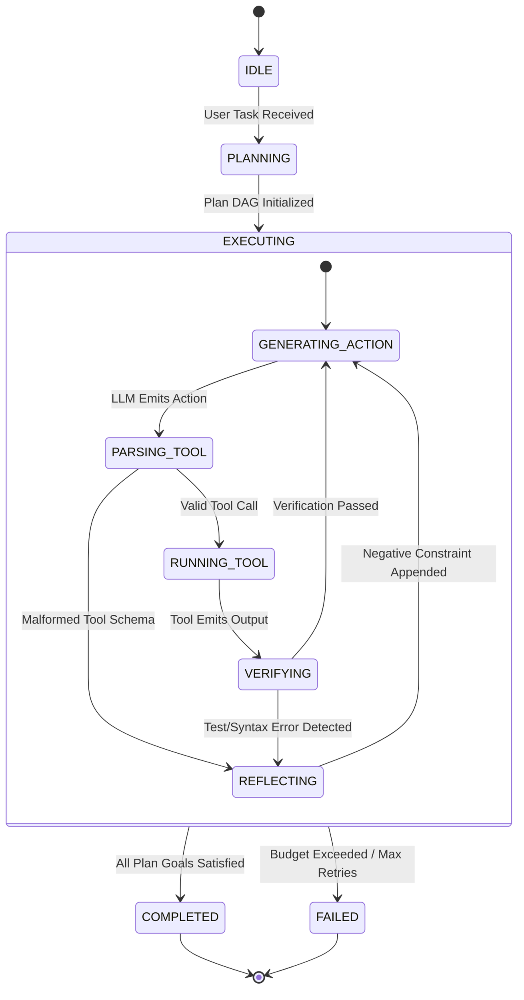

# Case Study 29: Building an Autonomous Coding & Data Science Agent from Scratch — The First-Principles Approach & Open-Source Playbook

> **Core Focus**: Designing, implementing, and open-sourcing a production-grade autonomous agent capable of solving end-to-end software engineering (SWE) tasks and exploratory data science (DS) workflows from scratch—without fragile commercial wrappers or bloated frameworks. Exploring the dual-loop cognitive engine, stateful sandbox runtimes (CLI & Jupyter ZeroMQ), verification & backtracking mechanics, context window economics, and the open-source engineering blueprint (licensing, evaluation harnesses, and contributor flywheels).

---

## 1. Executive Summary & The Problem Formulation

The landscape of Artificial Intelligence has shifted from conversational chatbots to **Autonomous Task-Oriented Agents**. Among these, two domains stand at the apex of agentic complexity:
1. **Software Engineering (SWE) Agents**: Systems that ingest user issue descriptions, navigate multi-thousand-file repositories, isolate root causes, execute multi-file edits, run test suites, and generate mergeable pull requests (e.g., SWE-bench benchmarks, OpenHands, Aider, Devin).
2. **Data Science (DS) Agents**: Systems that ingest raw, noisy datasets, formulate exploratory hypotheses, execute stateful statistical code in an interactive REPL/Jupyter kernel, handle data cleaning and feature engineering, train predictive models, generate visualizations, and synthesize business insights (e.g., DS-1000, Data-Interpreter, Code Interpreter).

Many teams attempt to build these agents by chaining high-level framework abstractions (e.g., basic LangChain/CrewAI chains). These naive prototypes inevitably collapse when exposed to real-world tasks due to **state explosion, context window saturation, tool hallucination, destructive filesystem mutations, and lack of deterministic verification**.

```
┌────────────────────────────────────────────────────────────────────────────────────────────────────────┐
│                        THE SPECTRUM OF AGENTIC CODE & DATA SCIENCE EXECUTION                           │
├──────────────────────────────────────┬─────────────────────────────────────────────────────────────────┤
│ Fragile Prototype Approach           │ First-Principles Modular Approach (From Scratch)                │
├──────────────────────────────────────┼─────────────────────────────────────────────────────────────────┤
│ • Giant system prompt with all tools │ • Decoupled Dual-Loop Engine (Planner DAG + ReAct Step Runner)  │
│ • Full-file rewrite on every edit    │ • Surgical Search/Replace Blocks with Tree-sitter AST validation│
│ • Stateless, ephemeral subshell runs │ • Persistent PTY shell & Stateful ZeroMQ IPython Kernel Gateway │
│ • Blind to test/linter failures      │ • Automated Test-Driven Verification Loop & Error Distillation  │
│ • Unbounded history bloats context   │ • Dynamic Token Budgeting, Prompt-Cache Pinning & Compaction    │
│ • Unsafe raw execution on host OS    │ • Hardened Sandboxes (Docker / gVisor / eBPF / Isolated microVM)│
│ • Proprietary vendor lock-in         │ • Provider-Agnostic Engine (Local Ollama/vLLM & Commercial APIs)│
│ • No reproducible benchmarks         │ • Automated SWE-bench Lite & DS-1000 CI/CD Evaluation Matrix    │
└──────────────────────────────────────┴─────────────────────────────────────────────────────────────────┘
```

### The "From Scratch" Philosophy

Building from scratch does **not** mean writing an LLM inference engine in C++ from zero. It means:
- **Zero Framework Dependency**: Building the cognitive state machine, tool dispatch, context ledger, and sandboxing using core language primitives (Python standard library, typing, Pydantic, and low-level protocol clients).
- **Domain Specialization**: Tailoring tool interfaces specifically for coding (AST search, exact chunk replacement, diff patching) and data science (stateful kernel memory, dataframe schema tracking, chart artifact extraction).
- **Open-Source Ergonomics**: Architecting the project so external developers can install it in under 60 seconds, run it against local open models (e.g., DeepSeek-R1, Qwen 2.5 Coder, Llama 3.3) or frontier APIs (Claude 3.5 Sonnet, GPT-4o), and contribute modular tools via standard interfaces (like Model Context Protocol - MCP).

---

## 2. Core Differences: Coding Agent vs. Data Science Agent

While both archetypes share the need to write and execute code, their runtime mechanics, state spaces, and verification loops diverge significantly:

| Architectural Vector | Autonomous Coding (SWE) Agent | Autonomous Data Science (DS) Agent |
|---|---|---|
| **Primary Execution Medium** | Shell / Bash / PTY + Filesystem edits | Stateful Interactive REPL / Jupyter Kernel (ZeroMQ) |
| **State Persistence** | On-disk files, Git worktree, commit index | In-memory namespace (`globals()`, DataFrames, fitted models) |
| **Context Map** | Repository AST hierarchy, file trees, symbols | Tabular schemas (`df.info()`), summary statistics, distributions |
| **Verification Signal** | Deterministic: Compilers, Linters, Pytest exit codes | Empirical: Loss convergence, metric curves, p-values, plot sanity |
| **Output Artifacts** | Git commit, patch/diff, Pull Request | Executable Notebook (`.ipynb`), trained weights, charts, EDA report |
| **Primary Failure Mode** | Syntax/type regressions, import loops, merge conflicts | Data leakage, silent NaN/null propagation, overfitting, GPU OOM |
| **Benchmark Standard** | SWE-bench (Lite/Verified), HumanEval, RepoBench | DS-1000, Bird-SQL, ARC, Kaggle Grandmaster benchmarks |

### The Unified Hybrid Architecture

To build a general-purpose technical agent, we formulate a **Unified Dual-Mode Engine** where the agent initializes with an environmental profile:
- In **SWE Mode**, the agent activates the **Repository Navigation, AST Diff Staging, and Shell Harness**.
- In **Data Science Mode**, the agent activates the **ZeroMQ Jupyter Kernel, Variable Inspector, and Multimedia Artifact Manager**.

```
                                 ┌──────────────────────────────────┐
                                 │   User Task / Issue / Query      │
                                 └─────────────────┬────────────────┘
                                                   │
                                      ▼───────────────────────▼
                                     ┌─────────────────────────┐
                                     │  Metacognitive Router   │
                                     │  & Goal Decomposition   │
                                     └─────────────┬───────────┘
                                                   │
                        ┌──────────────────────────┴──────────────────────────┐
                        ▼                                                     ▼
        ┌───────────────────────────────┐                     ┌───────────────────────────────┐
        │        SWE AGENT MODE         │                     │       DATA SCIENCE MODE       │
        ├───────────────────────────────┤                     ├───────────────────────────────┤
        │ • Repo Map (Tree-sitter AST)  │                     │ • Kernel Session (IPython ZMQ)│
        │ • Surgical Search/Replace     │                     │ • Dataframe Schema Tracker    │
        │ • Bash Subshell / PTY Harness │                     │ • Rich Output & Chart Parser  │
        │ • Pytest / Git Diff Ledger    │                     │ • Empirical Convergence Tests │
        └───────────────┬───────────────┘                     └───────────────┬───────────────┘
                        │                                                     │
                        └──────────────────────────┬──────────────────────────┘
                                                   │
                                      ▼───────────────────────▼
                                     ┌─────────────────────────┐
                                     │  Sandboxed Safe Runtime │
                                     │ (Docker / Podman/ gVisor│
                                     └─────────────┬───────────┘
                                                   │
                                      ▼───────────────────────▼
                                     ┌─────────────────────────┐
                                     │ Deterministic Verifier  │
                                     │ & Backtracking Engine   │
                                     └─────────────────────────┘
```

---

## 3. Theoretical & Mathematical Foundations

### 3.1 Formalization of the Agentic Trajectory

We model the agent's interaction with the code or data environment as a Partially Observable Markov Decision Process (POMDP) defined by the tuple $\mathcal{M} = \langle \mathcal{S}, \mathcal{A}, \mathcal{O}, \mathcal{T}, \mathcal{R}, \gamma \rangle$:
- $\mathcal{S}$: The true state of the operating environment (complete filesystem, Git tree, kernel memory, environment variables).
- $\mathcal{A}$: The set of discrete tool actions (e.g., `read_file`, `replace_content`, `run_command`, `execute_kernel_code`).
- $\mathcal{O}$: The observation space received by the agent (truncated stdout, diff outputs, compiler warnings, dataframe heads).
- $\mathcal{T}(s' \mid s, a)$: State transition dynamics governed by the deterministic OS and Python interpreter.
- $\mathcal{R}(s, a)$: The task success reward (e.g., $1.0$ if all unit tests pass or Kaggle test metric surpasses baseline, $0$ otherwise).

At step $t$, the agent receives observation $o_t \in \mathcal{O}$ and updates its internal conversation context history $H_t$:

$$
H_t = [u_0, (a_1, o_1), (a_2, o_2), \dots, (a_{t-1}, o_{t-1})]
$$

The agent's policy $\pi_\theta(a_t \mid H_t)$ parameterizes the probability distribution over candidate actions given the tokenized history.

### 3.2 Context Window Economics & Prompt-Cache Optimization

Modern LLM inference engines (vLLM, SGLang, Anthropic, OpenAI) leverage **KV-Cache Reuse (Prompt Caching)**. If consecutive API calls share an identical prefix, the server skips re-computing transformer attention for cached tokens, reducing latency by up to **80%** and API cost by **50–90%**.

Let the token cost of generating step $t$ without caching be:

$$
C_{\text{naive}}(t) = c_{\text{input}} \cdot |H_t| + c_{\text{output}} \cdot |a_t|
$$

With prefix prompt caching over a common static prefix $P_{\text{static}}$ (system instructions, tool definitions, static repo map), the effective cost becomes:

$$
C_{\text{cached}}(t) = c_{\text{cached}} \cdot |P_{\text{static}}| + c_{\text{input}} \cdot (|H_t| - |P_{\text{static}}|) + c_{\text{output}} \cdot |a_t|
$$

where $c_{\text{cached}} \approx 0.1 \times c_{\text{input}}$.

**Architectural Law of Autonomous Agents**: 
> *The conversation prefix must remain strictly append-only and monotonically stable. Never dynamically mutate tool signatures, system prompts, or past historical messages mid-flight; otherwise, the KV cache is invalidated on every turn.*

### 3.3 Information Distillation & Observation Compaction

When a shell command produces $100{,}000$ lines of verbose logs (e.g., `npm install` or massive pandas printouts), dumping this directly into $H_t$ saturates the context window and triggers "Lost in the Middle" attention degradation.

We define an information distillation operator $\Phi(o)$:

$$
Phi(o) = \begin{cases}
o, & \text{if } \text{len}(o) \le \tau_{\text{thresh}} \\
\text{Head}(o, k) \;\cup\; \left[ \dots \text{Truncated } N \text{ lines} \dots \right] \;\cup\; \text{Tail}(o, k), & \text{if } \text{is\_stdout}(o) \\
\text{ExtractStacktrace}(o), & \text{if } \text{is\_traceback}(o)
\end{cases}
$$

By extracting only the error header, failing test assertion, and leaf stacktrace frame, observation tokens shrink by up to **95%** while retaining **100%** of the causal diagnostic signal.

---

## 4. Phase-by-Phase Approach to Building from Scratch

```
┌────────────────────────────────────────────────────────────────────────────────────────┐
│                        6-PHASE AGENT DEVELOPMENT LIFECYCLE                             │
├────────────────────────────────────────────────────────────────────────────────────────┤
│ PHASE 1: Core Cognitive Loop (Planner, ReAct State Machine, Token Ledger)              │
│ PHASE 2: Execution Sandboxing (Docker Runtime, PTY Shell & Jupyter ZeroMQ Gateway)    │
│ PHASE 3: Domain Specialization (Repo Map AST, Search/Replace & Kernel Memory)          │
│ PHASE 4: Verification & Backtracking (Linter/Test gates, Negative Constraints)        │
│ PHASE 5: Model Abstraction & Ergonomics (LiteLLM/Ollama wrapper, Streaming CLI)        │
│ PHASE 6: Open-Source Infrastructure (CI Benchmarking, Docs, Contributor Standards)     │
└────────────────────────────────────────────────────────────────────────────────────────┘
```

### Phase 1: Core Cognitive Loop & State Machine

Avoid monolithic scripts. The core runtime must be an explicit, deterministic state machine:



1. **State Machine States**:
   - `IDLE`: Awaiting user prompt.
   - `PLANNING`: High-level goal decomposition into a directed acyclic graph (DAG) of actionable sub-tasks.
   - `EXECUTING`: The active inner ReAct loop executing concrete tool calls.
   - `VERIFYING`: Running deterministic tests, linters, or dataframe assertions against the output.
   - `REFLECTING`: Ingesting error signals, pruning stale context, and appending corrective guidance.
   - `COMPLETED` / `FAILED`: Terminal states.

2. **Structured Action Parsing**:
   Never rely solely on vendor-specific function-calling APIs if you want to support open-source local models (e.g., Ollama, vLLM, DeepSeek-R1). Build a **Dual-Mode Action Parser**:
   - **Mode A (Native Tool Calling)**: Uses OpenAI/Anthropic tool schemas (`tools=[...]`, `tool_choice="auto"`).
   - **Mode B (XML / Markdown Schema)**: Uses robust regex parsing for models that reason best in raw text tags (e.g., `<tool_call>{"name": "write_file", "args": {...}}</tool_call>`). This ensures 100% interoperability across any open model.

---

### Phase 2: Execution Sandboxing & Environment Harness

Executing arbitrary code authored by an LLM directly on a developer's host machine is a critical security vulnerability. An open-source agent must have rock-solid isolation by default.

#### 1. The SWE Shell Harness (PTY over Docker)
- **Virtual Terminal (PTY)**: Standard `subprocess.Popen(..., stdout=PIPE)` fails on interactive commands (e.g., `git log`, commands expecting confirmation, colored terminal output). By wrapping shell execution in a Pseudo-Terminal (`pty` on Linux/macOS or `winpty`/named pipes on Windows), the agent observes authentic shell dynamics.
- **Persistent State**: Rather than spawning a new subshell for every command (`cd /dir` followed by `ls` will fail in naive setups), maintain a long-running daemonized bash session communicating via Unix sockets or Docker exec streams.
- **Output Streaming & Timeout Guards**: Wrap all execution in non-blocking event loops with hard CPU and wall-clock timeouts (e.g., 120s limit) to prevent runaway infinite loops (`while True:`).

#### 2. The Data Science Harness (Jupyter ZeroMQ Kernel)
For data science, re-running a 40-minute dataset ingestion script on every turn is intolerable. The agent requires an **Interactive IPython Kernel**:
- Use `jupyter_client` to launch an in-process or containerized IPython kernel.
- Connect to the kernel via ZeroMQ channels:
  - `shell`: Sends code execution requests (`execute_request`).
  - `iopub`: Streams live `stdout`, `stderr`, execution count, and rich display outputs (`image/png` base64 data, `text/html` tables).
  - `stdin`: Handles interactive user input if requested.
- State inspection tool: Equip the agent with a `%whos` or schema inspector tool that automatically summarizes active memory:
  ```python
  def get_active_variables():
      return {var: type(val).__name__ for var, val in globals().items() if not var.startswith("_")}
  ```

---

### Phase 3: Domain Specialization Tools

#### For the Coding Agent: Surgical Editing
Early agents attempted to overwrite entire files using `write_file(path, new_full_content)`. For a 1,500-line file, this burns thousands of output tokens, introduces hallucinated regressions, and frequently gets truncated mid-file.

Modern coding agents use **Surgical Block Replacement**:
```json
{
  "target_file": "src/auth/jwt.py",
  "search_block": "def verify_token(token: str):\n    payload = jwt.decode(token, SECRET)\n    return payload",
  "replace_block": "def verify_token(token: str):\n    try:\n        payload = jwt.decode(token, SECRET, algorithms=['HS256'])\n        return payload\n    except jwt.ExpiredSignatureError:\n        raise AuthenticationError('Token has expired')"
}
```
**Algorithm for Fuzzy Search-and-Replace**:
1. Check for exact string match. If found exactly once, apply edit.
2. If exact match fails (due to whitespace or indentation drift), normalize tabs/spaces and line endings (`\r\n` $\to$ `\n`).
3. If still not found, execute Levenshtein fuzzy distance matching over rolling line windows. If similarity $\gt 0.95$ and unambiguous, apply edit; otherwise, return precise line number context to the LLM with an error.

#### For the Data Science Agent: Dynamic Visualizations & Artifacts
A data scientist agent must do more than print numbers—it must communicate visually:
- When code generates a Matplotlib, Seaborn, or Plotly figure, the ZeroMQ harness intercepts the `display_data` message with MIME type `image/png`.
- The runtime automatically saves the image to an `artifacts/plots/` directory and returns a markdown image link to the agent:
  `[Generated Artifact]: artifacts/plots/feature_importance.png`
- If connected to a multimodal vision model (e.g., Claude 3.5 Sonnet, GPT-4o), the image is immediately fed back into the agent's observation context, enabling the agent to visually inspect chart skew, outlier distributions, or ROC curve quality!

---

### Phase 4: Verification, Reflection, and Error Backtracking

An autonomous agent without a feedback loop is merely a code generator. What makes an agent *autonomous* is its capacity to verify its own work and correct course.

```
       ┌────────────────────────┐
       │   Agent Applies Edit   │
       └───────────┬────────────┘
                   │
                   ▼
       ┌────────────────────────┐
       │ Syntactic Verification │ ──▶ [Failed: SyntaxError / MyPy]
       │   (AST Parser / Linter)│        │
       └───────────┬────────────┘        ▼
                   │ Passed       ┌─────────────────────────┐
                   ▼              │ Self-Correction Loop:   │
       ┌────────────────────────┐ │ Inject syntax error trace│
       │ Deterministic Unit Test│ │ without executing tests │
       │     (pytest / tests)   │ └─────────────────────────┘
       └───────────┬────────────┘        ▲
                   │                     │
      ┌────────────┴────────────┐        │
      ▼ Passed                  ▼ Failed │
┌──────────────────┐      ┌─────────────────────────┐
│ Commit Changes   │      │ Dynamic Backtracking:   │
│ & Update Ledger  │      │ 1. Git checkout file    │
└──────────────────┘      │ 2. Add negative rule    │
                          │ 3. Re-route plan branch │
                          └─────────────────────────┘
```

1. **Deterministic Syntax Gate**: Before running test suites, pass edited files through Python's built-in `ast.parse()` or language linter. If syntax fails, immediately return the `SyntaxError` to the model without wasting compute on shell test suites.
2. **Test-Driven Self-Correction**: Run targeted test commands (`pytest tests/test_auth.py -k test_jwt`). Parse the output using regex to extract only the failing assertion and stacktrace.
3. **Negative Constraint Memory**: When an agent attempts an approach that fails twice (e.g., attempting to install an incompatible package version), record this in a `NegativeConstraintLedger`:
   `CONSTRAINT: Do NOT use sklearn.cross_validation (deprecated). Use sklearn.model_selection.`
   Inject this concise ledger into subsequent reasoning prompts to prevent cyclic loops.

---

### Phase 5: Provider-Agnostic LLM Layer

Never hardcode OpenAI or Anthropic SDK calls into business logic. Build a clean, decoupled LLM client abstraction:

```python
class LLMMessage(BaseModel):
    role: Literal["system", "user", "assistant", "tool"]
    content: str
    tool_calls: Optional[List[ToolCall]] = None
    tool_call_id: Optional[str] = None

class LLMProvider(ABC):
    @abstractmethod
    def generate(
        self, 
        messages: List[LLMMessage], 
        tools: Optional[List[Dict[str, Any]]] = None,
        temperature: float = 0.0
    ) -> LLMResponse:
        pass
```

Implement concrete adapters for:
- `OpenAICompatibleProvider`: Covers OpenAI, Groq, Together, DeepSeek, vLLM, and Ollama.
- `AnthropicProvider`: Native Anthropic SDK supporting prompt caching headers (`cache_control={"type": "ephemeral"}`).
- `LocalLlamaCppProvider`: Direct local execution with zero network overhead.

---

## 5. The Open-Source Playbook: How to Release, Sustain, and Scale

Building great agent code is only half the battle. Making an agent project thrive in the open-source ecosystem requires deliberate architectural and community engineering.

```
┌────────────────────────────────────────────────────────────────────────────────────────┐
│                        THE OPEN-SOURCE AGENT FLYWHEEL                                  │
├────────────────────────────────────────────────────────────────────────────────────────┤
│                                                                                        │
│     ┌────────────────────────────────────────────────────────────────────────────┐     │
│     │                       1. 60-Second Onboarding                              │     │
│     │      Single CLI command (`pip install` / `docker run`) & zero config       │     │
│     └─────────────────────────────────────┬──────────────────────────────────────┘     │
│                                           │                                            │
│                                           ▼                                            │
│     ┌────────────────────────────────────────────────────────────────────────────┐     │
│     │                       2. Transparent Benchmarks                            │     │
│     │         Verified SWE-bench / DS-1000 score published on every PR           │     │
│     └─────────────────────────────────────┬──────────────────────────────────────┘     │
│                                           │                                            │
│                                           ▼                                            │
│     ┌────────────────────────────────────────────────────────────────────────────┐     │
│     │                       3. Modular Extensibility                             │     │
│     │    Clean plugin interface for custom tools, MCP servers, and LLM backends  │     │
│     └─────────────────────────────────────┬──────────────────────────────────────┘     │
│                                           │                                            │
│                                           ▼                                            │
│     ┌────────────────────────────────────────────────────────────────────────────┐     │
│     │                       4. Active Contributor Base                           │     │
│     │    Clear contributing guidelines, issue triage labels, and mock unit tests │     │
│     └────────────────────────────────────────────────────────────────────────────┘     │
│                                                                                        │
└────────────────────────────────────────────────────────────────────────────────────────┘
```

### 5.1 Licensing & Governance

| License | Pros | Cons | Recommendation |
|---|---|---|---|
| **Apache 2.0** | Explicit patent grant, enterprise friendly, allows commercial derivative works | Competitors can wrap it as closed SaaS without contributing back | **Highly Recommended** for developer tools aiming for enterprise adoption |
| **MIT** | Maximum developer freedom, ultra-permissive, zero legal friction | No explicit patent protection | Excellent for minimalist libraries |
| **AGPLv3** | Forces any cloud SaaS provider using your agent code to open-source their changes | Scares away corporate contributors and enterprise adoption | Use only if monetizing via dual-licensing (commercial license) |

### 5.2 Contributor Ergonomics & Zero-Cost CI

The number one killer of open-source agent contributions is requiring a paid \$50 API key to run the test suite. If contributors cannot test their PRs locally for free, they will not contribute.

**The Solution: Deterministic LLM Mocking & VCR Trajectories**:
- Record agent trajectory sessions (user prompt, model tool call, tool observation) into deterministic JSON test fixtures (using tools like `pytest-recording` or custom replay ledgers).
- When contributors run `pytest`, the test suite replays frozen tool calls and LLM outputs with **zero API calls and zero network latency**.
- Provide a `MockLLMProvider` that verifies whether the agent's prompt serialization, tool call parsing, and diff staging logic work flawlessly.

### 5.3 Benchmarking: The Credibility Standard

In the agent community, claims like "Best autonomous AI engineer!" are met with extreme skepticism without verifiable numbers. To gain credibility:
1. **SWE-bench (Software Engineering)**:
   - Integrate an automated evaluation runner against **SWE-bench Lite** (300 representative GitHub issues from real-world repositories like Django, SymPy, Flask).
   - Report exact Pass@1 resolution percentages.
2. **DS-1000 / GAIA (Data Science)**:
   - Evaluate the data science mode against **DS-1000** (1,000 realistic data science problems across NumPy, Pandas, Scipy, Matplotlib).
   - Verify code execution correctness in sandboxed Docker containers.
3. **Continuous Evaluation Action**: Run 5 SWE-bench instances on every release tag to guarantee that prompt modifications or tool refactors have not caused silent capability regressions.

---

## 6. Architecture Comparison Matrix

| Architectural Feature | Devin (Cognition) | OpenHands (formerly OpenDevin) | Aider | Proposed Architecture (From Scratch) |
|---|---|---|---|---|
| **License** | Proprietary Cloud | MIT (Open Source) | Apache 2.0 (Open Source) | **Apache 2.0 (Open Source)** |
| **Hosting Model** | Cloud-only SaaS | Docker / Local WebUI | Terminal CLI | **Headless Core + CLI + WebUI / MCP** |
| **Execution Medium** | Ephemeral MicroVM | Docker Container | Host OS (Git Repo) | **Pluggable (Docker / Local Subshell / ZMQ)** |
| **Data Science Support** | Generalist | Basic bash | None (Pure SWE) | **First-Class Jupyter ZMQ Kernel** |
| **Editing Mechanism** | Custom IDE Agent | Multi-format patches | Git repo map + Aider diff | **Surgical AST Search/Replace + Fuzzy Block** |
| **LLM Provider Support** | Proprietary fine-tune | LiteLLM (All providers) | LiteLLM (All providers) | **LiteLLM + Direct Local Ollama/vLLM** |
| **Prompt Cache Aware** | Yes (Internal) | Moderate | High (Repo map caching) | **Strict Append-Only Monotonic Pinning** |
| **Framework Overhead** | Custom internal | Custom agent loop | Custom pure Python | **Zero-Dependency Native Python Core** |

---

## 7. Failure Modes & Production Battle-Hardening

### 7.1 The Infinite Loop of Doom (Thrashing)
- **Symptom**: The agent tries an edit, runs the test, sees a failure, attempts the exact same edit, and loops until the token budget is exhausted.
- **Root Cause**: The LLM forgets that it already attempted this hypothesis because previous turns were truncated or lost in noisy tool logs.
- **Remedy**: Maintain a cryptographic trajectory hash of `(file_path, diff_content)`. If the agent emits an identical patch twice, immediately trigger the `REFLECTING` state and force the agent to formulate an alternative hypothesis.

### 7.2 The Destructive Filesystem Wipeout
- **Symptom**: The agent runs `rm -rf *` or `git reset --hard` to "clean up temporary files," wiping out the user's uncommitted work.
- **Remedy**: 
  1. Enforce a **Git Shadow Branch**: Before the agent begins work, automatically create an isolated temporary Git branch (`agent/task-sandbox-xyz`).
  2. Maintain a tool execution permission ring: Block destructive commands (`rm -rf /`, `mkfs`, `dd`) via regex guardrails and command white-listing.

### 7.3 Data Leakage in Data Science Trajectories
- **Symptom**: When training a machine learning model, the agent fits an imputer or scaler on the entire dataset *before* performing train/test split, yielding falsely optimistic cross-validation scores.
- **Remedy**: Incorporate automated static code analysis checks into the verification gate:
  ```python
  def verify_no_data_leakage(code_str: str) -> Optional[str]:
      if "fit_transform" in code_str and "train_test_split" in code_str:
          # Check order of operations via AST
          pass
  ```

---

## 8. Feature Delta: Supercharging Beyond Claude Code and OpenCode

Anthropic's **Claude Code** and its open-source counterpart **OpenCode** represent the current state-of-the-art in terminal-based coding agents. However, both were architected primarily as **monolithic, shell-based software engineering assistants**. 

When building an autonomous coding and data science agent from scratch, we have the architectural freedom to introduce breakthrough features that sit **directly on top of and beyond** the capabilities of Claude Code and OpenCode:

```
┌──────────────────────────────────────────────────────────────────────────────────────────────────┐
│                     FEATURE MATRIX: FROM-SCRATCH AGENT vs. CLAUDE CODE & OPENCODE                │
├───────────────────────────────────┬──────────────────────┬───────────────────────────────────────┤
│ Capability Vector                 │ Claude Code/OpenCode │ This From-Scratch Unified Architecture│
├───────────────────────────────────┼──────────────────────┼───────────────────────────────────────┤
│ 1. Data Science & REPL Execution  │ ❌ Raw Bash only     │ ✅ Stateful ZeroMQ Jupyter Kernel     │
│ 2. Visual Artifact Extraction     │ ❌ Text stdout only  │ ✅ Auto-extracted PNG/Plotly figures  │
│ 3. In-Process AST Syntax Gating   │ ❌ Post-facto shell  │ ✅ Pre-commit AST interceptor (0 cost)│
│ 4. Anti-Thrashing Circuit Breakers│ ❌ Prone to loops    │ ✅ Cryptographic patch deduplication  │
│ 5. Trajectory Branch Forking      │ ❌ Linear ReAct      │ ✅ Speculative Git worktree forking   │
│ 6. Heterogeneous Model Routing    │ ⚠️ Single model lock │ ✅ Tiered SLM (Local) + Frontier LLM  │
│ 7. Statistical & Leakage Guards   │ ❌ None              │ ✅ AST ML pipeline static verification│
│ 8. Deployment Surface             │ ⚠️ Terminal CLI only │ ✅ Headless Daemon (CLI, IDE, MCP)    │
└───────────────────────────────────┴──────────────────────┴───────────────────────────────────────┘
```

### 8.1 First-Class Stateful Data Science & Jupyter Kernel Runtime (vs. Stateless Bash)
- **Claude Code / OpenCode Limitation**: They operate solely via a terminal subshell. To run Python, they execute `python script.py`. Every execution spawns a brand new OS process, dumping all memory, re-reading massive CSV/Parquet files from disk, and losing intermediate DataFrames.
- **Added Feature**: A native **ZeroMQ IPython Kernel Gateway**.
  - Maintains persistent global memory (`df`, PyTorch models, tensors) across turns.
  - Sub-second iterative exploration: The agent can inspect `df.head()`, transform a column, and fit a model across 10 sequential turns without ever reloading the dataset.
  - Automatic **Variable Namespace Inspector** (`%whos`) that injects active variable names and dtypes into the agent's observation state.

### 8.2 Multimedia Artifact Interception & Visual Verification Loop
- **Claude Code / OpenCode Limitation**: Only captures raw text streams (`stdout` and `stderr`). When a data science script generates a Matplotlib or Seaborn plot, the terminal agent either ignores it or saves it invisibly to disk without visual inspection.
- **Added Feature**: Native interception of Jupyter `display_data` MIME streams (`image/png`, `text/html`).
  - Automatically captures generated charts, renders them in the workspace artifact directory, and provides a direct visual feedback loop.
  - When paired with multimodal vision backends (e.g., Claude 3.5 Sonnet, GPT-4o), the agent can **visually inspect its own charts** to identify class imbalance, distribution skew, or ROC curve degradation.

### 8.3 In-Process AST Pre-Commit Syntax Gates (Zero-Turn Verification)
- **Claude Code / OpenCode Limitation**: When the agent generates a patch, it writes it directly to disk or attempts a search/replace. If the LLM makes an indentation error or forgets a colon, the file is modified on disk, and the agent only discovers the error after burning an expensive subsequent turn running `pytest` or `python`.
- **Added Feature**: In-process **Abstract Syntax Tree (AST) validation** before touching the filesystem.
  - Python's `ast.parse()` and Tree-sitter grammars parse the patched in-memory buffer before disk write.
  - If invalid, the write is immediately rejected, and the exact syntax line error is reflected back to the LLM in the same turn—saving token costs, preventing file corruption, and cutting turnaround time to zero.

### 8.4 Cryptographic Patch Deduplication & Negative Constraint Ledgers
- **Claude Code / OpenCode Limitation**: When faced with stubborn test failures, terminal agents frequently get trapped in "thrashing loops," attempting the same failing edit or reinstalling the same incompatible package version over multiple turns until the budget is exhausted.
- **Added Feature**: 
  - **Patch Hashing**: The engine computes $H(\text{file\_path}, \Delta_{\text{unified}})$. If the agent emits an identical or near-identical patch that previously failed, the action is intercepted.
  - **Negative Constraint Ledger**: Failed hypotheses are recorded as explicit negative guidelines (e.g., `AVOID: Do NOT use regex to parse HTML in parser.py; use BeautifulSoup`). This ledger is pinned to subsequent prompts, pruning repetitive failure modes.

### 8.5 Speculative Trajectory Branch Forking (Counterfactual Exploration)
- **Claude Code / OpenCode Limitation**: The agent operates along a strictly linear, sequential ReAct path. If it picks an incorrect architectural approach early on, it burns dozens of turns attempting to make the flawed approach work.
- **Added Feature**: Automated **Git Worktree Shadow Forking**.
  - The agent can speculatively launch 2 parallel candidate branches (`branch-a: refactor-helper` vs. `branch-b: monkey-patch-adapter`).
  - Both branches execute tests in isolated sandboxes.
  - The agent evaluates the results and seamlessly merges the winning branch while discarding the failing branch with zero side effects.

### 8.6 Heterogeneous Tiered Model Routing & Air-Gapped Local SLMs
- **Claude Code / OpenCode Limitation**: Claude Code is locked to Anthropic's cloud endpoints, making it unusable in air-gapped defense, financial, or proprietary corporate environments with strict data residency requirements. OpenCode supports LiteLLM, but uses the same model for every step.
- **Added Feature**: **Heterogeneous Task-Level Routing**.
  - **Tier 1 (Local Edge SLMs via Ollama/vLLM - Qwen 2.5 Coder 1.5B/7B)**: Handles high-volume, low-complexity operations: symbol grep, AST file mapping, linter error distillation, and syntax checks with 0 API cost and <50ms latency.
  - **Tier 2 (Frontier Reasoning Models - DeepSeek-R1 / Claude 3.5 Sonnet / o3-mini)**: Invoked only for metacognitive goal decomposition, complex debugging, and algorithmic synthesis.
  - **100% Offline Air-Gapped Mode**: The entire agent can operate completely offline using local models, guaranteeing zero data leakage for enterprise privacy.

### 8.7 Automated Machine Learning & Data Leakage Guards
- **Claude Code / OpenCode Limitation**: They have no domain-specific knowledge of machine learning pitfalls. They will happily fit transformers on test sets or evaluate models with data leakage.
- **Added Feature**: Built-in static and empirical ML guardrails:
  - AST-level detection of data leakage (e.g., calling `fit_transform` before splitting datasets into train/test).
  - Post-training metric sanity assertions: detecting overfitting ($R^2_{\text{train}} = 1.0, R^2_{\text{test}} = 0.2$), class-imbalance metric illusions (high accuracy with 0 F1-score), and silent NaN propagation.

---

## 9. Summary & Key Takeaways

1. **Beyond Pure SWE to Unified Data & Code Intelligence**: Integrating a persistent ZeroMQ IPython kernel alongside the surgical SWE file-editing harness enables a unified agent capable of both fixing complex software bugs and executing end-to-end data science pipelines.
2. **Deterministic Verification Eliminates Guesswork**: Pre-commit AST syntax gates, test runners, and negative constraint ledgers elevate the agent from an error-prone code generator into a self-correcting autonomous engineer.
3. **Prompt Cache Awareness is Non-Negotiable**: Maintaining strictly append-only conversational history ensures maximum KV-cache reuse, dropping latency and token costs by up to 80–90%.
4. **Supercharging Open-Source Over Closed Alternatives**: By decoupling the engine from single cloud providers, introducing local SLM routing, enabling air-gapped execution, and providing zero-cost mock test fixtures, an open-source agent can surpass proprietary tools in flexibility, privacy, and community velocity.
